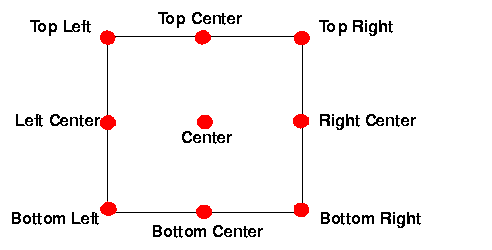

### Date: October 14, 2024
### Title: Lesson05: Objects
### Author: Caesar James LEE
### Book: HTML5+CSS3+JavaScript: from beginer to senior
### Website: [W3Schools](https://www.w3schools.com)
### AI Assistant: CloseAI ChatGPT

##### `background-color`
* Sets the background color for an element.
##### `background-image`
* Sets one or more background images for an element.
* It has eight values:
    1. url(URL)
        * The URL to the image().
        * To specify more than one image, separate the URLs witha comma (`,`).
    2. `none`       ***DEFAULT***
        * No background image will be displayed.
    3. `conic-gradient()`
        * The `conic-gradient` (圓錐形漸層) function sets a conic gradient as the background image.
        * A conic gradient is a gradient with color transitions rotated around a center point.
        * To create a conic gradient you must define at least two color stops.
        * syntax:       `conic-gradient(angle, position, color (reqiured) angle, color1 (reqiured) angle1...);
            * `angle`
                * The entire conic gradient is rotated by this angle.
                * You need type `from` in front.
                * **Default value is `0deg`**
            * `position`
                * Specifies the gradient center of the conic gradient.
                * You need type `at` in front.
                * You can pass two values:  `horizontalPercentage VerticalPercentage`. And `50%` is the center point.
                * **Default value is `center`**
            * `color` or `color angle`
                * Color stops are the colors you want to render (宣染) smooth transitions among.
                * This value condsists of a color name, followed by an optional stop position(`[0, 360] degree` or `[0, 100] %`)
        * example:
        ```
        ...
        <style>
            body{
	            background-color: black;
                color: white;
            }
            #container{
                height: 200px;
                width: 200px;
                background-color: red;/*for browsers that don't support gradients*/
                background-image: conic-gradient(from 90deg at 30% 60%, red 180deg, green 260deg, blue 350deg);
                border-radius: 50%;
            }
        </style>
        ...
        <body>
            <div id="container"></div>
        </body>
        ...
        ```
    4. `linear-gradient()`
        * Sets a linear gradient color as a background image.
        * syntax:   `linear-gradient(direction, colorStop, colorStop1...);`
            * direction
            * It has eight values:
                1. `to bottom`      ***DEFAULT***
                    * from top to bottom.
                2. `to top`
                    * from bottom to top.
                3. `to left`
                    * from right ot left.
                4. `to right`
                    * from left to right.
                5. `to top left`
                    * from bottom-right corner to top-left corner.
                6. `to top right`
                    * from bottom-left corner to top-right corner.
                7. `to bottom left`
                    * from top-right corner to bottom-left corner.
                8. `to bottom right`
                    * from top-left corner to bottom-right corner.
        * exmaple:
        ```
        ...
        <style>
            body{
	            background-color: black;
            }
            div{
	            width: 90%;
                height: 200px;
                margin: 30px auto;
                background: linear-gradient(to right, red, orange, yellow, green, blue, indigo, violet);
            }
        </style>
        ...
        <body>
            <div></div>
        </body>
        ...
        ```
    5. `radial-gradient()`
        * Sets a radial gradient color as a background image.
        * By default, shape is `ellipse`, size is `farthest-corner`, and position is `center`.
        * syntax:   `radial-gradient(shape size at position, startColor, colorstop, ..., endColor);`
            * shape
                * It has two values:
                    1. `ellipse`        ***DEFAULT***
                        * Sets shape to an ellipse.
                    2. `circle`
                        * Sets shape to a circle.
            * size
                * It has four values:
                    1. `closest-side`
                        * The gradient will extend from position (default is center) to the nearest edge (side) of the element.
                    2. `farthest-side`
                        * The gradient will extend from position (default is center) to the farthest edge (side) of the element.
                    3. `closest-corner`
                        * The gradient will extend from position (default is center) to the nearest corner (a corner being where two sides meet) of the element.
                    4. `farthest-corner`        ***DEFAULT***
                        * The gradient will extend from position (default is center) to the farthest corner (a corner being where two sides meet) of the element.
            * example:
            ```
            ...
                <style>
                    body{
	                    background-color: black;
                    }
                    div{
                        width: 85%;
                        height: 500px;
                        margin: 30px auto;
                        background: radial-gradient(farthest-side at 30%, red 30%, yellow 60%, blue);
                    }
                </style>
            ...
            <body>
                <div></div>
            </body>
            ...
            ```
    6. `repeating-conic-gradient()`
        * It's used to repeat `conic-gradient` function.
        * syntax:   `repeating-conic-gradient(angle, position, colorStop, colorStop);
        * For colorStops, you need add a start degree and an end degree.
        * example:
        ```
        ...
            <style>
                body{
	                background-color: black;
                    color: white;
                }
            div{
                height: 200px;
                width: 200px;
                background-image: repeating-conic-gradient(from 30deg at 40% 40%, red 0deg 10deg, yellow 10deg 20deg, blue 20deg 30deg);
                border-radius: 50%;
            }
            </style>
        ...
        <body>
            <div></div>
        </body>
        ...
        ```
    7. `repeating-linear-gradient()`
        * It's used to repeat `linear-gradient()` function.
        * syntax: `repeating-linear-gradient(position, colorStop, colorStop1...);`
            * position
                * It has two types of vaues:
                    1. degree
                        * `[0, 360] degree`
                    2. to position
                        1. `to left top`
                            * from bottom-right corner to top-left corner.
                        2. `to right top`
                            * from bottom-left corner to top-right corner.
                        3. `to left bottom`
                            * from top-right corner to bottom-left corner.
                        4. `to right bottom`
                            * from top-left corner to bottom-right corner.
            * example:
            ```
            ...
            <style>
                body{
	                background-color: black;
                    color: white;
                }
                div{
	                width: 90%;
                    height: 200px;
                    margin: 30px auto;
                    background-image: repeating-linear-gradient(to left top, red 5%,blue 7%,green 10%);
                }
            </style>
            ...
            <body>
                <div></div>
            </body>
            ...
            ```
    8. `repeating-radial-gradient()`
        * It's used to repea `radial-gradient()` function.
        * syntax:   `repeating-radial-gradient(shape size position, startColor, colorStop, ..., endColor);
        * example:
        ```
        ...
            <style>
                body{
	                background-color: black;
                    color: white;
                }
                div{
	                width: 90%;
                    height: 200px;
                    margin: 30px auto;
                    background-image: repeating-radial-gradient(circle closest-corner at 30% 30%, red 5%, green 10%, blue 15%);
                }
            </style>
        ...
        <body>
            <div></div>
        </body>
        ...
        ```
##### `background-repeat`
* Sets how a background image will be repeated.
* It has six values:
    1. `repeat`     ***DEFAULT***
        * The background image is repeated both vertically and horizontally.
        * The last image will be clipped if it doesn't fit.
    2. `repeat-x`
        * the background image is repeated only horizontally.
    3. `repeat-y`
        * the background image is repeated only vertically.
    4. `no-repeat`
        * The background image isn't repeated.
        * The image will only be shown once.
    5. `space`
        * The background image is repeated as much as possible without clipping.
        * The first and last image is pinned (固定) to either side of the element, and whitespace is distributed evenly between the images.
    6. `round`
        * The background image is repeated and squashed (擠壓) or stretched (拉伸) to fill the space (no gaps).
##### `background-attachment`
* Sets whether a background image scrolls with the rest of the page, or is fixed.
* It has three values:
    1. `scroll`     ***DEFAULT***
        * The background image will scroll with the page.
    2. `fixed`
        * The background image will not scroll with the page.
        * The background image will stay in the same location when you are scrolling.
    3. `local`
        * The background image will scroll with the element's contents.
##### `background-position`
* Sets the starting position of a background image.
* It has eleven values:
    1. `left top`
    2. `left center`
    3. `left bottom`
    4. `right top`
    5. `right center`
    6. `right bottom`
    7. `center top`
    8. `center center`
    9. `center bottom`
    
        * If you only specify one keyword, the other value will be `center`.
    10. x% y%
        * The first value is horizontal position and the second value is vertial.
        * The top-left corner is `0% 0%`, and the bottom-right corner is `100% 100%`.
        * If you only sprcify one value, the other value will be `50%`.
        * Default value is `0% 0%` or top-left corner.
    11. xunit yunit
        * The first value is the horizontal value and the second is the vertical.
        * The top left corner is `0px 0px` or any other CSS length unit.
        * If you only specify one value, the other value will be `50%`.
        * You can mix `%` and a type of CSS length units.
##### `background-position-x`
* Sets the position of a background image on the x-axis.
* It has five values:
    1. `left`
        * Positions background left side on x-axis.
    2. `right`
        * Positions background right side on x-axis.
    3. `center`
        * Positions background center on x-axis.
    4. `x%`
        * Left side is `0%`, and right side is `100%`.
        * Percentage value refers to width of background positioning area minus width of bakcground image.
    5. `xunit`
        * Horizontal distance from left side.
#####  `background-position-y`
* Sets the position of background image on y-axis.
* It has five values:
    1. `top`
        * Positions background top on y-axis.
    2. `bottom`
        * Positions background bottom on y-axis.
    3. `center`
        * Positions background center on y-axis.
    4. `y%`
        * Top side is `0%` on y-axis, and bottom side is `100%` on y-axis.
        * Percentage value refers to height of background positioning area munis height of background image.
    5. `yunit`
        * Vertical distance from top side.
##### `background`
* It's a shorthand property for `background-color`, `background-image`, `background-repeat` and `background-position`.
* syntax:   `background: color image repeat horizontalPosition verticalPosition;`.
##### `opacity`
* Specifies the opacity (不透明度) or transparency (透明度) of an element.
* The `opacity` property can take a value [0.0, 1.0], the lower value, the more transparent.
* Default value is `1.0`.
##### `list-style-type`
* Specifies the type of list-item (`<li></li>`) marker in a list.
* It has three types of values:
    1. `<ul></ul>`
        1. `disc`   ***DEFAULT***
            * The marker is a filled circle.
        2. `circle`
            * The marker is a circle.
        3. `square`
            * The marker is a square.
    2. `<ol></ol>`
        1. `armeninan`
            * The marker is traditional American numbering.
        2. `cjk-ideographic`
            * The marker is plain ideographic numbers.  (e.g. 一、, 二、, 三、, ...)
        1. `decimal`        ***DEFAULT***
            * The marker is a number.   (e.g. 1., 2., 3., ...)
        2. `decimal-leading-zero`
            * The marker is a number with leading zeros.    (e.g. 01., 02., 03., ...)
        3. `georgian`
            * The marker is traditional Georgian numbering.
        4. `hebrew`
            * The marker is traditional Hebrew numbering.
        5. `hiragana`
            * The marker is traditional Hiragana numbering.
        6. `hiragana-iroha`
            * The marker is traditional Hiragana iroha numbering.
        7. `katakana`
            * The marker is traditional Katakana numbering.
        8.  `katakana-iroha`
            * The marker is traditional Katakana iroha numbering.
        9.  `lower-alpha`
            * The marker is lower-alpha.    (e.g. a., b., c., ...)
        10. `lower-greek`
            * The marker is lower-greek.    (e.g. α., β., γ., ...)
        11. `lower-latin`
            * The marker is lower-latin.    (e.g. a., b., c., ...)
        12. `lower-roman`
            * The marker is lower-roman.    (e.g. i., ii., iii., ...)
        13. `upper-alpha`
            * The marker is upper-alpha.    (e.g. A., B., C., ...)
        14. `upper-greek`
            * The marker is upper-greek.    (e.g. 1., 2., 3., ...)
        15. `upper-latin`
            * The marker is upper-latin.    (e.g. A., B., C., ...)
        16. `upper-roman`
            * The marker is upper-roman.    (e.g. I., II., III., ...)
    3. `none`
        * No marker is shown.
##### `list-style-position`
* Specifies the position of the list-item (`<li></li>`) markers.
* It has two values:
    1. `inside`
        * The bullet points will be inside the list item.
    2. `outside`        ***DEFAULT***
        * The bullet points will be outside the list item.
##### `list-style-image`
* Replaces the list-item (`<li></li>`) marker with an image.
* Always specify `list-style-type` property in addition. In case for some reasons, this image can't display.
* It has two values:
    1. `none`       ***DEFAULT***
        * No image will be displayed.
    2. `url(URL)`
        * The path to the image to be used as a list-item (`<li></li>`) marker.
##### `list-style`
* It's a shorthand property for `list-style-type`, `list-type-position` and `list-style-image` properties.
* syntax:   `list-style: type position image;`.
##### table border
* Using `border` property.
##### table width and height
* Using `width` and `height` properties.
##### table alignment
* Using `text-align` property.
##### zebra-striped tabls
* Using `tr:nth-child(even) {background-color: color;}` and property.