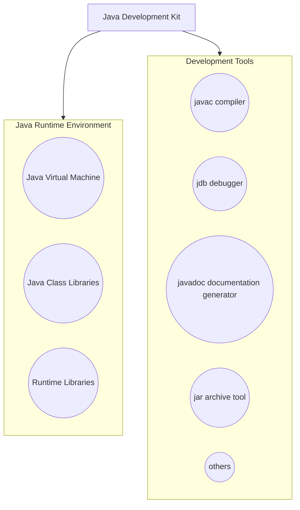
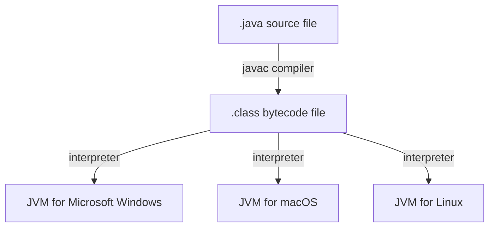
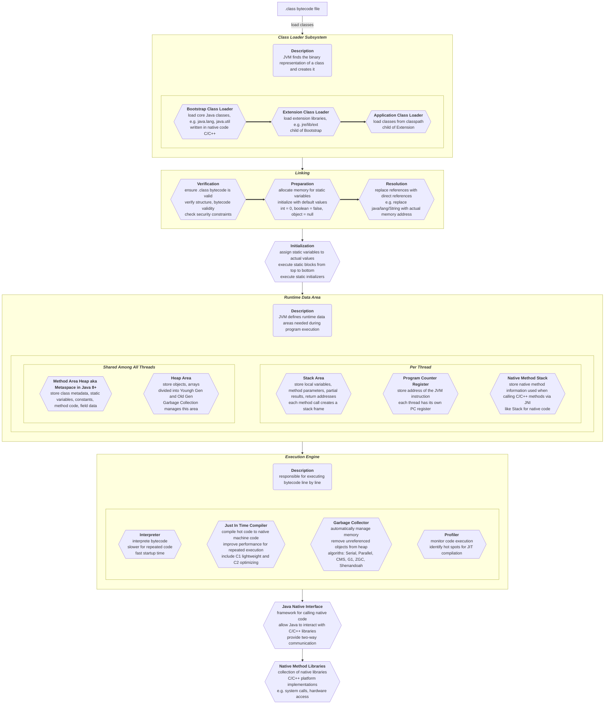

# Title: Java Notes

# Author: Caesar James LEE

## 000. Java Info

### Overview

* a **high-level**, **object-oriented**, **platform-independent** language created by `Sun Microsystems`(later acquired by `Oracle`)
* designed to `Write Once, Run Anywhere` (`WORA`) - meaning compiled Java code can run on **any device with a `Java Virtual
  Machine`(`JVM`)

### Compare With `C++`

| property | `C++` | `Java` |
| :-: | :-: | :-: |
| `compilation` | compile to **machine code** | compile to **bytecode** |
| `system independent` | ❌ different machine code across OS | ✔️ by `JVM` |
| `execution` | **directly** by `OS` | by `JVM` |
| `inheritance`  | single and multiple(`virtual`) | single **only**(multiple via `interface`) |
| `pointers` | ✔️ support | ❌ only `references` |
| `memory management` | manual(`new`/`delete`) | automatic(`garbage collector`) |
| `global scope` | ✔️ support | ❌ **not** support |
| `goto` | ✔️ support | ❌ exist but **not** implemented |
| `operator overloading` | support(except `.`,`::`,`.*`,`?:`,`sizeof`) | **not** support |
| `template` | `timeplate`(**compile-time**) | `generics`(**runtime**, **type erasure**) |
| `structs` | ✔️ support | ❌ **not** support(can use `inner class`) |
| `default argument` | ✔️ support | ❌ **not** support |
| `constant` | `const` | `final` |
| `unsigned types` | ✔️ support | ❌ **only** signed |
| `argument passing ways` | `pass by value` and `pass by reference` | **only** `pass by value` |
| `friend functions` | ✔️ support | ❌ **not** support |
| `union` | ✔️ support | ❌ **not** support |
| `access modifies` | `public`, `private`(**default**), `protected` | plus ` `(ignore, **default**) |

### History

#### Before Releasing

| year | even |
| :-: | :-: |
| `1991` | start `Green Project` |
| `1992` | develop a prototype named `Oak` from a tree outside `James Gosling`'s office |
| `1994` | `Oak` evolves into a language for the internet era |
| | create `WebRunner`(first `Java` browser) |
| `1995` | `Oak` renamed `Java` that inspired by `Java coffee` |
| `May 23, 1995` | offically released at `SunWorld conference` |

#### After Releasing

| version | year | highlight |
| :-: | :-: | :-: |
| `JDK 1.0` | `1996` | `applets`, `AWT`, basic APIs |
| `JDK 1.1` | `1997` | `inner classes`, `JavaBeans`, `JDBC`, `RMI`, reflection |
| `J2SE 1.2` | `1998` | `Swing`, `collections framework`, `JIT compiler`, `strictfp` |
| `J2SE 1.3` | `2000` | `HotSpot JVM`, `JNDI`, `JavaSound`, dynamic proxies |
| `J2SE 1.4` | `2002` | `assert`, `NIO`, `logging`, `XML parser`, `regex`, exception chaining, `preferences` |
| `J2SE 5.0` | `2004` | generics, annotations, `enum`s, autoboxing/unboxing |
| | | `foreach`, `varargs`, `java.util.concurrent` |
| `Java SE 6` | `2006` | `JSR 223`, performance improvements, `JDBX 4.0` |
| | | `@Override` on `interface` methods, `Compiler` |
| `Java SE 7` | `2011` | try-with-resources, diamond operator `<>`, `NIO.2`, `switch` on `String`s |
| | | `fork`/`join` framework, binary literals, underscores in numeric literals |
| 📍 `Java SE 8` | `2014` | `lambda`, `stream`, `Date`/`Time`, default methods in `interface`s |
| | | `Optional`, method references, `CompletableFuture`, `Nashorn JavaScript engine` |
| `Java SE 9` | `2017` | `module` system, `JShell`, `private` methods in `interface`s |
| | | reactive `Stream`s, improved `javadoc`, factory methods for `Collection`s |
| `Java SE 10` | `2018` | local `var`, application `Class-Data` sharing, `Parallel` Full GC for G1 |
| 📍 `Java SE 11` | `2018` | `var` in `lambda` parameters, new `HttpClient`, remove `JavaFX` and `Java EE` |
| | | new `String` methods, `Epsilon GC`, `flight` recorder |
| `Java SE 12` | `2019` | `switch` expressions(preview), `Shenandoah GC`, `Microbenchmark` suite |
| `Java SE 13` | `2019` | text blocks(preview), `switch` epxpressions(2nd preview) |
| | | dynamic `CDS` archives |
| `Java SE 14` | `2020` | `Record`s(preview), `pattern matching` for `instance of`(preview) |
| | | `switch expression`(standard), `NullPointerException` |
| `Java SE 15` | `2020` | `Sealed` classes(preview), text blocks(standard), `Record`s(2nd preview) |
| | | hidden classes, `Edwards-Curve Digital Signature Algorithm` |
| `Java SE 16` | `2021` | `Record`s(standard), `pattern matching` for `instance of`(standard) |
| | | `Sealed` classes(2nd preview), `Unix`-domain socket channels |
| 📍 `Java SE 17` | `2021` | `Sealed` classes(standard), new `macOS` rendering pipeline |
| | | enhanced `pseudo-random` number generator, remove `RMI` activation |
| | | strongly encapsulate `JDK` intrernals |
| `Java SE 18` | `2022` | simple web server, **default** `UTF-8` charset, code snippets in `javadoc` |
| | | `Vector`(3rd incubator), deprecate `finalize` |
| `Java SE 19` | `2022` | virtual threads(preview), `Record` pastterns(preview) |
| | | `pattern matching` for `switch`(3rd preview), structured concurrency(incubato r) |
| | | `Foreign Function` and `Memory`(preview) |
| `Java SE 20` | `2023` | scoped values, `Record` patterns(2nd preview) |
| | | `pattern matching` for `switch`(4th preiview), virutal threads(2nd preview) |
| | | `structured concurrency(2nd incubator)` |
| 📍 `Java SE 21` | `2023` | virtual threads(standard), sequenced collections |
| | | `pattern matching` for `switch`(standard), `String` templates(preview) |
| | | generational `ZGC`, `Key Encapsulation Mechanism` |
| `Java SE 22` | `2024` | unnamed variables & patterns(standard), statements before `super`(preview) |
| | | `String` templates(2nd preview),scoped values(preview) |
| | | `Stream` gatherers(preview), structured concurrency(preview) |
| `Java SE 23` | `2024` | primitive types in `patterns`, `instanceof` and `switch`(preview) |
| | | module import declarations(preview), flexible constructor bodies(2nd preview) |
| | | `markdown` documentation comments, deprecate `sum.misc.Unsafe` memory-access methods |

`📍` means `L`ong `T`erm `S`upport versions

### Versions

| version | meaning | purpose |
| :-: | :-: | :-: |
| `JSE(Java Standard Edition)` | `core` | desktop, general-purpose applications |
| `JEE(Java Enterprise Edition)` | `enterprise` | web, server, business applications |
| `JME(Java Micro Edition)` | `embedded` | mobile, embedded devices |

### `JDK` vs `JRE` vs `JVM`

| term | description |
| :-: | :-: |
| `JVM(Java Virtual Machine)` | execute java bytecode |
| `JRE(Java Runtime Environment)` | include `JVM` and libraries |
| `JDK(Java Devekioment Kit)` | include compiler, tools and `JRE` |

### Compilation and Execution Process

### `JDK` Architecture

