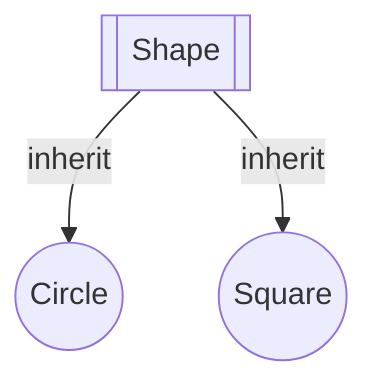

# Title: Java Notes

# Author: Caesar James LEE

## 011. `OOP` (`Object Oriented Programming`)

* `Java` is an `OOP` language — it models programs using real-world concepts as `objects`

### `class`

* a `class` is a **blueprint** or **template** that defines the structure and behavior (fields and methods) of **objects**
* define **what** an object is and **how** it behaves
* a class does **not occupy memory** until it is **instantiated** with `new`
* all `Java` code must be written inside a **class**
* **capitalize** the **first letter** of a `class name`

#### syntax

```java
    [accessModifier] [static] class className{
        //statements
    }
```

#### example

```java
    public class Main{
        //statements
    }
```

### `object`

* a **real instance** of a `class`
* occupy **memory** and has its own `fields` and `methods`

#### syntax

```java
    ClassName objectName = new ClassName([constructorParameters]);
```

#### example

```java
    Scanner scanner = new Scanner(System.in);//create scanner object from Scanner class to scan data from console using `Scanner(System.in)` constructor
```

### `field` aka `member variable`

* variables declared **inside** a `class`, but **outside** any `method`
* represent the **state** or **attributes** of a class or object
* keywords
    1. `static`: belong to the `class`
    2. `non-static`: belong to an `instance`
    3. `final`: value **cannot change** after initialization

#### syntax

```java
    [accessModifier] [static] [final] dataType fieldName [=initialValue];
```

#### example

```java
    class Dog{
        static final int normalHeadNumber = 1;//constant class field
        static final int normalLimbNumber = 4;//constant class field
        static String defaultName = "dog";//mutable class field
        int headNumber = normalHeadNumber;//instance field
        int limbNumber = normalLimbNumber;//instance field
        String name = defaultName;//instance field
    }

    public class Main{
        public static void main(String [] args){
            System.out.println("a normal dog's number of head:\t" + Dog.normalHeadNumber);
            System.out.println("a normal dog's number of limbs:\t" + Dog.normalLimbNumber);

            Dog.defaultName = "puppy";
            System.out.println("default name of a dog:\t" + Dog.defaultName);

            Dog dog = new Dog();
            dog.name = "cae";
            dog.headNumber = 2;
            dog.limbNumber = 3;
            System.out.println("my dog's name:\t" + dog.name);
            System.out.println("my dog's number of head:\t" + dog.headNumber);
            System.out.println("my dog's number of limbs:\t" + dog.limbNumber);
        }
    }
```

### `method`

* functions define inside a `class`, used to describe behavior
* keywords
    1. `static`: belong to the `class`
    2. `non-static`: belong to the object
    3. `final`: cannot `overridden` by `subclasses`

#### syntax

```java
    [accessModifier] [static] [final] returnType methodName([parameters]){
        //statements;
        [return data];
    }
```

#### example

```java
    class Dog{
        static final int normalHeadNumber = 1;
        static final int normalLimbNumber = 4;
        static String defaultName = "dog";
        int headNumber = normalHeadNumber;
        int limbNumber = normalLimbNumber;
        String name = defaultName;

        static void printNormalHeadNumber(){//belong to the class
            System.out.println(defaultName + "'s number of head:\t" + normalHeadNumber);
        }

        static void printNormalLimbNumber(){
            System.out.println(defaultName + "'s number of limbs:\t" + normalLimbNumber);
        }

        final void printDefaultName(){//cannot be overridden by subclasses
            System.out.println("default name of a dog:\t" + defaultName);
        }

        void printName(){//belong to an object
            System.out.println("your dog's name is:\t" + this.name);
        }

        void printHeadNumber(){
            System.out.println("your dog's number of head is:\t" + this.headNumber);
        }

        void printLimbNumber(){
            System.out.println("your dog's number of limbs is:\t" + this.limbNumber);
        }
    }

    public class Main{
        public static void main(String [] args){
            Dog.printNormalHeadNumber();
            Dog.printNormalLimbNumber();

            Dog.defaultName = "puppy";
            Dog dog = new Dog();
            dog.name = "cae";//see
            dog.headNumber = 2;
            dog.limbNumber = 3;

            dog.printDefaultName();
            dog.printName();
            dog.printHeadNumber();
            dog.printLimbNumber();
        }
    }
```

### `access modifiers`

* control the **visibility** || **accessibility** of **classes**, **fields**, **constructors**, and **methods**
* `Java` provides `4` types (`public`, `private`, `protected`, `default`) of `access modifiers`
* `default` means no modifier is written

| modifier      | same class    | smae package  | subclass (outside package)    | world  |
| :-----------: | :-----------: | :-----------: | :---------------------------: | :----: |
| `private`     | ✅           | ❌            | ❌                           | ❌     |
| `default`     | ✅           | ✅            | ❌                           | ❌     |
| `protected`   | ✅           | ✅            | ✅                           | ❌     |
| `public`      | ✅           | ✅            | ✅                           | ✅     |

#### example

##### project structure

```
    org.example/
    ├── Main.java
    ├── Lion.java
    └── animals/
        ├── Animal.java
        ├── Cat.java
        └── Dog.java
```

##### code

* `Animal.java`

```java
    package org.example.animals;

    public class Animal{
        private String privateField = "this is a private field";
        String defaultField = "this is a default field";
        protected String protectedField = "this is a protected field";
        public String publicField = "this is a public field";

        private void privatePrint(){
            System.out.println("this is a private print method");
        }

        void defaultPrint(){
            System.out.println("this is a default print method");
        }

        protected void protectedPrint(){
            System.out.println("this is a protected print method");
        }

        public void publicPrint(){
            System.out.println("this is a public print method");
        }

        public void printResult(){
            System.out.println("private field:\t" + this.privateField);
            System.out.println("default field:\t" + this.defaultField);
            System.out.println("protected field:\t" + this.protectedField);
            System.out.println("public field:\t" + this.publicField);

            this.privatePrint();
            this.defaultPrint();
            this.protectedPrint();
            this.publicPrint();
        }
    }
```

* `Cat.java`

```java
    package org.example.animals;

    public class Cat extends Animal{
        @Override
        public void printResult(){
            //System.out.println("private field:\t" + this.privateField);
            System.out.println("default field:\t" + this.defaultField);
            System.out.println("protected field:\t" + this.protectedField);
            System.out.println("public field:\t" + this.publicField);

            //this.privatePrint();
            this.defaultPrint();
            this.protectedPrint();
            this.publicPrint();
        }
    }
```

* `Dog.java`

```java
    package org.example.animals;

    public class Dog{
        public void printResult() {
            Animal animal = new Animal();
            //System.out.println("private field:\t" + animal.privateField);
            System.out.println("default field:\t" + animal.defaultField);
            System.out.println("protected field:\t" + animal.protectedField);
            System.out.println("public field:\t" + animal.publicField);

            //animal.privatePrint();
            animal.defaultPrint();
            animal.protectedPrint();
            animal.publicPrint();
        }
    }
```

* `Lion.java`

```java
    package org.example;

    import org.example.animals.Animal;

    public class Lion extends Animal{
        @Override
        public void printResult() {
            //System.out.println("private field:\t" + this.privateField);
            //System.out.println("default field:\t" + this.defaultField);
            System.out.println("protected field:\t" + this.protectedField);
            System.out.println("public field:\t" + this.publicField);

            //this.privatePrint();
            //this.defaultPrint();
            this.protectedPrint();
            this.publicPrint();
        }
    }
```

* `Main.java`

```java
    package org.example;

    import org.example.animals.Animal;
    import org.example.animals.Cat;
    import org.example.animals.Dog;

    public class Main{
        public static void main(String [] args){
            System.out.println("same class - all :\n");
            Animal animal = new Animal();
            animal.printResult();
            System.out.println("\n---\n");

            System.out.println("an object inside the same package - no private:\n");
            Dog dog = new Dog();
            dog.printResult();
            System.out.println("\n---\n");

            System.out.println("a subclass inside the same package - no private:\n");
            Cat cat = new Cat();
            cat.printResult();
            System.out.println("\n---\n");

            System.out.println("a subclass outside the package - no private, default:\n");
            Lion lion = new Lion();
            lion.printResult();
            System.out.println("\n---\n");

            System.out.println("a class outside the package - no private, default, protected:\n");
            System.out.println("public field:\t" + animal.publicField);
            animal.publicPrint();
            System.out.println("\n---\n");
        }
    }
```

* result table

| class                                 | `private` | `default` | `protected`   | `public`  |
| :-----------------------------------: | :-------: | :-------: | :-----------: | :-------: |
| same class (`Animal`)                 | ✅       | ✅       | ✅            | ✅        |
| same package (`Dog`)                  | ❌       | ✅       | ✅            | ✅        |
| subclass same package (`Cat`)         | ❌       | ✅       | ✅            | ✅        |
| subclass different package (`Lion`)   | ❌       | ❌       | ✅            | ✅        |
| external class (`Main`)               | ❌       | ❌       | ❌            | ✅        |

### `encapsulation`

* one of the `4` main pillars of `OOP` (`encapsulation`, `inheritance`, `polymorphism`, `abstraction`)
* **encapsulate** `fields` and `methods` into a single unit: a `class`
* restrict **direct access** to internal data using **access modifiers**
* typically use `private` fields + `public` `getters` && `setters`
* improve **security**, **data integrity**, and **code maintainability**

#### syntax

```java
    class ClassName{
        private dataType fieldName;

        public ClassName(){//empty constructor
            this.fieldName = defaultValue;
        }

        public ClassName(dataType fieldName){//constructor with parameter(s)
            this.fieldName = fieldName;
        }

        public void setFieldName(dataType fieldName){//setter
            this.fieldName = fieldName;
        }

        public dataType getFieldName(){//getter
            return this.fieldName;
        }
    }
```

#### example

* `Circle.java`

```java
    public class Circle{
        private double radius;

        //constructors
        public Circle(){
            this.radius = 0.0;
        }

        public Circle(double radius){
            this.radius = radius;
        }

        //setter
        public void setRadius(double radius){
            this.radius = radius;
        }

        //getters
        public double getRadius(){
            return this.radius;
        }

        public double getCircumference(){
            return 2.0 * Math.PI * this.radius;
        }

        public double getArea(){
            return Math.PI * this.radius * this.radius;
        }
    }
```

* `Main.java`

```java
    public class Main{
        public static void main(String [] args){
            Circle circle = new Circle();
            System.out.printf(
                "empty constructor:\nradius:\t%f\ncircumference:\t%f\narea:\t%f\n",
                circle.getRadius(),
                circle.getCircumference(),
                circle.getArea()
            );

            circle.setRadius(1.2);
            System.out.printf(
                "using setter:\nradius:\t%f\ncircumference:\t%f\narea:\t%f\n",
                circle.getRadius(),
                circle.getCircumference(),
                circle.getArea()
            );

            Circle circle1 = new Circle(3.2);
            System.out.printf(
                "constructor with one parameter:\nradius:\t%f\ncircumference:\t%f\narea:\t%f\n",
                circle1.getRadius(),
                circle1.getCircumference(),
                circle1.getArea()
            );
        }
    }
```

### `inheritance`

* one of the `4` main pillars of `OOP` (`encapsulation`, `inheritance`, `polymorphism`, `abstraction`)
* allow a `class` to **inherit** fields and methods from another class
* promote **code reuse**, **organization**, and **hierarchical relationships**
* keywords

| keyword       | usage                                                                 |
| :-----------: | :-------------------------------------------------------------------: |
| `extends`     | a `class` to inherit from a **class** (**single inheritance only**)   |
| `implements`  | a `class` to implement **one or more** **interfaces**                 |

---

| feature           | `extends`                         | `implements`                                         |
| :---------------: | :-------------------------------: | :--------------------------------------------------: |
| used for          | class $\rightarrow$ class         | class $\rightarrow$ interface(s)                     |
| relationship      | "is-a" relationship               | "can-do" or "has behavior" relationship              |
| inheritance type  | **single only** (1 superclass)    | multiple (can implement many interfaces)             |
| purpose           | inherit fields and methods        | promise to implement abstract method contracts       |

* types
  * `single inheritance`: one `superclass` -> `subclass`
  * `multilevel inheritance`: `Class0` -> `Class1` -> `Class2`
  * `hierarchical inheritance`: one `superclass` -> multiple `subclasses`
  * `interface`: multiple `superclasses` -> one `subclass`
* we **cannot define** methods in an `interface`, we have to define (`override`) it in a subclass

#### syntax

* `extends`

```java
    class ParentClassName{
        //statements
    }

    class SubclassName extends ParentClassName{//only one
        //statements
    }
```

* `implements`

```java
    interface InterfaceName0{
        //statements;
    }

    interface InterfaceName1{
        //statements;
    }

    class SubclassName implements InterfaceName0, InterfaceName1{
        //statements;
    }
```

#### example

* project structure

```
    org.example.life
        ├── animals
        │   ├── Born.java
        │   ├── Grow.java
        │   ├── Die.java
        │   ├── Animal.java
        │   ├── Human.java
        │   └── Frog.java
        └── Main.java
```

* code

* `animals/Born.java`

```java
    package org.example.animals;

    public interface Born{
        void born();
        String getReproductionWay();
    }
```

* `animals/Grow.java`

```java
    package org.example.animals;

    public interface Grow{
        void grow();
        boolean isHolometabolism();
    }
```

* `animals/Die.java`

```java
    package org.example.animals;

    public interface Die{
        void die();
    }
```

* `animals/Animal.java`

```java
    package org.example.animals;

    public class Animal implements Born, Grow, Die{
        protected String species;

        public Animal(String species){
            this.species = species;
        }

        @Override
        public void born(){
            System.out.println(this.species + " is born");
        }

        @Override
        public void grow(){
            System.out.println(this.species + " is growing");
        }

        @Override
        public String getReproductionWay(){
            return "";
        }

        @Override
        public boolean isHolometabolism(){
            return false;
        }

        @Override
        public void die(){
            System.out.println(this.species + " is passing away");
        }
    }
```

* `animals/Human.java`

```java
    package org.example.animals;

    public class Human extends Animal{
        public Human(String species){
            super(species);
        }

        @Override
        public String getReproductionWay(){
            return "Viviparous";
        }

        @Override
        public boolean isHolometabolism(){
            return false;
        }
    }
```

* `animals/Frog.java`

```java
    package org.example.animals;

    public class Frog extends Animal{
        public Frog(String species){
            super(species);
        }

        @Override
        public String getReproductionWay(){
            return "Oviparous";
        }

        @Override
        public boolean isHolometabolism(){
            return true;
        }
    }
```

* `Main.java`

```java
    package org.example;

    import org.example.animals.Frog;
    import org.example.animals.Human;

    public class Main{
        public static void main(String [] args){
            Human human = new Human("human being");
            Frog frog = new Frog("frog");

            System.out.println("human part:");
            human.born();
            human.grow();
            human.die();
            System.out.println("human's reproduction way:\t" + human.getReproductionWay());
            System.out.println("is human holometabolism" + human.isHolometabolism());

            System.out.println("frog part:");
            frog.born();
            frog.grow();
            frog.die();
            System.out.println("frog's reproduction way:\t" + frog.getReproductionWay());
            System.out.println("is frog holometabolism" + frog.isHolometabolism());
        }
    }
```

### `abstraction`

* one of the `4` main pillars of `OOP` (`encapsulation`, `inheritance`, `polymorphism`, `abstraction`)
* **hide implementation details** and only show **essential features**
* provide a clear **interface** while hiding complex logic
* increase **readability**, **flexibility**, and **scalability**
* `2` ways to achieve `abstraction` in `Java`:
    1. **abstract classes**
    2. **interfaces**

#### abstract classes

* declared using `abstract` keyword
* cannot be instantiated directly
* can contain:
    * `abstract methods` (no body)
    * `concrete methods` (with body)
    * `fields`
    * `constructors`

##### syntax

* superclass

```java
    abstract class SuperclassName{
        accessModifier dataType fieldName;

        public SuperclassName(dateType fieldName){
            this.fieldName = fieldName;
        }

        accessModifier abstract returnType abstractMethodName([parameters]);

        accessModifier returnType methodName([parameters]){
            //statements
            [return dataName;]
        }
    }
```

* subclass

```java
    class subclassName extends SuperclassName{
        public SubclassName(dateType fieldName){
            super(fieldName);
        }

        @Override
        accessModifier returnType abstractMethodName([parameters]){
            //statements;
            [return dataName];
        }
    }
```

##### example

* inheritance relationship



* codes

* `Shape.java`

```java
    public abstract class Shape{
        protected String shapeName;

        public Shape(String shapeName){
            this.shapeName = shapeName;
        }

        public abstract double getCircumference();
        public abstract double getArea();

        public String getShapeName(){
            return this.shapeName;
        }
    }
```

* `Circle.java`

```java
    public class Circle extends Shape{
        private double radius;

        public Circle(){
            super("Circle");
            this.radius = 0.0;
        }
        public Circle(double radius){
            super("Circle");
            this.radius = radius;
        }

        @Override
        public double getCircumference(){
            return 2 * Math.PI * this.radius;
        }

        @Override
        public double getArea(){
            return Math.PI * this.radius * this.radius;
        }
    }
```

* `Square.java`

```java
    public class Square extends Shape{
        private double side;

        public Square(){
            super("Square");
            this.side = 0.0;
        }

        public Square(double side){
            super("Square");
            this.side = side;
        }
        @Override
        public double getCircumference(){
            return 4 * this.side;
        }

        @Override
        public double getArea(){
            return this.side * this.side;
        }
    }
```

* `Main.java`

```java
    public class Main{
        public static void main(String [] args){
            Circle circle = new Circle();
            System.out.printf(
                "circle with radius 0's shape name:\t%s\nits circumference:\t%f\nits area:\t%f\n",
                circle.getShapeName(),
                circle.getCircumference(),
                circle.getArea()
            );

            Circle circle1 = new Circle(1.2);
            System.out.printf(
                "circle with radius 1.2's shape name:\t%s\nits circumference:\t%f\nits area:\t%f\n",
                circle1.getShapeName(),
                circle1.getCircumference(),
                circle1.getArea()
            );

            Square square = new Square();
            System.out.printf(
                "square with side 0's shape name:\t%s\nits circumference:\t%f\nits area:\t%f\n",
                square.getShapeName(),
                square.getCircumference(),
                square.getArea()
            );

            Square square1 = new Square(1.2);
            System.out.printf(
                "square with side 1.2's shape name:\t%s\nits circumference:\t%f\nits area:\t%f\n",
                square1.getShapeName(),
                square1.getCircumference(),
                square1.getArea()
            );
        }
    }
```

#### interfaces

* declare using `interface` keyword
* can only contain:
    1. `abstract methods`
    2. `constants` (`public static final`)
* a `class` can implement **multiple** `interfaces` (`multiple inheritance`)
* used to define capabilities or behaviors

##### syntax

```java
    interface InterfaceName{
        returnType methodName([parameters]);
    }
```

##### example

* `Shape.java`

```java
    public interface Shape{
        double getCircumference();
        double getArea();
        String getShapeName();
        String getName();

        void setName(String name);
    }
```

* `Circle.java`

```java
    public class Circle implements Shape{
        private double radius;
        private final String shapeName = "Circle";
        private String name;

        public Circle(){
            this.setName("");
            this.setRadius(0.0);
        }

        public Circle(String name){
            this.setName(name);
            this.setRadius(0.0);
        }

        public Circle(double radius){
            this.setName("");
            this.setRadius(radius);
        }

        public Circle(double radius, String name){
            this.setName(name);
            this.setRadius(radius);
        }

        public double getRadius(){
            return this.radius;
        }

        @Override
        public double getCircumference(){
            return 2 * Math.PI * this.radius;
        }

        @Override
        public double getArea(){
            return Math.PI * this.radius * radius;
        }

        @Override
        public String getShapeName(){
            return this.shapeName;
        }

        @Override
        public String getName(){
            return this.name;
        }

        public void setRadius(double Radius){
            this.radius = radius;
        }

        @Override
        public void setName(String name){
            this.name = name;
        }
    }
```

* `Square.java`

```java
    public class Square implements Shape{
        private double side;
        private final String shapeName = "Square";
        private String name;

        public Square(){
            this.setName("");
            this.setSide(0.0);
        }

        public Square(String name){
            this.setName(name);
            this.setSide(0.0);
        }


        public Square(double side){
            this.setName("");
            this.setSide(side);
        }


        public Square(double side, String name){
            this.setName(name);
            this.setSide(side);
        }


        public double getSide(){
            return this.side;
        }

        @Override
        public double getCircumference(){
            return 4 * this.side;
        }

        @Override
        public double getArea(){
            return this.side * this.side;
        }

        @Override
        public String getShapeName(){
            return this.shapeName;
        }

        @Override
        public String getName(){
            return this.name;
        }

        public void setSide(double side){
            this.side = side;
        }

        @Override
        public void setName(String name){
            this.name = name;
        }
    }
```

* `Main.java`

```java
    public class Main{
        public static void main(String [] args){
            Circle circle = new Circle();
            System.out.printf(
                "circle with radius 0's shape name:\t%s\nits circumference:\t%f\nits area:\t%f\n",
                circle.getShapeName(),
                circle.getCircumference(),
                circle.getArea()
            );

            Circle circle1 = new Circle(1.2);
            System.out.printf(
                "circle with radius 1.2's shape name:\t%s\nits circumference:\t%f\nits area:\t%f\n",
                circle1.getShapeName(),
                circle1.getCircumference(),
                circle1.getArea()
            );

            Square square = new Square();
            System.out.printf(
                "square with side 0's shape name:\t%s\nits circumference:\t%f\nits area:\t%f\n",
                square.getShapeName(),
                square.getCircumference(),
                square.getArea()
            );

            Square square1 = new Square(1.2);
            System.out.printf(
                "square with side 1.2's shape name:\t%s\nits circumference:\t%f\nits area:\t%f\n",
                square1.getShapeName(),
                square1.getCircumference(),
                square1.getArea()
            );
        }
    }
```

#### `abstract classes` vs `interface`

| feature              | `abstract class`       | `interface`               |
| :------------------: | :--------------------: | :-----------------------: |
| constructors allowed | ✅                    | ❌                        |
| fields               | **any** type           | **constant only**         |
| method types         | abstract + concrete    | abstract                  |
| inheritance          | `single inheritance`   | `multiple inheritance`    |
| usage                | "is-a" relationship    | "can-do" relationship     |

### `record classes`

* introduced in `Java 14` (preview), became **official** in `Java 16`
* a **concise way** to declare **immutable data carriers**
* automatically generate:
    * `constructor`
    * `getters`
    * `equals()`
    * `hashCode()`
    * `toString()`
* used for **simple** classes that **only store data**
* used cases
    1. `DTOs` (`Data Transfer Objects`)
    2. **read-only** `settings` || `configs`
    3. **coordinates**, **points**, **pairs**, **key-value entries**
    4. grouping **simple values** without creating full-blown classes
* a kind of `final classes`, which means the class couldn't change

#### syntax

```java
    public record RecordName(dataType fieldName...){
        //statements
    }
```

#### example

* `CartesianCoordinate`

    ```java
        public record CartesianCoordinate(double x, double y){
            public double getDistanceFromOriginPoint(){
                return Math.sqrt(this.x * this.x + this.y * this.y);
            }

            public String getPosition(){
                return switch(String.format("(%s, %s)", Integer.signum((int)this.x), Integer.signum((int)this.y))){
                    case "(0, 0)" -> "origin point";
                    case "(0, 1)", "(0, -1)" -> "x-axis";
                    case "(1, 0)", "(-1, 0)" -> "y-axis";
                    case "(1, 1)" -> "Quadrant I";
                    case "(-1, 1)" -> "Quadrant II";
                    case "(-1, -1)" -> "Quadrant III";
                    case "(1, -1)" -> "Quadrant IV";
                    default -> "unknown";
                };
            }

            @Override
            public String toString(){
                return String.format("(%s, %s)", this.x, this.y);
            }
        }
    ```

* `Main`
    
    ```java
        public class Main{
            public static void main(String [] args){
                CartesianCoordinate cartesianCoordinate = new CartesianCoordinate(1, 2);
                System.out.println("coordinate:\t" + cartesianCoordinate);
                System.out.println("its distance from origin point:\t" + cartesianCoordinate.getDistanceFromOriginPoint());
                System.out.println("its position:\t" + cartesianCoordinate.getPosition());
                //cartesianCoordinate.x = 0; you cannot change a final field
                //cartesianCoordinate.y() = 0;
                System.out.println("its x value:\t" + cartesianCoordinate.x());
                System.out.println("its y value:\t" + cartesianCoordinate.y());
                System.out.println("is the point in origin point:\t" + cartesianCoordinate.equals(new CartesianCoordinate(0, 0)));
            }
        }
    ```

### `instanceof`

* used to **check if an object is an instance of a specific class or interface**
* return `true` if the object is `not null` and is an `instance` of the **specified type** (or its `subclass` / `implementation`)
* useful for **type checking** before **downcasting**
* since `Java 16`, supports **pattern matching** with **type binding**

#### syntax

```java
    object instanceof ClassNameOrInterfaceName;//return a boolean value

    if(object instanceof ClassName){//pattern matching

    }
```

#### example

* `Shape.java`:

```java
    public abstract class Shape{
        protected String kind;

        public Shape(String kind){
            this.kind = kind;
        }

        public abstract double getCircumference();
        public abstract double getArea();
        public String getKind(){
            return this.kind;
        }
    }
```

* `Circle.java`:

```java
    public class Circle extends Shape{
        private double radius;

        public Circle(){
            super("Circle");
            this.setRadius(0.0);
        }

        public Circle(double radius){
            super("Circle");
            this.setRadius(radius);
        }

        public void setRadius(double radius){
            this.radius = radius;
        }

        @Override
        public double getCircumference() {
            return 2 * Math.PI * this.radius;
        }

        @Override
        public double getArea() {
            return Math.PI * this.radius * this.radius;
        }
    }
```

* `Rectangle.java`:

```java
    public class Rectangle extends Shape{
        private double length;
        private double width;

        public Rectangle(){
            super("Rectangle");
            this.setLength(0.0);
            this.setWidth(0.0);
        }

        public Rectangle(double side){
            super("Rectangle");
            this.setLength(side);
            this.setWidth(side);
        }

        public Rectangle(double length, double width){
            super("Rectangle");
            this.setLength(length);
            this.setWidth(width);
        }

        public void setLength(double length){
            this.length = length;
        }

        public void setWidth(double width) {
            this.width = width;
        }

        @Override
        public double getCircumference() {
            return 2 * (this.length + this.width);
        }

        @Override
        public double getArea() {
            return this.length * this.width;
        }
    }
```

* `Main.java`:

```java
    public class Main{
        public static void main(String [] args){
            Circle circle = new Circle(1.2);
            System.out.println("is circle an instance of Circle:\t" + (circle instanceof Circle));
            //System.out.println("is circle an instance of Rectangle:\t" + (circle instanceof Rectangle));  cannot cast Circle to Rectangle
            System.out.println("is circle an instance of Shape:\t" + (circle instanceof Shape));
            if(circle instanceof Circle){
                System.out.println("I'm a circle");
            }else if(circle instanceof Shape){
                System.out.println("at least I'm a shape");
            }else{
                System.out.println("kidding me?");
            }
        }
    }
```

### object castings

* convert a reference of one type into another type in an **inheritance hierarchy**
* `2` types:
    1. **upcasting**: `subclass` $\Rightarrow$ `superclass` (**safe**, **implicit**)
    2. **downcasting**: `superclass` $\Rightarrow$ `subclass` (**unsafe**, **need** `instanceof` check)

#### syntax

```java
    SuperClass superclassObjectName = new SubClass();//upcasting(safe), like List <Integer> nums = ArrayList <>();

    SubClass subclassObjectName;
    if(subclassObjectName instanceof SuperClass){
        subclassObjectName = (SubClass)superclassObjectName;//downcasting(risky, need instanceof check)
    }
```

#### example

* `Shape.java`

```java
    public class Shape{
        protected String kind;

        public Shape(String kind){
            this.kind = kind;
        }

        public String getKind(){
            return this.kind;
        }
    }
```

* `Circle.java`

```java
    public class Circle extends Shape{
        private double radius;

        public Circle(){
            super("Circle");
            this.setRadius(0.0);
        }

        public Circle(double radius){
            super("Circle");
            this.setRadius(radius);
        }

        public void setRadius(double radius){
            this.radius = radius;
        }

        public double getCircumference() {
            return 2 * Math.PI * this.radius;
        }

        public double getArea() {
            return Math.PI * this.radius * this.radius;
        }
    }
```

* `Rectangle.java`

```java
    public class Rectangle extends Shape{
        private double length;
        private double width;

        public Rectangle(){
            super("Rectangle");
            this.setLength(0.0);
            this.setWidth(0.0);
        }

        public Rectangle(double side){
            super("Rectangle");
            this.setLength(side);
            this.setWidth(side);
        }

        public Rectangle(double length, double width){
            super("Rectangle");
            this.setLength(length);
            this.setWidth(width);
        }

        public void setLength(double length){
            this.length = length;
        }

        public void setWidth(double width) {
            this.width = width;
        }

        public double getCircumference() {
            return 2 * (this.length + this.width);
        }

        public double getArea() {
            return this.length * this.width;
        }
    }
```

* `Main.java`

```java
    public class Main{
        public static void main(String [] args){
            Shape shape = new Circle(1.2);//upcasting, Circle -> Shape, subclass -> superclass
            System.out.println("the shape's kind:\t" + shape.getKind());

            Shape shape1 = new Rectangle();
            if(shape1 instanceof Rectangle){
                Rectangle rectangle = (Rectangle)shape1;//downcasting, Shape -> Rectangle, superclass -> subclass
                System.out.println("shape1 is an instance of Rectangle");
                System.out.println("rectangle's getCircumference:\t" + rectangle.getCircumference());
            }else{
                System.out.println("shape1 is not an instance of Rectangle");
                System.out.println("shape1's kind:\t" + shape1.getKind());
            }
        }
    }
```

### `package`

* a `namespace` that **organizes** classes and interfaces into a **folder-like structure**
* benefits
    1. avoid **naming conflicts**
    2. group **related classes**
    3. **control access** using access modifiers
    4. enable **modular programming**

#### types

| type          | example       |
| :-----------: | :-----------: |
| built-in      | `java.util`   |
| user-defined  | `org.example` |

#### syntax

1. define package

    ```java
        package packageName;
    ```

2. import from a package

    ```java
        import packageName.ClassName;//import a specific class

        import packageName.*;//import everything in a specific package

        import static packageName.ClassName.fieldName;//import a static field
    ```

#### example

* project structure

```
    org.example
    ├── constantNumbers
    │   └── PhysicsConstantNumber.java
    └── Main.java
```

* `PhysicsConstantNumber.java`

    ```java
        package org.example.constantNumbers;

        public class PhysicsConstantNumber{
            public static final double speedOfLightInVacuum = 299_792_458;
            public String getSpeedOfLightInVacuumWithUnit(){
                return PhysicsConstantNumber.speedOfLightInVacuum + " m/s";
            }
        }
    ```

* `Main.java`

    ```java
        package org.example;

        import static org.example.constantNumbers.PhysicsConstantNumber.speedOfLightInVacuum;
        import org.example.constantNumbers.PhysicsConstantNumber;

        public class Main{
            public static void main(String [] args){
                System.out.println("number of speed of light in vacuum:\t" + speedOfLightInVacuum);//you don't need type its ClassName
                PhysicsConstantNumber physicsConstantNumber = new PhysicsConstantNumber();
                System.out.println("speed of light in vacuum:\t" + physicsConstantNumber.getSpeedOfLightInVacuumWithUnit());
            }
        }
    ```

### `outer class`

* a **regular top-level class** defined in its own `.java` file
* can contain **fields**, **methods**, and **inner classes**
* must match the file name if it is `public`

#### syntax

```java
    public class OuterClassName{
        //statements
    }
```

### `inner class`

* a `class` defined **inside** an `outer class`
* has access to `private members` of the `outer class`
* types
    1. `non-static inner class`
    2. `static nested class`
    3. `local class`
    4. `anonymous inner class`

#### `non-static inner class`

* can access **all** `fields` || `methods` of the `outer class.
* must be instantiated from **an instance of the outer class**

##### syntax

1. declare

```java
    public class OuterClassName{
        //statements
        public class InnerClassName{
            //statements
        }
    }
```

2. instantiate

```java
    OuterClassName outerClass = new OuterClassName();
    OuterClassName.InnerClassName innerClass = outerClass.new InnerClassName();
```

##### example

* `OuterClass.java`

```java
    public class OuterClass{
        private String message;

        public OuterClass(String message){
            this.setMessage(message);
        }

        public void setMessage(String message){
            this.message = message;
        }

        public class InnerClass{
            public void printMessage(){
                System.out.println(message);
            }
        }
    }
```

* `Main.java`

```java
    public class Main{
        public static void main(String [] args){
            OuterClass outerClass = new OuterClass("Hello,World!");
            OuterClass.InnerClass innerClass = outerClass.new InnerClass();
            innerClass.printMessage();
        }
    }
```

#### `static nested class`

* **cannot access** `non-static` members of the outer class
* can be instantiated **without outer class instance**

##### syntax

1. declare

    ```java
        public class OuterClassName{
            accessModifier static dateType = value;//nested class can access
            accessModifier dataType = value;//nested class cannot access
            //statements
            public static class NestedClassName{
                //statements
            }
        }
    ```

2. instantiate

    ```java
        OuterClassName.NestedClassName nestedClassName = new OuterClassName.NestedClassName();
    ```

##### example

* `OuterClass.java`

```java
    public class OuterClass{
        private static String staticMessage = "Hello World";
        private String message;

        public OuterClass(String message){
            this.setMessage(message);
        }

        public void setMessage(String message){
            this.message = message;
        }

        public static class InnerClass{
            private int times;

            public InnerClass(int times){
                this.times = times;
            }

            public void printMessage(){
                for(int i = 0; i < times; i++){
                    //System.out.println("non-static message:\t" + message);    cannot access
                    System.out.println("cannot access non-static fields || methods");
                    System.out.println("static message:\t" + staticMessage);
                }
            }
        }
    }
```

* `Main.java`

```java
    public class Main{
        public static void main(String [] args){
            OuterClass.InnerClass innerClass = new OuterClass.InnerClass(3);
            innerClass.printMessage();
        }
    }
```

#### `local class`

* declared **inside** a `method`
* can access **effectively final variables** from the `method`

##### syntax

* declare

```java
    public class OuterClassName{
        //statements;

        class LocalClass{
            //statements;
        }

        accessModifier [static] [final] returnType method([parameters]){
            return new LocalClass().methodName([parameters]);
        }
    }
```

##### example

* `OuterClass.java`

    ```java
        import java.time.LocalDate;

        public class OuterClass{
            private int year;
            private int month;
            private int day;

            public OuterClass(int year, int month, int day){
                this.year = year;
                this.month = month;
                this.day = day;
            }

            public OuterClass(LocalDate date){
                this.year = date.getYear();
                this.month = date.getMonthValue();
                this.day = date.getDayOfMonth();
            }


            class LocalClass{
                public String getDayOfWeek(int year, int month, int day){
                    if(month == 1 || month == 2){
                        month += 12;
                        year--;
                    }
                    int centuryRemainder = year % 100,
                        centuryCount = year / 100,
                        d = (day + (13 * (month + 1)) / 5 + centuryRemainder + (centuryRemainder / 4) + (centuryCount / 4) + 5 * centuryCount) % 7;
                    String [] names = {"Saturday", "Sunday", "Monday", "Tuesday", "Wednesday", "Thursday", "Friday"};
                    return names [d];
                }

                public boolean isLeapYear(int year){
                    return year % 4 == 0 && year % 100 != 0 || year % 400 == 0;
                }
            }

            public String getDayOfWeek(){
                return new LocalClass().getDayOfWeek(this.year, this.month, this.day);
            }

            public boolean isLeapYear(){
                return new LocalClass().isLeapYear(this.year);
            }
        }
    ```

* `Main.java`

```java
    import java.time.LocalDate;

    public class Main{
        public static void main(String [] args){
            OuterClass outerClass = new OuterClass(LocalDate.now());
            System.out.println("today's day of week:\t" + outerClass.getDayOfWeek());
            System.out.println("is this year a leap year:\t" + outerClass.isLeapYear());
        }
    }
```

#### `anonymous inner class`

* a `class` with **no name** used to `override` or `implement` an `interface` or `abstract class` **inline.**

##### syntax

```java
    public class OuterClassName{
        AnonymousInnerClass anonymous = new AnonymousInnerClass(){//AnonymousInnerClass should be an abstract class or interface
            @Override
            accessModifier [static] [final] returnType methodName([parameters]){
                //statements;
            }
        }
        anonymous.methodName();
    }
```

##### example

* `Hello.java`

```java
    public interface Hello{
        void sayHello();
        void sayHello(String name);
        void sayHello(String name, int times);
    }
```

* `OuterClass.java`

```java
    public class OuterClass{
        Hello hello = new Hello(){
            @Override
            public void sayHello(){
                System.out.println("Hello");
            }

            @Override
            public void sayHello(String name){
                System.out.println("Hello " + name);
            }

            @Override
            public void sayHello(String name, int times){
                for(int i = 0; i < times; i++){
                    this.sayHello(name);
                }
            }
        };

        public void sayHello(){
            hello.sayHello();
        }

        public void sayHello(String name){
            hello.sayHello(name);
        }

        public void sayHello(String name, int times){
            hello.sayHello(name, times);
        }
    }
```

* `Main.java`

```java
    public class Main{
        public static void main(String [] args){
            OuterClass outerClass = new OuterClass();
            outerClass.sayHello();
            outerClass.sayHello("Caesar");
            outerClass.sayHello("Caesar", 3);
        }
    }
```