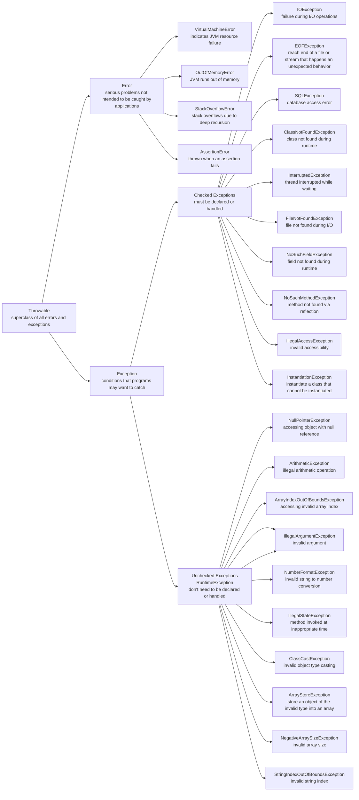

# Title: Java Notes

# Author: Caesar James LEE

## 013. Exceptions

* an **event** that **disrupts** the normal flow of a program
* `exceptions` are **objects** that represent `runtime errors`
* all exceptions derive from the class `java.lang.Throwable`

### `try-catch-finally` Statements

* `try`: execute a block of code that may throw an exception
* `catch`: handle the exception thrown in the `try` block
* `finally`: always executes after `try` (and `catch` if present), regardless of whether an exception occurred
* the `finally` block is **optional**, and is typically used to `release resources` (like closing files or connections)

#### Syntax

```java
    try{
        statements;
    }catch(ExceptionClassName exceptionName){
        statements;
    }finally{
        statements;
    }
```

#### Example

```java
    double result = 0.0;
    Scanner scanner = new Scanner(System.in);
    System.out.println("plz enter two integer number:");
    int numerator = scanner.nextInt(),
        denominator = scanner.nextInt();
    try{
        result = numerator / denominator;
    }catch(ArithmeticException e){
        System.out.println("cannot divide by 0");
        e.printStackTrace();
    }finally{
        System.out.println("result:\t" + result);
        scanner.close();
    }
```

### `throw` Statements

* used to **explicitly** throw an `exception`

#### Syntax

```java
    throw new ExceptionClassName("message");
```

#### Example

* `Person.java`

    ```java
        public class Person{
            private String name;
            private int age;

            public Person(){
                this.setName("");
                this.setAge(0);
            }

            public Person(String name){
                this.setName(name);
                this.setAge(0);
            }

            public Person(int age){
                this.setName("");
                this.setAge(age);
            }

            public Person(String name, int age){
                this.setName(name);
                this.setAge(age);
            }

            public void setName(String name){
                if(name == null){
                    throw new IllegalArgumentException("name cannot be null");
                }
                this.name = name;
            }

            public void setAge(int age){
                if(age < 0){
                    throw new IllegalArgumentException("age cannot be negative");
                }else if(age > 180){
                    throw new IllegalArgumentException("age is out of bound");
                }
                this.age = age;
            }

            public String getName(){
                return this.name;
            }

            public int getAge(){
                return this.age;
            }

            @Override
            public String toString(){
                return String.format(
                    "hello %d-year-old %s",
                    this.age,
                    this.name
                );
            }
        }
    ```

* `Main.java`

    ```java
        public class Main{
            public static void main(String [] args){
                try{
                    Person person = new Person(null, -3);
                    System.out.println(person);
                }catch(Exception e){
                    System.out.println("cannot instantiate a Person object");
                    e.printStackTrace();
                }
            }
        }
    ```

### `throws` Statements

* used **only** for `checked exceptions`
* used to declare checked exceptions in `method headers`
* you must treat the exception **at least once**

#### Syntax

```java
    accessModifier [static] [final] returnType methodName throws CheckExceptionName, CheckedExceptionName1{
        //statements;
    }
```

#### Example

* `NoSuchMethodExceptionExample.java`

    ```java
        import java.lang.reflect.Method;

        public class NoSuchMethodExceptionExample{
            public boolean isContainMethod(Class <?> className, String methodName)throws NoSuchMethodException{
                Method method = className.getMethod(methodName);
                return method.getName().equals(methodName);
            }
        }
    ```

* `Main.java`

    ```java
        import java.util.ArrayList;

        public class Main{
            public static void main(String [] args){
                NoSuchMethodExceptionExample noSuchMethodExceptionExample = new NoSuchMethodExceptionExample();
                try{
                    System.out.println(noSuchMethodExceptionExample.isContainMethod(ArrayList.class, "push_back"));//push_back(T element) means add(T element)
                }catch(NoSuchMethodException e){
                    System.out.println("this class doesn't contain the method");
                }
            }
        }
    ```

### Exception Category

| category | description |
| :-: | :-: |
| `Checked Exception` | **must be declared** in method signature or handled with `try-catch` |
| `Unchecked Exception` | **not required** to be caught or declared |
| `Error` | **Serious problems** you usually **don't handle** |

### Common Errors and Exceptions



### Custom Exceptions

#### Syntax

1. `checked exception`
    1. create a `checked exception class`

        ```java
            public class CheckedExceptionName extends Exception{
                public CheckedExceptionName(String message){
                    super(message);
                }
            }
        ```

    2. throw an exception

        ```java
            accessModifier [static] [final] returnType methodName([parameters]) throw CheckedExceptionName{
                throw new CheckedExceptionName("message");
                [return data;]
            }
        ```

2. `unchecked exception`

    1. create a `unchecked exception class`

        ```java
            public class UncheckedExceptionName extends RuntimeException{
                public UncheckedExceptionName(String message){
                    super(message);
                }
            }
        ```

    2. throw an exception
    
        ```java
            accessModifier [static] [final] returnType methodName([parameters]){
                throw new UncheckedExceptionName("message");
                [return data;]
            }
        ```

#### Example

* `NameException.java`

    ```java
        public class NameException extends Exception{
            public NameException(String message){
                super(message);
            }
        }
    ```

* `AgeException.java`

    ```java
        public class AgeException extends RuntimeException{
            public AgeException(String message){
                super(message);
            }
        }
    ```

* `Person.java`

    ```java
        public class Person{
            private String name;
            private int age;

            public Person() throws NameException{
                this.setName("");
                this.setAge(0);
            }

            public Person(String name) throws NameException{
                this.setName(name);
                this.setAge(0);
            }

            public Person(int age) throws NameException{
                this.setName("");
                this.setAge(age);
            }

            public Person(String name, int age) throws NameException{
                this.setName(name);
                this.setAge(age);
            }

            public void setName(String name) throws NameException{
                if(name == null){
                    throw new NameException("name cannot be null");
                }
                this.name = name;
            }

            public void setAge(int age){
                if(age < 0){
                    throw new AgeException("age cannot be negative");
                }else if(age > 180){
                    throw new AgeException("age is out of bound");
                }
                this.age = age;
            }

            public String getName(){
                return this.name;
            }

            public int getAge(){
                return this.age;
            }

            @Override
            public String toString(){
                return String.format(
                    "hello %d-year-old %s",
                    this.age,
                    this.name
                );
            }
        }
    ```

* `Main.java`

    ```java
        public class Main{
            public static void main(String [] args){
                try{
                    Person person = new Person(null, -3);
                    System.out.println(person);
                }catch(Exception e){
                    System.out.println("cannot instantiate a Person object");
                    e.printStackTrace();
                }
            }
        }
    ```
