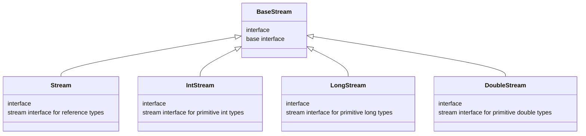

# Title: Java Notes

# Author: Caesar James LEE

## 015. Stream API

* introduced in `Java8`
* allow `functional-style` operations on sequences of elements

### `Stream`

* a pipeline of data processing operations
* categories
    1. `intermediate` (`lazy`): return a new `stream`
    2. `terminal` (`eager`): produce a result or a side effect



#### library

```java
    import java.util.stream.Stream;
```

#### nested class

* `static interface Stream.Builder <T>`
    1. `void accept(T t)`: add an element
    2. `default Stream.Builder <T> add(T t)`: add an element
    3. `Stream <T> build()`: build the stream

#### methods

##### intermedia methods

1. `Stream <T> distinct()`: remove duplicates
2. `Stream <T> filter(Predicate <? super T> predicate)`: filter elements
3. `Optional <T> findAny()`: return an element
4. `Optional <T> findFirst()`: return first element
5. `<R> Stream <R> flatMap(Function <? super T, ? extends Stream <? extends R>> mapper)`: flatten nested streams
6. `DoubleStream flatMapToDouble(Function <? super T, ? extends DoubleStream> mapper)`: flatten to `DoubleStream`
7. `IntStream flatMapToInt(Function <? super T, ? extends IntStream> mapper)`: flatten to `IntStream`
8. `LongStream flatMapToLong(Function <? super T, ? extends LongStream> mapper)`: flatten to `LongStream`
9. `Stream <T> limit(long maxSize)`: limit stream size
10. `<R> Stream <R> map(Function <? super T, ? extends R> mapper)`: transform elements
11. `DoubleStream mapToDouble(ToDoubleFunction <? super T> mapper)`: transform to `DoubleStream`
12. `IntStream mapToInt(ToIntFunction <? super T> mapper)`: transform to `IntStream`
13. `LongStream mapToLong(ToLongFunction <? super T> mapper)`: transform to `LongStream`
14. `Optional <T> max(Comparator <? super T> comparator)`: find maximum
15. `Optional <T> min(Comparator <? super T> comparator)`: find minimum
16. `Stream <T> peek(Consumer <? super T> action)`: perform action on each action
17. `Optional <T> reduce(BinaryOperator <T> accumulator)`: reduce elements to one
18. `Stream <T> skip(long n)`: skip first `n` elements
19. `Stream <T> sorted()`: sort naturally
20. `Stream <T> sorted(Comparator <? super T> comparator)`: sort by comparator

##### terminal methods

1. `boolean allMatch(Predicate <? super T> predicate)`: all elements match
2. `boolean anyMatch(Predicate <? super T> predicate)`: any element matches
3. `<R, A> R collect(Collector <? super T, A, R> collector)`: collect elements
4. `<R> R collect(Supplier <R> supplier, BiConsumer <R, ? super T> accumulator, BiConsumer <R,R> combiner)`: custom collect
5. `void forEach(Consumer <? super T> action)`: loop over elements
6. `void forEachOrdered(Consumer <? super T> action)`: loop with order
7. `boolean noneMatch(Predicate <? super T> predicate)`: no element matches
8. `T reduce(T identity, BinaryOperator <T> accumulator)`: reduce with identity
9. `<U> U reduce(U identity, BiFunction <U, ? super T, U> accumulator, BinaryOperator <U> combiner)`: reduce with accumulator
10. `Object [] toArray()`: to array
11. `<A> A [] toArray(IntFunction <A []> generator)`: to array with generator

##### static methods

1. `static <T> Stream.Builder <T> builder()`: get builder
2. `static <T> Stream <T> concat(Stream <? extends T> a, Stream <? extends T> b)`: join two streams
3. `static <T> Stream <T> empty()`: get empty stream
4. `static <T> Stream <T> generate(Supplier <T> s)`: infinite stream from supplier
5. `static <T> Stream <T> iterate(T seed, UnaryOperator <T> f)`: infinite stream from seed
6. `static <T> Stream <T> of(T... values)`: stream of values
7. `static <T> Stream <T> of(T t)`: stream from single value

#### example

```java
    import java.util.Arrays;
    import java.util.List;
    import java.util.stream.Stream;

    public class Main{
        public static void main(String [] args){
            Stream.Builder <String> fruitsBuilder = Stream.builder();
            fruitsBuilder.accept("apple");
            fruitsBuilder.add("banana")     .add("grape")       .add("pear")
                         .add("pineapple")  .add("coconut")     .add("orange")
                         .add("strawberry") .add("blueberry")   .add("apple")
                         .add("orange")     .add("pineapple")   .accept("watermelon");
            Stream <String> fruitsStream = fruitsBuilder.build();

            fruitsStream.distinct()
                        .filter(fruit -> fruit.length() > 7)
                        .map(String::toUpperCase)
                        .peek(fruit -> System.out.println("peeked:\t" + fruit))
                        .sorted()
                        .limit(3)
                        .skip(1)
                        .forEach(fruit -> System.out.println("fruit:\t" + fruit));

            Stream <Integer> nums0 = Stream.of(2, 9, 3, 12, 21, 0),
                             nums1 = Stream.of(-5),
                             nums = Stream.concat(nums0, nums1);

            System.out.println("are all numbers positive:\t" + nums.allMatch(num -> num > 0));
            System.out.println(
                "is at least one number is odd:\t" +
                Stream.concat(
                    Stream.of(2, 9, 3, 12, 21),
                    Stream.iterate(3, n -> n + 1).limit(3)
                ).anyMatch(num -> num % 2 != 0)
            );
            System.out.println(
                "are all numbers not equal to zero:\t" +
                Stream.concat(
                    Stream.of(0),
                    Stream.iterate(0, n -> n).skip(1).limit(2)
                ).noneMatch(num -> num == 0)
            );

            List <Integer> n = Arrays.asList(3, 0, -9, 12, -21, 5, 8, -2, 5, -1, 9, -21);
            System.out.println("sorted in a special order:\n");
            n.stream().sorted(
                (n0, n1) -> {
                    boolean isN0Even = n0 % 2 == 0,
                            isN1Even = n1 % 2 == 0;
                    return isN0Even && isN1Even ? Integer.compare(n0, n1) :
                           !isN0Even && !isN1Even ? Integer.compare(n1, n0) :
                           isN0Even ? -1 : 1;
                }
            ).forEach(number -> System.out.print(number + "\t"));
        }
    }
```

#### other streams

1. `IntStream`: for primitive `int` types
2. `LongStream`: for primitive `long` types
3. `DoubleStream`: for primitive `double` types

### `Optional`

* a **container object** that may or may not contain a **non-null value**
* used to avoid `NullPointerException` and make `null-checking` **clearer**

#### library

```java
    import java.util.Optional;
```

#### intermediate method

1. `Optional <T> filter(Predicate <? super T> predicate)`: keep value only if it matches condition
2. `<U> Optional <U> flatMap(Function <? super T, Optional <U>> mapper)`: transform the value and wrap result in `Optional`
3. `<U> Optional <U> map(Function <? super T, ? extends U> mapper)`: like `map`, but avoids nested `Optional`
4. `<X extends Throwable> T orElseThrow(Supplier <? extends X> exceptionSupplier)`: get value or throw custom exception

#### terminal method

1. `boolean equals(Object obj)`: compare two `Optionals`
2. `T get()`: get value or throw if empty, you must check whether it exists first
3. `boolean isPresent()`: check if value exists
4. `void ifPresent(Consumer <? super T> consumer)`: call `Consumer` if value exists
5. `T orElse(T other)`: return value or default
6. `T orElseGet(Supplier <? extends T> other)`: return value or call `Supplier`

#### static method

1. `static <T> Optional <T>	empty()`: create an empty `Optional`
2. `static <T> Optional <T>	of(T value)`: wrap `non-null` value (throw if `null`)
3. `static <T> Optional <T>	ofNullable(T value)`: wrap value or empty if `null`

##### example

```java
    import java.util.Optional;

    public class Main{
        public static void main(String [] args){
            Optional <String> existName = Optional.of("Caesar"),
                            emptyName = Optional.ofNullable(null);
            System.out.println("is the name exists:\t" + existName.isPresent());

            if(emptyName.isEmpty()){
                System.out.println("this is empty");
            }else{
                System.out.println("its value:\t" + emptyName.get());
            }

            existName.ifPresent(name -> System.out.println("Hi " + name));
            System.out.println(existName.filter(name -> name.length() > 7).orElse("optional is empty"));
            System.out.println(existName.orElseGet(() -> "an empty name"));
            try{
                existName.orElseThrow(() -> new IllegalArgumentException("name is null"));
                System.out.println("the name exists");
            }catch(IllegalArgumentException e){
                System.out.println("please fulfill a name again");
                e.printStackTrace();
            }
        }
    }
```

##### other optionals

1. `OptionalInt`: for primitive `int` types
1. `OptionalLong`: for primitive `long` types
1. `OptionalDouble`: for primitive `double` types

### `Collector`

* a `generic interface` that defines how to **collect elements** from a `Stream <T>` into a `final result R`, possibly using an **intermediate accumulation** type `A`

#### library

```java
    import java.util.stream.Collector;
```

#### nested class

1. `static class Collector.Characteristics`
    * `static Collector.Characteristics valueOf(String name)`: get enum constant by name
    * `static Collector.Characteristics [] values()`: get all enum constants as array
    * `CONCURRENT`: enum constant, allow parallel accumulation into a shared container
    * `IDENTITY_FINISH`: enum constant, finisher is identity (no conversion needed)
    * `UNORDERED`: enum constant, order of input elements doesn't matter

#### convert methods

1. `BiConsumer <A, T> accumulator()`: convert to `BitConsumer <A, T>`
2. `Supplier <A> supplier()`: convert to `Supplier <A>`
3. `Function <A, R>	finisher()`: convert to `Function <A, R>`
4. `Set <Collector.Characteristics>	characteristics()`: convert to `Set` of `Characteristics`
5. `BinaryOperator <A> combiner()`: convert to `BinaryOperator <A>`

#### static methods

1. `static <T, A, R> Collector <T, A, R> of(Supplier <A> supplier, BiConsumer <A,T> accumulator, BinaryOperator <A> combiner, Function <A, R> finisher, Collector.Characteristics... characteristics)`: create a new `Collector`
2. `static <T, R> Collector <T, R, R> of(Supplier <R> supplier, BiConsumer <R, T> accumulator, BinaryOperator <R> combiner, Collector.Characteristics... characteristics)`: create a new `Collector`

#### example

```java
    import java.util.Arrays;
    import java.util.List;
    import java.util.stream.Collector;

    public class Main{
        public static void main(String [] args){
            List <String> fruits = Arrays.asList("apple", "banana", "orange", "watermelon", "strawberry", "pineapple", "coconut", "pear", "grape");
            String favoriteFruits = fruits.stream().collect(
                Collector.of(
                    StringBuilder::new,
                    (stringBuilder, fruit) -> {
                        if(fruit.length() > 5){
                            if(!stringBuilder.isEmpty()){
                                stringBuilder.append(",\t");
                            }
                            stringBuilder.append(fruit);
                        }
                    },
                    (stringBuilder0, stringBuilder1) -> {
                        if(!stringBuilder0.isEmpty() && !stringBuilder1.isEmpty()){
                            stringBuilder0.append(", ");
                        }
                        stringBuilder0.append(stringBuilder1);
                        return stringBuilder0;
                    },
                    StringBuilder::toString,
                    Collector.Characteristics.UNORDERED
                )
            );
            System.out.println("my favorite fruits:");
            System.out.println(favoriteFruits);
        }
    }
```

### `Collectors`

* a `final class` with many `static factory methods` that return commonly used `Collector` implementations

#### methods

1. `static <T> Collector <T, ?, Double> averagingDouble(ToDoubleFunction <? super T> mapper)`: average of `double` values
2. `static <T> Collector <T, ?, Double> averagingInt(ToIntFunction <? super T> mapper)`: average of `int` values
3. `static <T> Collector <T, ?, Double> averagingLong(ToLongFunction <? super T> mapper)`: average of `long` values
4. `static <T, A, R, RR> Collector <T, A, RR> collectingAndThen(Collector <T, A, R> downstream, Function <R, RR> finisher)`: apply finisher after collecting
5. `static <T> Collector <T, ?, Long> counting()`: count number of elements
6. `static <T, K> Collector <T, ?, Map <K, List <T>>> groupingBy(Function <? super T, ? extends K> classifier)`: group into `Map <K, List <T>>`
7. `static <T, K, A, D> Collector <T, ?, Map <K,D>> groupingBy(Function <? super T, ? extends K> classifier, Collector <? super T, A, D> downstream)`: group then reduce
8. `static <T, K, D, A, M extends Map <K,D>> Collector<T, ?, M> groupingBy(Function <? super T, ? extends K> classifier, Supplier <M> mapFactory, Collector <? super T, A, D> downstream)`: group with custom map and reduction
9. `static <T, K> Collector <T, ?, ConcurrentMap <K, List<T>>> groupingByConcurrent(Function <? super T, ? extends K> classifier)`: concurrent  grouping
10. `static <T, K, A, D> Collector <T, ?, ConcurrentMap <K,D>> groupingByConcurrent(Function <? super T, ? extends K> classifier, Collector <? super T, A, D> downstream)`: concurrent group then reduce
11. `static <T, K, A, D, M extends ConcurrentMap <K,D>> Collector <T, ?, M> groupingByConcurrent(Function <? super T, ? extends K> classifier, Supplier <M> mapFactory, Collector <? super T, A, D> downstream)`: concurrent with map & reduction
12. `static Collector <CharSequence, ?, String> joining()`: join strings
13. `static Collector <CharSequence, ?, String> joining(CharSequence delimiter)`: join with delimiter
14. `static Collector <CharSequence, ?, String> joining(CharSequence delimiter, CharSequence prefix, CharSequence suffix)`: join with delimiter + wrapper
15. `static <T, U, A, R> Collector <T, ?, R> mapping(Function <? super T, ? extends U> mapper, Collector <? super U, A, R> downstream)`: map before collecting
16. `static <T> Collector <T, ?, Optional <T>> maxBy(Comparator <? super T> comparator)`: get max wrapped in `Optional`
17. `static <T> Collector <T, ?, Optional <T>> minBy(Comparator <? super T> comparator)`: get min wrapped in `Optional`
18. `static <T> Collector <T, ?, Map <Boolean, List<T>>> partitioningBy(Predicate <? super T> predicate)`: spilt into `true` || `false` groups
19. `static <T, D, A> Collector <T, ?, Map <Boolean, D>> partitioningBy(Predicate <? super T> predicate, Collector <? super T, A, D> downstream)`: split and reduce
20. `static <T> Collector <T, ?, Optional <T>> reducing(BinaryOperator <T> op)`: reduce with `BinaryOperator`
21. `static <T> Collector <T, ?, T> reducing(T identity, BinaryOperator <T> op)`: reduce with initial value
22. `static <T, U> Collector <T, ?, U> reducing(U identity, Function <? super T, ? extends U> mapper, BinaryOperator <U> op)`: map, then reduce
23. `static <T> Collector <T, ?, DoubleSummaryStatistics> summarizingDouble(ToDoubleFunction <? super T> mapper)`: start for `double` values
24. `static <T> Collector <T, ?, IntSummaryStatistics> summarizingInt(ToIntFunction <? super T> mapper)`: start for `int` values
25. `static <T> Collector <T, ?, LongSummaryStatistics> summarizingLong(ToLongFunction <? super T> mapper)`: start for `long` values
26. `static <T> Collector <T, ?, Double> summingDouble(ToDoubleFunction<? super T> mapper)`: sum of `double` values
27. `static <T> Collector <T, ?, Integer> summingInt(ToIntFunction <? super T> mapper)`: sum of `int` values
28. `static <T> Collector <T, ?, Long> summingLong(ToLongFunction <? super T> mapper)`: sum of `long` values
29. `static <T, C extends Collection <T>> Collector <T, ?, C> toCollection(Supplier <C> collectionFactory)`: collect into custom `Collection`
30. `static <T, K, U> Collector <T, ?, ConcurrentMap <K, U>> toConcurrentMap(Function <? super T, ? extends K> keyMapper, Function <? super T, ? extends U> valueMapper)`: `ConcurrentMap` from `key/value`
31. `static <T, K, U> Collector <T, ?, ConcurrentMap <K, U>> toConcurrentMap(Function <? super T, ? extends K> keyMapper, Function <? super T, ? extends U> valueMapper, BinaryOperator <U> mergeFunction)`: `ConcurrentMap` with conflict handling
32. `static <T, K, U, M extends ConcurrentMap <K, U>> Collector <T, ?, M> toConcurrentMap(Function <? super T, ? extends K> keyMapper, Function <? super T, ? extends U> valueMapper, BinaryOperator <U> mergeFunction, Supplier <M> mapSupplier)`: `Concurrent` with merge + custom map
33. `static <T> Collector <T, ?, List <T>> toList()`: collect into `List`
34. `static <T, K, U> Collector <T, ?, Map <K,U>> toMap(Function <? super T, ? extends K> keyMapper, Function <? super T, ? extends U> valueMapper)`: `Map` from `key/value`
35. `static <T, K, U> Collector <T, ?, Map <K,U>> toMap(Function <? super T, ? extends K> keyMapper, Function <? super T, ? extends U> valueMapper, BinaryOperator <U> mergeFunction)`: `Map` with conflict handling
36. `static <T, K, U, M extends Map <K,U>> Collector <T, ?, M> toMap(Function <? super T, ? extends K> keyMapper, Function <? super T, ? extends U> valueMapper, BinaryOperator <U> mergeFunction, Supplier <M> mapSupplier)`: `Map` with merge + custom map
37. `static <T> Collector <T, ?, Set <T>> toSet()`: collector that accumulates the input elements into a new Set

#### example

```java
    import java.util.Arrays;
    import java.util.Comparator;
    import java.util.List;
    import java.util.stream.Collectors;

    public class Main{
        public static void main(String [] args){
            List <String> fruits = Arrays.asList(
                "apple", "banana", "grape", "pineapple", "coconut",
                "strawberry", "blueberry", "watermelon", "pumpkin"
            );

            System.out.println(
                "average length in the fruits:\t" +
                fruits.stream().collect(Collectors.averagingInt(String::length))
            );

            System.out.println(
                "summarizing length of fruits:\t" +
                fruits.stream().collect(Collectors.summarizingInt(String::length))
            );

            System.out.println(
                "count number of elements:\t" +
                fruits.stream().collect(Collectors.counting())
            );

            System.out.println(
                "group by the first letter in lexicographical order:\t" +
                fruits.stream().collect(Collectors.groupingBy(fruit -> fruit.charAt(0)))
            );

            System.out.println(
                "joined fruits with comma:\t" +
                fruits.stream().collect(Collectors.joining(", "))
            );

            System.out.println(
                "maximum length fruit:\t" +
                fruits.stream().collect(Collectors.maxBy(Comparator.comparingInt(String::length))).stream().collect(Collectors.toSet()) + "\n" +
                "minimum length fruit:\t" +
                fruits.stream().collect(Collectors.minBy(Comparator.comparingInt(String::length))).stream().collect(Collectors.toSet())
            );

            System.out.println(
                "add \" - \" between fruits:\t" +
                fruits.stream().collect(Collectors.reducing(
                    (fruit0, fruit1) -> fruit0 + " - " + fruit1
                )).orElse("single string")
            );

            System.out.println(
                "\"false\" for fruits whose length are less than 5:\t" +
                fruits.stream().collect(Collectors.partitioningBy(
                    fruit -> fruit.length() > 5
                ))
            );
        }
    }
```
