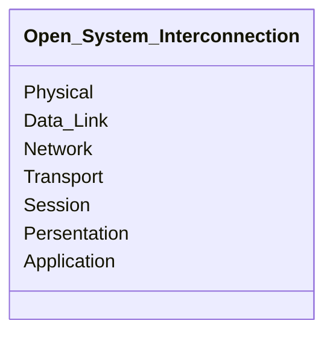
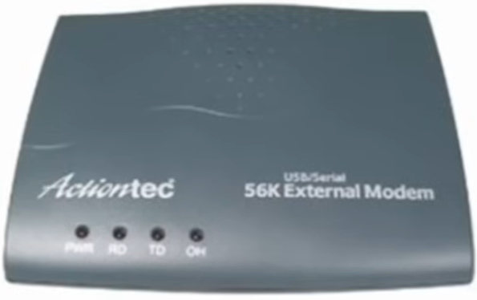
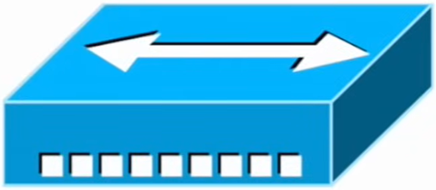
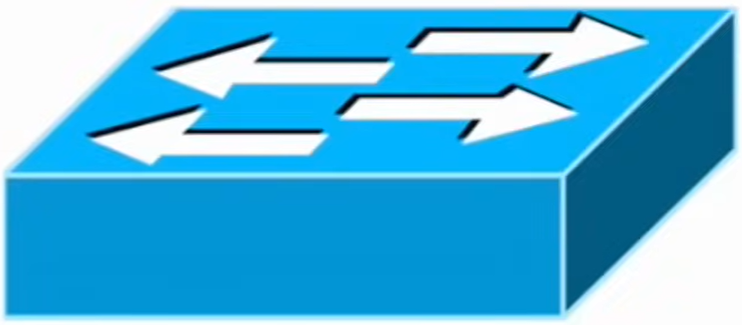
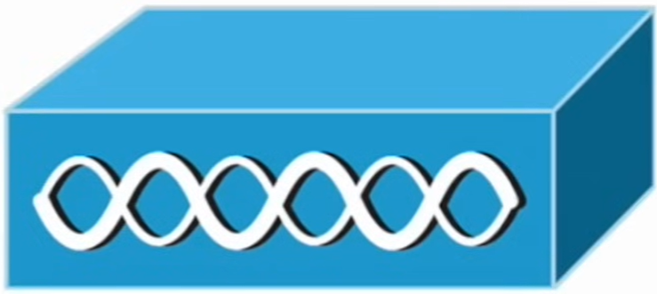
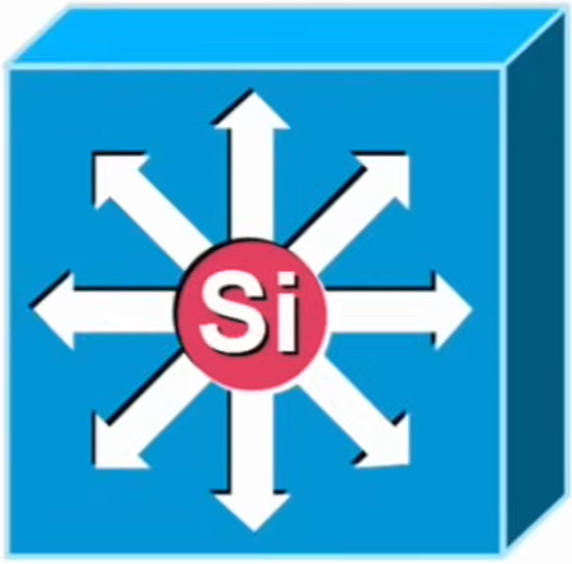
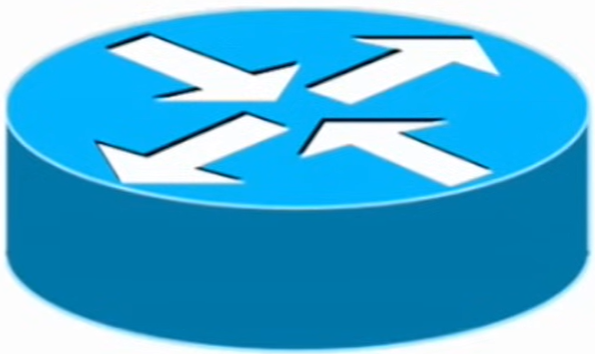
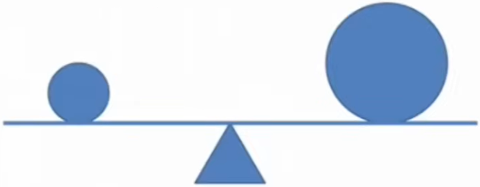
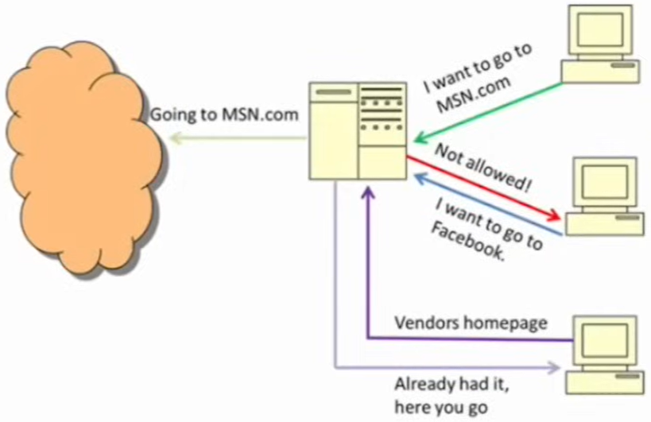

# Network Devices

- **Author**: Caesar James LEE

---

## `O`pen `S`ystem `I`nterconnection Model

- a **reference model** developed by the `I`nternational `O`rganization of `S`tandardization:

    > provide a common framework for the coordination of standards to enable system interconnection

- define **how computer systems communicate** with each other
- divide the communication process into `7` **abstraction layers**



### Layer 1 -- `Physical` Layer Devices

1. `Analog Modem (ˈmodəm)`
    - photo

        

    - come from `mo`dulator/`dem`odulator
    - convert **digital signals** (used by `computers`) into **analog signals** (used by `telephone` or cable lines)
      -- `modulating` and vice vers -- `demodulating`
    - typically provide a **single connection** to an external network
    - commonly integrated into `routers` or `gateways` today
    - examples: `Diag-up modems`, `DSL modems`, `cable modems`

2. `Hub`
    - photo

        

    - act as a **repeater** or **concentrator**, sending incoming signals to **all other ports**, regardless of destination
    - typically available with `4`, `8`, `12`, or `24` ports
    - not **very common** in modern networking
    - replaced by `switches` in modern networks
    - examples: early ethernet hubs used in small `LANs`

### Layer 2 -- `Data Link` Layer Devices

1. `Switch`
    - photo

        

    - use `A`pplication-`S`pecific `I`ntegrated `C`ircuits (ˈsɝkɪt, electrical pipe) to forward frames efficiently
    - learn and store device `MAC` address to send frames only the correct destination port
    - can be simple (unmanaged) or advanced (managed with `VLAN`, `QoS`, etc)
    - communicate **only** with `L`ocal `A`rea `N`etwork
    - support for `VLANs`, `link aggregation (ˌæɡrɪˈɡеʃǝn, combination)`, `Power over Ethernet` and `port mirroring`
    - examples: `Cisco Catalyst 2960`, `TP-Link TL-SG108`

2. `W`ireless `A`ccess `P`oint
    - photo

        

    - act as a bridge between wired (`Ethernet`) and wireless (`Wi-Fi`) network segments
    - common standards include `IEEE 802.11a`, `IEEE 802.11b`, `IEEE 802.11g`, `IEEE 802.11n`, `IEEE 802.11ac`, `IEEE 802.11ax`
    - communicate with **local wireless clients** such as `laptops`, `phones`, and `IoT` devices
    - may include guest `network isolation`, `WPA3 encryption`, `mesh networking`, and `band steering`
    - examples: `Ubiquit UniFi AP`, `Cisco Aironet`

### Layer 3 -- `Network` Layer Devices

1. `M`ulti-`L`ayer `S`witch
    - photo

        

    - provide **Layer `2`**, **Layer `3`** (**most common**), and something higher-layer services
    - allow communicate between **different subnets**
    - combine hardware speed of switches with **routing intelligence**
    - support `inter-VLAN routing`, `A`ccess `C`ontrol `L`ists, and `QoS policies`
    - examples: `Cisco Catalyst 3850 Series`

2. `Router` (ˈrutɚ/ˈraʊtɚ)
    - photo

        

    - **connect multiple network together** using layer `3` (`logical`) addressing
    - determine **the best path** of data packets using routing tables and algorithms (`Dijsktra`, `Floyd-Warshall`, etc)
    - **the most common** network device for connecting different networks together using `OSI` Layer 3 logical network information
    - handle both **local** and **wise-area** network communication
    - support `NAT`, `DHCP`, `VPN tunneling`, `firewall rules`, `QoS`, and `static/dynamic routing` (e.g. `OSPF`,
      `BGP`)
    - examples: home Wi-Fi routers, enterprise routers

### Security Devices

1. `Firewall`
    - act as the **police force** of the network
    - can be implemented as
        1. `Hardware Application`
            - examples: `Fortinet FortiGate`, `Palo Alto Networks`
        2. `Software Application`
            - place on `routers` or `hosts`
            - examples: `Microsoft Windows Defender Firewall`
        3. `Cloude Application`
    - operate across several layers -- `2` (data link), `3` (network), `4` (transport) and `7` (application)
    - inspect and filter traffics using
        1. `stateles  inspection`
            - check each packet against predefined rules
        2. `stateful inspection`
            - track connections and allow related packets
    - support `intrusion prevention`, `application controll`, `web filtering`, and `VPN termination`
    - examples: `pfSense`, `iptables`, `AWS Security Groups`

2. `I`ntrusion (invasion) `D`etection `S`ystem
    - act as the **detective** of the network
    - a **passive** system to identify possible breaches (an unauthorized access to a network by bypassing security
      measures) and attacks
    - monitor and compare it against signatures or behavioral baselines
    - detection methods
        1. `Signature-Based`
            - detect known malware (ˈmælˌwɛr, a computer virus to change or destroy an OS) or attack patterns
        2. `Anomaly (ǝˈnɑmǝlɪ, an abnormal thing)-Based`
            - detect unusual or suspicious (sǝˈspɪʃǝs, doubtful) activity
        3. `Policy-Based`
            - check for violations of defined security rules
    - can be host-based (`H`ost-based `I`ntrusion `D`etection `S`ystem) or network-based (`N`etwork-based
      `I`ntrusion `D`etection `S`ystem)
    - usage: generate alert via log files, SMS or email notifications
    - examples: `Snort`, `Suricate`, `OSSEC`

3. `I`ntrusion `P`revenion `S`ystem
    - act as a **customs officer**, actively deciding what to allow or block
    - unlike `IDS`, it is **active**, automatically responding to detected threats
    - can block IP address, close vulnerable (sensitive) ports, terminate (end) the network session, redirect traffic
    - think of a customs officer to decide who can enter or who must leave a state
    - best placement:

    ```mermaid
        flowchart LR
            subgraph Router[Router]
                firewall[Firewall Configuration]
            end;

            Router --> IPS[Intrusion Prevention System];

            subgraph Destination[Destination Netwrok]
                destination[a network segment]
            end;

            IPS --> Destination;
    ```

    - examples: `Cisco Firewall`, `Palo Alto Threat Prevention`

4. `V`irtual `P`rivate `N`etwork
    - act as both a **shield** and a **lock**, protecting and encrypting data
    - provide `secure tunneling` and `encryption` across untrusted networks
    - work at multiple layers -- typically `2` (data link), `3` (network via `IPsec`), and `7` (application via `SSL/TLS`)
    - examples: `OpenVPN`, `WireGuard`, `Cisco AnyConnect`

### Optimization and Performance Devices

1. `Load Balancer` (aka `Content Switch` or `Content Filter`)
    - photo

        

    - distribute incoming network or application traffic evenly across multiple services
    - ensure no single server is **overloaded**
    - operate mainly at layer `7` (application) or `4` (transport)
    - support `health checks`, `SSL offloading`, `session persistence`, `auto-scaling integration`
    - examples: `NGINX`, `HAProxy`, `F5 IG-IP`

2. `Proxy Server`
    - photo

        

    - act as **intermediary** (messenger) between clients and external servers
    - require resources on behalf (perform an action in place of or to represent another person) of the client, helping hide and protect the client's identity
    - can **filter**, **cache**, or **modify** content
    - usage
        1. web content filtering and parental (pǝˈrɛntḷ, adjective of parent) contents
        2. cache commonly access pages for better performance
        3. access control and anonymity (ˌænǝˈnɪmǝtɪ, nameless) features
    - examples: `Squid Proxt`, `NGINX Reverse Proxy`, `Cloudfare Gateway`
