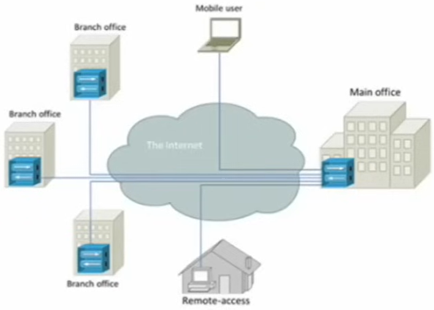
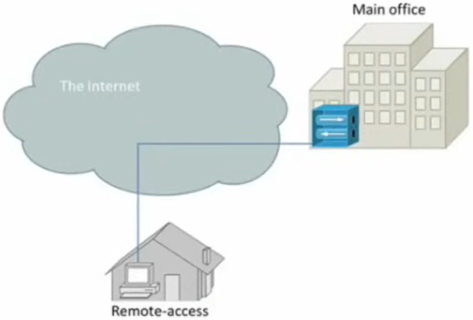
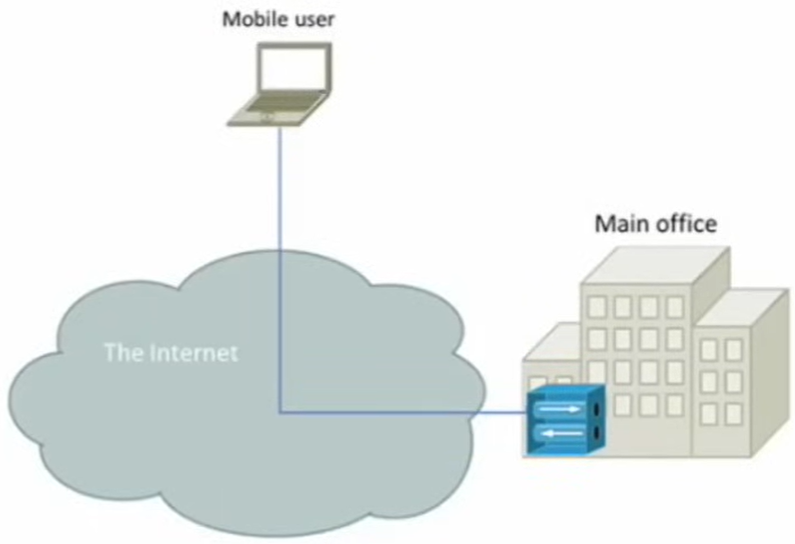
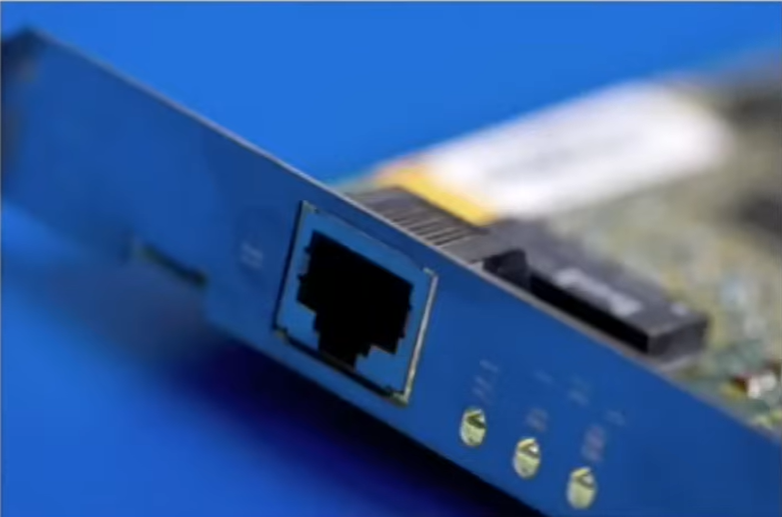
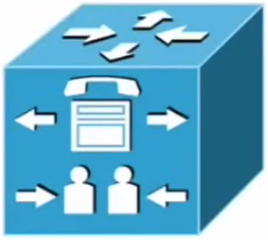

# Services && Applications

- **Author**: Caesar James LEE

---

## Basics of `V`irtual `P`rivate `N`etwork

- allow a remote device or user to surely connect to a private network through a public network, such as the internet
- use **encryption tunnel** to protect data while traveling across public channels
- once a VPN connection is established, the remote host appears to the private network as if it were a **local device**
- the VPN connection acts like a **direct secure like**, no matter how many routers or systems it passes
  through
- reduce cost because it doesn't require a **dedicated (ˈdɛdǝˌkеtɪd, only need to do something) leased
  line** to create the connection

### Types

1. `Site-to-Site VPN`
    - photo

        

    - connect two separate networks, such as a `remote office` and `main office`
    - act as if both networks are part of the **same local network**
    - a `VPN concentrator` on **both sides** manages the connection
    - examples: a company which offices in Taipei and Los Angeles connects both networks using a
      `Site-to-Site VPN`

2. `Host-to-Site VPN` aka `Remote-Access VPN`
    - photo

        

    - allow **individual remote users** to connect to a private network
    - the `VPN concentrator` **on the local network** manages incoming connections
    - the remote device uses `VPN client software` to establish the connection
    - examples: an employee working from home uses `OpenVPN` software to connect securely to the company's network

3. `Host-to-Host VPN` aka `SSL VPN`
    - photo

        

    - create a secure connection between two systems **without needing VPN client software**
    - managed by a `VPN concentrator` on the **local network**
    - use a `web browser` that supports `SSL`/`TLS` encryption to connect
    - examples: access a secure web-based dashboard through `HTTPS` (`SSL`/`TLS`) without extra VPN client software
      connection to the `VPN concentrator`

### Protocols

1. `I`nternet `P`rotocol `Sec`urity
    - **a set of protocols used** to secure VPN connections at layer `3` (`network`) or above
    - **the most common and powerful** VPN protocol suite
    - can use
        1. `A`uthentication `H`eader
            - provide authentication but no encryption
        2. `E`ncapsulating `S`ecure `P`ayload
            - provide both authentication and encryption
            - most popular
    - working modes
        1. `Transport mode`
            - used for `host-to-host` communication
        2. `Tunnel mode`
            - used for `network-to-network` communication (e.g. `Site-to-Site VPN`)
    - include `I`nternet `S`ecurity `A`ssociation and `K`ey `M`anagemen `P`rotocol (ˈesɛkæmp) for securely
      exchanging encryption keys
    - examples: used in corporate (ˈkɒrpǝrɪt, something is belong to a company) VPNs to protect branch office communication

2. `G`eneric `R`outing `E`ncapsulation
    - not `G`raduate `R`ecord `E`xaminations
    - a tunneling protocol that can encapsulate many different network layer protocols
    - often used with `IPSec` to transmit `multicast` (one-to-some communication) or `broadcast` (one-to-many communication) traffic, which `IPSec` alone (only `unicast` means one-to-one communication) cannot handle
    - examples: allow a company's video conference traffic (`multicast`) to pass securely over the internet

3. `P`oint-to-`P`oint `T`unneling `P`rotocol
    - an older VPN technology that supports `dial-up VPN` connections
    - provide basic encryption but is **largely deprecated** due to weak security

4. `T`ransport `L`ayer `S`ecurity
    - a cryptographic protocol that secures data transmission between two systems or applications
    - use `asymmetric (ˌæsɪˈmɛtrɪk, use public and private keys to encrypt and decrypt) encryption` for authentication and `symmetric keys (a key to both encrypt and decrypt)` for session encryption
    - has replaced `SSL` due to stronger security
    - work at layer `5` (`session`) and above
    - commonly used for `SSL VPN`s and secure websites (`HTTPS`)

5. `S`ecure `S`ocket `L`ayer protocol
    - predecessor (ˈprɛdɪˌsɛsɚ, ancestor) to `TLS`
    - provide encryption for web transactions

## Network Access Services

1. `N`etwork `I`nterface `C`ontroller aka `Network Interface Card`
    - photo

        

    - a hardware device that connects a computer or device to a network
    - operate at
        1. layer `2` (`data link`)
            - determine which networking protocol is used (e.g. `Ethernet`, `PPP`)
            - provide a **unique `MAC` address**
        2. layer `1` (`physical`)
            - convert data into `electrical` or `radio signals`
    - most modern devices come with **at least one** built-in `NIC`
    - examples: `Ethernet NIC` in a desktop PC, `Wi-Fi adapter` in a laptop or smartphone

2. `R`emote `A`uthentication `D`ial `I`n `U`ser `S`ervice
    - photo

        

    - a service used to **authenticate remote users** and **grant access to authorized network**
    - implement `A`uthentication, `A`uthorization, and `A`ccounting
    - only the **user's password** is encrypted
    - examples: used in enterprissse `Wi-Fi` networks to verify user credentials

3. `T`erminal `A`ccess `C`ontroller `A`ccess-`C`ontrol `S`ystem Plus (`+`) (tæˈkæksplʌs)
    - similar to `RADIUS` but used to authenticate network **devices** instead of users
    - encrypt **all communication**, not just password
    - **less advanced accounting features** than `RADIUS`
    - examples: an administrator uses it to log in securely to `Cisco` routers and switches

4. `R`emote `A`ccess `S`ervices
    - photo

        

    - refer to both the `hardware and software` components that allow users to connect to a network remotely
    - receive incoming requests and either grant or deny the access
    - examples: `Windows Server Remote Access` or legacy dial-up `RAS` servers

5. `Web Services`
    - enable **software applications** to communicate **across different OS**
    - typically use `.xml` or `.json` for **data exchange**
    - allow integration between **web applications**, **APIs**, and **enterprise systems**

6. `Unified Voice Services`
    - photo

        

    - integrate **voice**, **video** and **messaging** systems into a single communication network
    - combine both **hardware** and **software** for efficient voice communication
    - commonly referred to as `V`oice `o`ver `IP` systems
    - examples: `Cisco Unified Communication`, `Microsoft Teams`, `Zoom phone`
