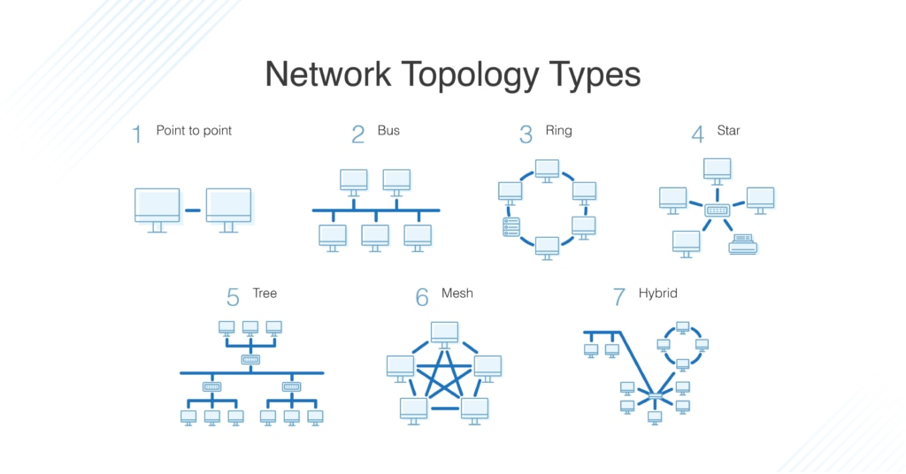

# Unit 1: Computer Network Basic Info

- **Author**: Caesar James LEE

## Kinds

1. By Scope

|             term              |                  description                   |   approximately area    |                example                 |
| :---------------------------: | :--------------------------------------------: | :---------------------: | :------------------------------------: |
|    `L`ocal A`rea `N`etwork    | a network that connects within a limited area  |     ~100 m to 1 km      | home Wi-Fi, office network, school lab |
| `M`etropolian A`rea `N`etwork | a network that covers a city or a large campus |       ~5 to 50 km       |    city-wide Wi-Fi, campus network     |
|    `W`ide A`rea `N`etwork     |  a network that covers large geographic areas  | countries or continents |    the Internet, corporate network     |

2. By Transmission Technology

|           term           |                           description                           |          usage          |                  example                  |
| :----------------------: | :-------------------------------------------------------------: | :---------------------: | :---------------------------------------: |
|    `Brodcast Network`    | every transmitted packet is received by all devices (on-to-all) | small networks (`LANs`) |  classic `Ethernet` with `Hub`, `Wi-Fi`   |
| `Point-to-Point Network` |       connection exists only between two specific devices       |     large networks      | modern switch Ethernet, telephone network |

3. By Ownership

|       term        |                    description                    |    approximate area    |               example                |
| :---------------: | :-----------------------------------------------: | :--------------------: | :----------------------------------: |
| `public network`  | network owned by telecom providers or governments | can be local to global | the Internet, public `Wi-Fi` hotspot |
| `private network` |      network owned by a single organization       |  `LAN` or `WAN` scale  |  corporate network, miltary network  |

4. By Transmission Media

|        term        |                      description                       |                   example                   |
| :----------------: | :----------------------------------------------------: | :-----------------------------------------: |
|  `wired network`   |       use physical cabels for data transmission        | Ethernet, fiber-optic cables, coaxial cable |
| `wireless network` | use radio waves, infraed or micromave for transmission |          Wi-Fi, blueteeth, 4G, 5G           |

5. By Functional Relationship

|    term    |                            description                            |          area           |                    example                    |
| :--------: | :---------------------------------------------------------------: | :---------------------: | :-------------------------------------------: |
| `Intranet` |   a private network accessible only to an organization's staff    | within one organization |    company internal websites, file shares     |
| `Extranet` | an intranet that is partially accessible to authorized outsideers |  between organizations  | supplier portals, partner collaboration sites |
| `Internet` |               the global public network of networks               |        worldwide        |        www, email, streaming services         |

## Topological Structures

1. photo

|       name        |                               description                               |                            pros                             |                             cons                              |                      usage                       |
| :---------------: | :---------------------------------------------------------------------: | :---------------------------------------------------------: | :-----------------------------------------------------------: | :----------------------------------------------: |
| `point-to-point`  |              direct connection between exactly two devices              |                     simple, high speed                      |                 only useful for two locations                 |  leased lines, `WAN` links between two offices   |
|  `bus topology`   |             all devices connected to a single central cable             |               easy to install, use less cable               |            entire network failed if backone break             |                   old ethernet                   |
|  `ring topology`  |         each device connected to the next to form a closd loop          |                 equal access, no collisions                 |           failure of one device can break the ring            |           token ring, some fiber rings           |
|  `star topology`  |                all devices connected to a central device                | easy to manage, single device failure doesn't affect others | require more cable, central device is single point of failure |     most modern `LAN`s, home `Wi-Fi` routers     |
|  `tree topology`  |         hierarchical structure combining star-configured nodes          |                  scalable, easy to extend                   |                 depend heavily on root device                 |         large computer/corprate networks         |
|  `mesh topology`  | every device connected to every other device or at least several others |             very fault-tolerant, multiple paths             |                      expensive, complex                       |    internet backbone, military networks, VPN     |
| `hybrid topology` |             combination of two or more different topologies             |            flexible, can be optimized for needs             |                 complex design and management                 | more real-world enterprise and computer networks |
