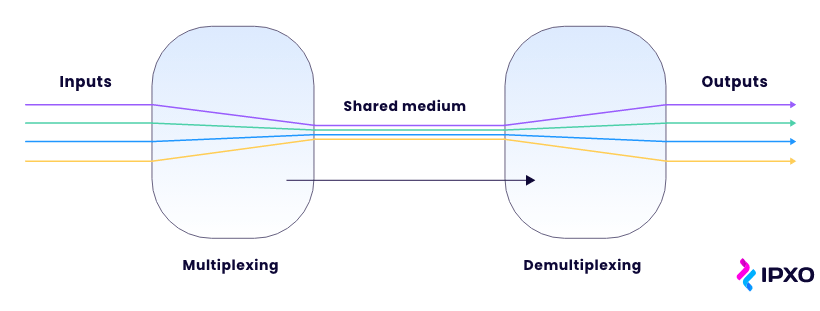
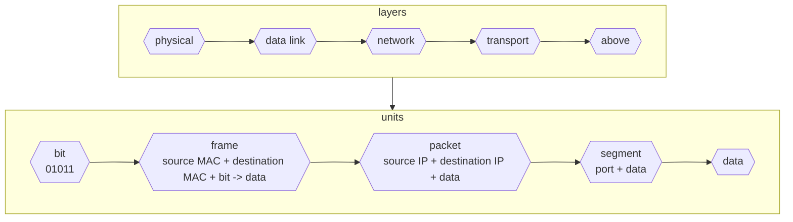

# Unit 2: Computer Network Structure

- **Author**: Caesar James LEE

## `O`pen `S`ystems `I`nterconnection Model

- created by the `I`nternational `O`rganization for `S`tandardization
- define **seven layers** that describe how data moves across a network: `physical`, `data link`, `network`, `transport`, `session`, `presentation` and `application`

```mermaid
---
title: OSI model structure
---
flowchart
    physicalMedia[[physical media]]
    subgraph Senders
        direction TB
        r7("Layer 7 Application<br>data")
        r6("Layer 6 Presentation<br>data")
        r5("Layer 5 Session<br>data")
        r4("Layer 4 Transport<br>segment")
        r3("Layer 3 Network<br>packet")
        r2("Layer 2 Data Link<br>frame")
        r1("Layer 1 Physical<br>bits")
        r7 -- user typed https://google.com --> r6
        r6 -- encode UTF-8, compress, encrypt TLS --> r5
        r5 -- establish/maintain dialog --> r4
        r4 -- add TCP header, port 443 to port 80/443 --> r3
        r3 -- add IP header, destination 142.250.184.206 --> r2
        r2 -- add Ethernet/Wi-Fi header + trailer --> r1
    end
    subgraph Receivers
        direction TB
        s1("Layer 1 Physical<br>Bits")
        s2("Layer 2 Data Link<br>frame to packet")
        s3("Layer 3 Network<br>packet to segment")
        s4("Layer 4 Transport<br>segment to data")
        s5("Layer 5 Session<br>data")
        s6("Layer 6 Presentation<br>data")
        s7("Layer 7 Application<br>data")
        s1 -- remove Ethernet header  --> s2
        s2 -- remove IP header, check destination --> s3
        s3 -- remove TCP header, reassemble --> s4
        s4 -- session management --> s5
        s5 -- decrypt TLS, decompress, decode --> s6
        s6 -- HTTP server receive GET request --> s7
    end
    r1 -- convert to electrical/light/radio signals --> physicalMedia
    physicalMedia -- receive bits from cable --> s1
    classDef green fill:#188525,stroke:#333,stroke-width:3px
    classDef blue fill:#1d38b8,stroke:#333,stroke-width:3px
    class Senders green
    class Receivers blue
```

### Layer 1: Physical

#### Purpose

- move raw bits (`0`s and `1`s) across physical media

#### What it Handles

- electrical signals, light pulses, radio waves
- hardware connections

#### Examples

1. Ethernet cables
2. Fiber-optic cables
3. Wi-Fi signals
4. hubs

#### Daily Life Analogy

- the road on which cars drive

### Layer 2: Data Link

#### Purpose

- package raw bits from `layer 1 - physical layer` into `frame`s
- ensure travel safely within the same local network

#### Responsibilities

1. `framing`: split data into manageable units
2. `error detection`
3. `media across control`: prevent multiple media from `"talking"` at the same time

#### `2` Sublayers

##### 1. `M`edia `A`ccess `C`ontrol

- control how devices share the communication medium
- perform `collision detection`
- perform `error recovery`

###### Daily Life Analogy

- traffic light controlling which car can go to avoid crashes

##### 2. `L`ogical `L`ink `C`ontrol

- interface between `MAC` and `network layer`
- `multiplexing`: combine multiple communications into a single frame
- `demultiplexing`: separate
- `acknowledgment`: confirm successful delivery
- `error checking`

###### Daily Life Analogy

- a mail sorter inside a post office that puts mixed mail into correct bins

###### Image

### Layer 3: Network

#### Purpose

- determine the **best route** for data to travel between different networks

#### Responsibilities

1. `routing`
2. `forwarding`
3. `IP` addressing
4. divide data into `packet`s
5. optional security with `IPSec`

#### Daily Life Analogy

- `Google Maps` chooses the best route from your home to another city

### Layer 4: Transport

#### Purpose

- provide `end-to-end` communication between devices
- ensure data arrives completely

#### Responsibilities

1. segmentation and reassembly
2. port management (e.g. `80` for `HTTP`)
3. reliable transfer (`TCP`) or faster transfer (`UDP`)

#### Daily Life Analogy

- `Uber Eats` picks up your meal, tracks it, and ensure it reaches the correct destination

### Layer 5: Session

#### Purpose

- manage ongoing communication between two devices

#### Functions

1. start, maintain and end sessions
2. keep track of state

#### Daily Life Example

- when you pause a video download and resume it later, the session layer helps re-establish context

### Layer 6: Presentation

#### Purpose

- make data readable for `application`s

#### Functions

1. encoding/decoding
2. data formating
3. encryption/decryption
4. compression/decompression

#### Daily Life Analogy

- translate a book from a language to another

### Layer 7: Application

#### Purpose

- provide network services directly to user application

#### Examples

1. `HTTP`
2. `STMP`
3. `DNS`
4. `FTP`

## Data Encapsulation

