# Unit 2: Computer Network Structure

- **Author**: Caesar James LEE

## `T`ransmission `C`ontrol `P`rotocol/`I`nternet `P`rotocol

### Comparing with `OSI`

#### Differences

- `TCP/IP`: **practical** model that addresses **specific communication** challenges and **relies on standardized protocols**
- `OSI`: **comprehensive**, **protocol-independent** framework designed to encompass various network communication
- image

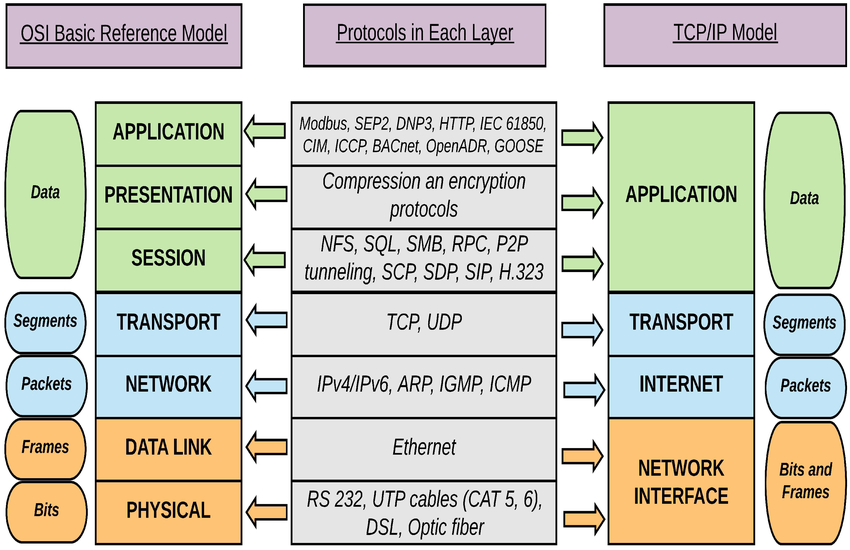

### Protocols

#### `Internet Layer` Protocols

##### `I`nternet `P`rotocol

###### What It Is

- the network layer communication protocol in the internet protocol suite for relaying datagrams across network boundaries
- provide logical addressing system which allows the routing of `IP data packets` from a source host to the next router that is one hop closer to the intended destination host on another network
- essentially **establish** the internet
- deliver packets from **source host** to the **destination host** based on the `IP address` in the packet header
- a connectionless communication protocol means doesn't establish a connection before transmitting data
- the first major version, `I`nternet `P`rotocol `v`ersion `4`, is the dominant protocol of the Internet
- successor is `I`nternet `P`rotocol `v`ersion `6` has been increasing deployment on public internet since around `2006`

###### Process

1. break date up into smaller pieces called `packet`s
2. each `packet` contains information about where it's coming from (`source IP address header`) and where it's going (`destination IP address header`) and the data itself (`payload`)
3. packets are sent to the Internet
4. packets travel across multiple networks and devices to reach the destination
5. reassemble all divided packets to form the original information

###### `IPv4`

- use a `32 bit` or `4 Byte` address space which provides `4,294,967,296` (${2}^{32}$) unique addresses
- packet format
    - image

        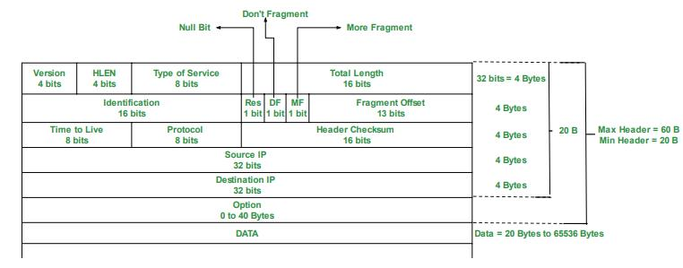
    1. `version`: only `IPv4` uses to tell us which `IP` version we are using (always `4`)
    2. `H`eader `LEN`gth: length of the `IP` header in `32 bit, 4 Byte` increments. We can type $[5, 15]$ here means range of length of `IP header` is $[20, 60]$ Bytes
    3. `T`ype `O`f `S`ervice: used for `Q`uality `O`f `S`ervice that tell us which service we are using. Format is `"RRRDTRUU"`:
        - `RRR`: Routine, order of IP. Default is `0`, the higher the bigger priority
        - `D`: Delay. `0` means normal, `1` means low
        - `T`: Throughput. `0` means normal, `1` means high
        - `R`: Reliability. `0` means normal, `1` means high
        - `UU`: Not Used
    4. `Total length`: entire size of the `IP packet` (`header` + `data`) in bytes. You can type $[20, 65\,525]$ here
    5. `Identification`: every **fragmented** packet will use the **same** identification number to identify to which `IP packet` they belong to
    6. `Null Bit`: always is `0`, because the `IP packet` is never an empty packet
    7. `D`on't `F`ragment: identify is this the last fragment (`0` means this is the last, `1` means isn't)
    8. `M`ore `F`ragment: identify is this a fragmented packet (`0` means yes, `1` means no)
    9. `Fragment Offset`: position of the fragmented packet in the original fragment sequence
    10. `T`ime `T`o `L`ive: time of the `IP packet` to live in seconds. If the time is decreased to `0`, router will drop it and send an `ICMP` time exceeded message to the sender
    11. `Protocol`: tell us which protocol is encapsulated in the `IP packet`. Some protocol numbers:
        - `ICMP`: `1`
        - `IGMP`: `2`
        - `IPv4`: `4`
        - `TCP`: `6`
        - `UDP`: `17`
        - `IPv6`: `41`
        - `IPv6-Route`: `43`
    12. `Header Checksum`: store a checksum of the header to check errors
    13. `Source IP`: address of source IP
    14. `Destination IP`: address of destination IP
    15. `Option`: some optional `IP` headers
    16. `Data`: payload data

- IP address
    - notation
        1. Dotted Decimal Notation

        ```mermaid
            flowchart TD
                subgraph binaries[Binary Octets]
                    direction LR
                    b0{{1000 0000}}
                    b1{{0000 1011}}
                    b2{{0000 0011}}
                    b3{{0001 1111}}
                end

                subgraph decimals[Dotted Decimal Notation]
                    direction LR
                    d0((128))
                    dot0((.))
                    d1((11))
                    dot1((.))
                    d2((3))
                    dot2((.))
                    d3((31))
                end

                b0 --> d0
                b1 --> d1
                b2 --> d2
                b3 --> d3
        ```

        2. Hexadecimal Notation

        ```mermaid
            ---
            title: Hexadecimal Notation
            config:
                theme: base
                themeVariables:
                    primaryColor: "#282c34"
                    primaryTextColor: "#abb2bf"
                    primaryBorderColor: "#56b6c2"
                    lineColor: "#c678dd"
                    secondaryColor: "#21252b"
                    tertiaryColor: "#5c6370"
            ---
            flowchart TD
                subgraph binaries[Binary Octets]
                    direction LR
                    b0{{0111 0101}}
                    b1{{0001 1101}}
                    b2{{1001 0101}}
                    b3{{1110 1010}}
                end

                subgraph hexadecimal[Hexadecimal Notation]
                    direction LR
                    prefix(0x)
                    h0(75)
                    h1(1D)
                    h2(95)
                    h3(EA)
                end

                b0 --> h0
                b1 --> h1
                b2 --> h2
                b3 --> h3
        ```

    - classful IP addressing
        - image

            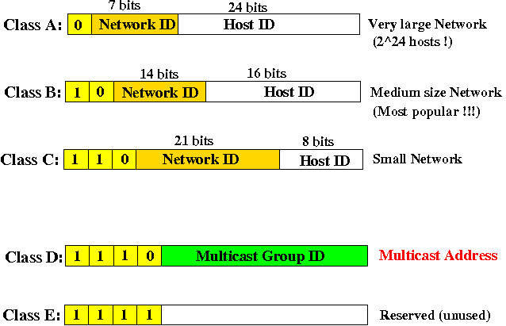
            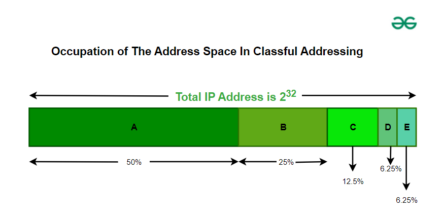

        - Classes
            - an early method (`1981 - 1993`) for assigning IP addresses and dividing the `IPv4` address space
            - replaced by `C`lassless `I`nter-`D`omain `R`outing in `1993`
            1. `Class A`
                - network ID: `8 bits`/`1 Byte`
                - start with: `0`
                - host ID: `24 bits`/`3 Bytes`
                - range: `0.0.0.0` - `127.255.255.255`
                - default subnet mask: `255.x.x.x`
                - special IP addresses:
                    - `0.0.0.0` - `0.0.0.8`: communicate within the current network
                    - `127.0.0.0` - `127.255.255.255`: loop-back addresses
                    - `127.0.0.1`: local device
                - private addresses - only be used in local network
                    - `10.0.0.0` - `10.255.255.255`
            2. `Class B`
                - network ID: `16 bits`/`2 Bytes`
                - start with: `10`
                - host ID: `16 bites`/`2 Bytes`
                - range: `128.0.0.0` - `191.255.255.255`
                - default subnet mask: `255.255.x.x`
                - special IP addresses:
                    - `169.254.0.0` - `169.254.0.16`: link-local addresses
                - private addresses:
                    - `172.16.0.0` - `172.31.255.255`
            3. `Class C`
                - network ID: `24 bits`/`3 Bytes`
                - start with: `110`
                - host ID: `8 bits`/`1 Byte`
                - range: `192.0.0.0` - `223.255.255.255`
                - default subnet mask: `255.255.255.x`
                - private addresses:
                    - `192.168.0.0` - `192.168.255.255`
            4. `Class D`
                - network ID: `4 bits`/`0.5 Byte`
                - start with: `1110`
                - host ID: `28 bits`/`3.5 Byte`
                - range: `224.0.0.0` - `239.255.255.255`
            5. `Class E`
                - network ID: `4 bits`/`0.5 Byte`
                - start with: `1111`
                - host ID: `28 bits`/`3.5 Byte`
                - range: `240.0.0.0`/`255.255.255.255`
        - special Host IDs
            1. all bits are set to `0` (`0`): represent the network ID, and **cannot be assigned**
            2. all bits are set to `1` (`255`): broadcast address to send packets to all the hosts within the network, and **cannot be assigned** as well
        - pros:
            1. a
        - cons:
            1. a

    - `C`lassless `I`nter `D`omain `R`outing (`ˈsædɚ`)
        - a method of IP address allocation and routing that allows more efficient use of IP addresses
        - use `prefix` instead of `fixed class` to allocate IP addresses
        - notation: `a.b.c.d/n`
            - `a`: the first byte
            - `b`: the second byte
            - `c`: the third byte
            - `d`: the fourth byte
            - `n`: number of `bits` in network prefix
            - example: `192.168.1.0/24`: first `24 bits` are network, the last `8 bits` are host ID
        - pros:
            1. minimize `IPv4` wastage
            2. support network at **any size**
            3. aggregate addresses for **faster** and **simpler** routing
            4. **easier** IP and network management
        - cons:
            1. more **complex** to implement and manage compared with traditional class-based addressing
            2. some **older** devices may not support
            3. implement security measures like firewall rules and access control lists can be more **difficult**

###### `IPv6`

- purpose
    - designed to fulfill the need for more internet address with `128 bits/16 Bytes` instead of `32 bits/4 Bytes` to provide (`340,282,366,920,938,463,463,374,607,431,768,211,456`, ${2}^{128} \approx {3.4} \times {10}^{35}$)
- address format
    - consist `8` groups of `4` hexadecimal digits separated by `.`
    - each hexadecimal digit represents `4` bits
    - format image:
      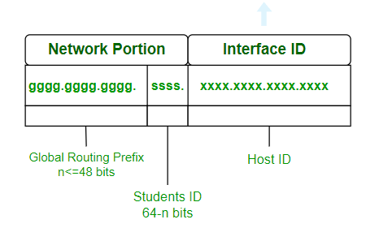
    - format: `gggg.gggg.gggg.ssss.xxxx.xxxx.xxxx.xxxx`
        - `gggg.gggg.gggg`: `Global Routing Prefix` is used to identify a specific **network or subnet** within the `IPv6` internet. It is assigned by an `I`nternet `S`ervice `P`rovider or a `R`egional `I`nternet `R`efistry
        - `ssss`: `Student ID` is used within an organization to identify **subnet**.
        - `xxxx.xxxx.xxxx.xxxx`: `Host ID` is used to identify a specific **host**
- types:
  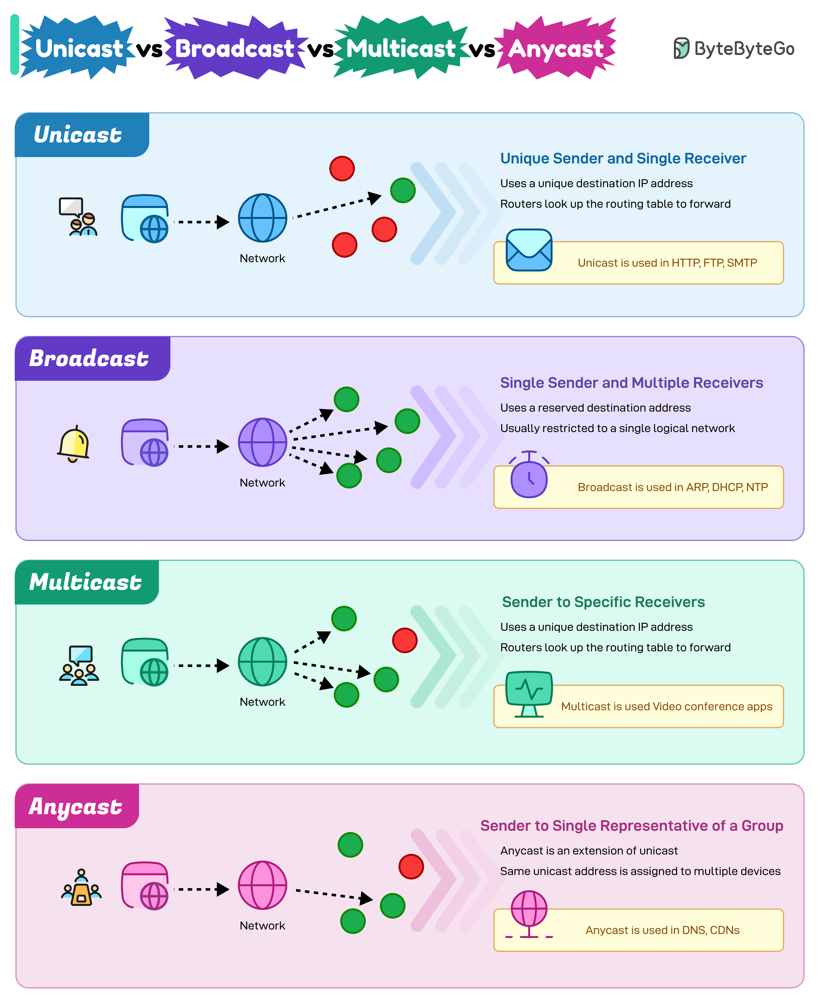
    1. `Unicast Address` aka `one-to-one`: only send packets to a **unique** IP destination, e.g. `HTTP`, `FTP`, `SMTP`
    2. `broadcast` aka `one-to-all`: send packets to **all hosts within a specific network**, e.g. `ARP`, `DHCP`, `NTP`
    3. `Multicast Address` aka `one-to-many`: send packets to **all hosts within a specific group**, e.g.
       `video conference apps like zoom`
    4. `Anycast Address` aka `one-to-any`: send packets to **the nearest IP destination**, e.g. `DNS`,
       `CDN`. Only support in `IPv6`
- header:

    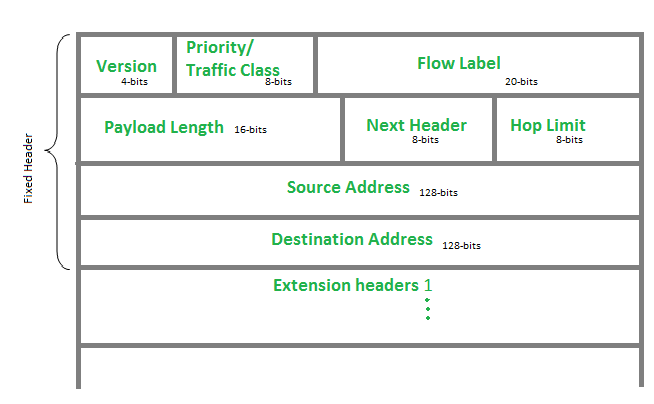
    - `version`: version of `IP`, which is always `6`
    - `traffic class`: indicate class or priority of `IPv6` packet that helps routers to handle the traffic
      based on priority of the packet. But routers can change the priority that is set by source node:
        - `0`: no specific traffic
        - `1`: background data
        - `2`: unattended data traffic
        - `3`: reversed
        - `4`: attend bulk data traffic
        - `5`: reversed
        - `6`: interactive traffic
        - `7`: control traffic
        - `8` - `15`: uncontrolled traffic that is mainly used by audio/video data
    - `flow label`: used by source to label the packets belong to the same flow in order to request special handling by intermediate `IPv6` routers
    - `payload length`: total size of the payload and that includes extension headers
    - `next header`: indicate the type of extension header immediately following the `IPv6` header
    - `hop limit`: same as `TTL` in `IPv4` packets
    - `source address`: `IPv6` address of source
    - `destination address`: `IPv6` address of destination
    - `extension headers`: designed to rectify the limitations of the `IPv4` option field. Like a linked list, `next header` points to `extension header 1`, which points to `extension header 2`, etc

- pros
    1. support `multicast` rather than `broadcast` that allows `bandwidth-intensive` packet flows to be sent
       to multiple destination at **once**
    2. `IPSec`urity, which provides confidentiality, and data integrity, is embedded
    3. routing efficiency
    4. reliability
    5. support more global network IP addresses
    6. own device allocated location
    7. enable simple aggregation of prefixes allocated to IP networks to save bandwidth by enabling the
       simultaneous transmission of large data packets
- cons
    1. will take long time to replace widespread present usage of `IPv4`
    2. cannot communicate with `IPv4` directly
    3. not available on `IPv4` computers
- comparison between `IPv4` and `IPv6`

|               feature               |                 `IPv4`                 |          `IPv6`          |
| :---------------------------------: | :------------------------------------: | :----------------------: |
|              `length`               |          `32 bits`/`4 Bytes`           |  `128 bits`/`16 Bytes`   |
|      `address representation`       |               `decimal`                |      `hexadecimal`       |
|           `header length`           |             `20-60 bytes`              |        `40 bytes`        |
|  `supported address configuration`  |          `manual` and `DHCP`           | `auto` and `renumbering` |
|               `type`                | `unicast`, `broadcast` and `multicast` |      plus `anycast`      |
|             `checksum`              |                support                 |     **not** support      |
| `V`ariable `L`ength `S`ubnet `M`ask |                support                 |     **not** support      |
|               `IPSec`               |              **optional**              |       **required**       |

##### `I`nternetwork `C`ontrol `M`essage `P`rotocol

###### Purpose

- used to send error messages and diagnostic messages of `IP packets` transmission duo to `IP` doesn't support inbuilt error-reporting or correction mechanism

###### Usage

1. `error reporting`
    - if a message cannot be delivered, `ICMP` informs the source about the failure
    - common issues: `unreachable hosts`, `timeout`, `fragmentation errors`, `packet is too large`, `routing errors`
2. `network diagnostics`
    - used to determine the path packets take across routers to reach the destination
    - common usage: `ping`

###### Process

1. `problem detection`: a `router`/`host` encounters an issue while processing an IP packet
2. `message creation`: receiver creates an `ICMP` message to describe the issue
3. `encapsulation and transmission`: the message is encapsulated within a new IP packet and sent back to the source IP address aka sender
4. `reception and handling`: sender receives the message, interprets the information to diagnose and decides an ongoing action

###### Format

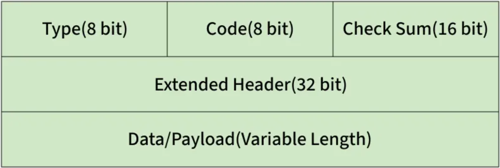

- `type`: a brief description of the message
- `code`: carry additional information about the error message and type
- `checksum`: used to check the number of bits of the complete message and enable the `ICMP` tool to ensure that complete data is delivered
- `extended header`: point out the problem in IP message
- `data/(payload of variable length)`: `IPv4` includes `576 Bytes`, and `IPv6` is `1,280 Bytes`

##### `I`nternet `G`roup `M`anagement `P`rotocol

###### What Is It

- used by hosts and adjacent routers to manage multicast group memberships on `IPv4` networks to establish **multicast group memberships**
- enable communication between hosts and local routers to identify multicast group members within a `LAN`
- replaced by `M`ulticast `L`istener `D`iscovery in `IPv6`

###### Applications

- `streaming media`: efficient multicast or multicast delivery of video/audio streams
- `online gaming`: enable multiple players to exchange game state updates in real-time
- `web conferencing`: support group communication for video meetings and collaboration tools

###### Types

1. `membership query`: sent by **routers** to discover which multicast groups **have active members** on a network segment
2. `membership report`: sent by **hosts** to indicate interest in **joining a multicast group**
3. `leave group`: sent by **hosts** when they **no longer wish to receive traffic** for a multicast group
4. `IGMPv3 membership report`: allow **hosts** to specific exact **multicast addresses and sources**

###### Process

1. `host-router interaction`: hosts send reports to **join**/**leave** multicast groups; routers **maintain** group membership tables
2. `multicast addressing`: multicast groups use class `D` IP addresses
3. `IGMP snooping`: switches listen to `IGMP` messages to **maintain a mapping** of multicast groups to ports, preventing unnecessary flooding. It's a feature in switches that listens to `IGMP` messages exchanged between hosts and routers
4. `multicast routing`: routers use `P`rotocol `I`ndependent `M`ulticast to forward multicast traffic between networks

###### Versions

1. `IGMPv1` (1989)

    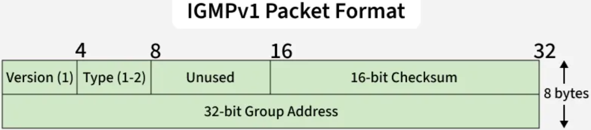
    - hosts join multicast groups using **membership requests**
    - doesn't support `leave` means **hosts must wait for timeout**

2. `IGMPv2` (1997)

    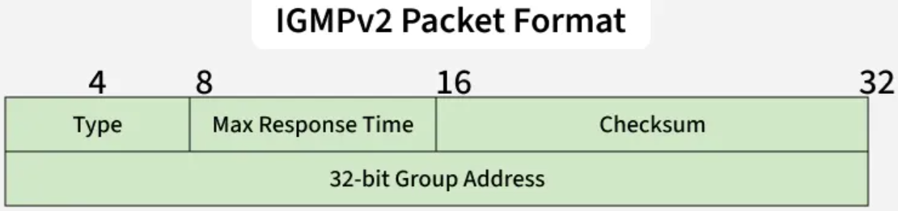
    - add `leave` group message for faster group exit
    - support `general`, `group-specific` and `source-specific` queries
    - types:
        1. `membership query`: `0x11`
        2. `IGMPv1 membership report`: `0x12`
        3. `IGMPv2 membership report`: `0x16`
        4. `IGMPv3 membership report`: `0x22`
        5. `leave group`: `0x17`

3. `IGMPv3` (2002)

    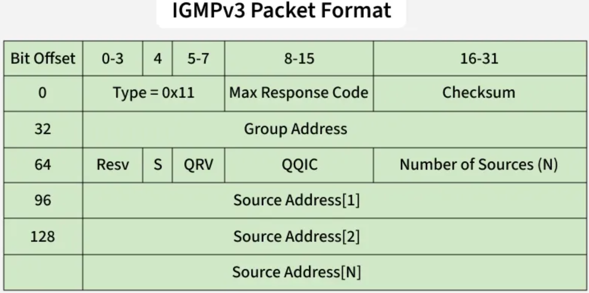
    - add `S`ource-`S`pecific `M`ulticast and `report aggregation`
    - hosts can specify `inclusion` (receive from specific sources) or `exclusion` (block specific sources)

##### `M`ulticast `L`istener `D`iscovery

- used by `IPv6` routers for discovering multicast listeners on a directly attached link like `IGMP` in `Ipv4`
- find out for which groups the router is listening on each directly connected network
- embedded in `ICMPv6`
- `MLDv1` equals to `IGMPv2`, and `MLDv2` equals to `IGMPv3`
- only difference between them is type code

##### `I`nternet `P`rotocol `Sec`urity

###### What It Is

- a large set of protocols and algorithms
- used for securing data transmitted all over the internet through authentication and encryption of IP packets
- designed by the `I`nternet `E`ngeering `T`ask `F`orce
- include `A`uthentication `H`eader to provide data integrity and non-replay services and `E`ncasulating `S`ecurity `P`ayload to encrypt and authenticate data
- also include `I`nternet `K`ey `E`xchange to generate security key with the purpose of establishing
  `S`ecurity `A`ssociation, which is majorly needed for encrypting & decrypting processes to negotiate security level between two entities

###### Architecture

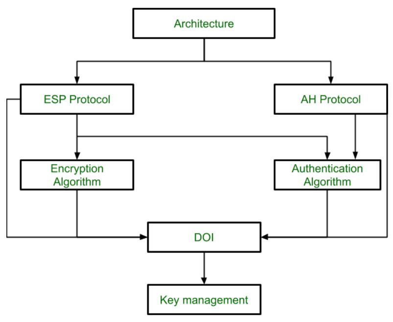

1. `I`nternet `P`rotocol `A`uthentication `H`eader: defined for adding authentication data and provides **data integrity**, **authentication**, **anti-replay** (protect against unauthorized transmission of packets) but not provide **encryption**
2. `I`nternet `P`rotocol `E`ncapsulating `S`ecurity `P`ayload: provide **authentication**, **integrity**, and **confidentiality** with encryption of IP packets
3. `I`nternet `K`ey `E`xchange: enable two systems or devices to establish secure and strong communication channel over networks even if in unreliable networks. To achieve this, `IKE` creates a secure and strong tunnel between a client and a server to send encrypted traffic easily and securely based on `Diffie-Hellman key exchange method`, which is one of widely used techniques used for security
4. `I`nternet `S`ecurity `A`ssociation and `K`ey `M`anagement `P`rotocol (ˈɪsəˌkæmp): a part of `IKE` and
   that is majorly used for **key establishment**, **authentication** and **negotiation** of a security association for a secure exchange of packets

###### Process

1. establish the `IKE` secure tunnel that is used to further negotiations. Operating in on `2` modes:
    1. `main mode`: a `6-message` exchange procedure since identify information is transmitted during negotiations
    2. `aggresive mode`: take less time with the exchange of `3` messages and is less secure since more information is disclosed during the course of negotiations
2. establish the `IPSec` tunnel to negotiate the `IPSec Security Association` after the construction of a secure `IKE` tunnel has been made. There're two modes
    1. `tunnel mode`: encrypt both **header** and **data** and add a new header. It's mostly deployed in the site of `VPN`s
    2. `transport mode`: only encrypt **data** and headers are unchanged. It's mainly deployed in `end-to-end` communication

###### Types of Encryptions

1. `symmetric encryption`: employ the same key to both encrypt and decrypt
2. `asymmetric encryption`: encryption key is made public, while the decryption key remains private

###### Pros

1. provide network-layer security and transparency to Applications
2. provide confidentiality during any kind of data exchange
3. no **dependability** on applicatiions

###### Cons

1. cannot only give access to a single device
2. bring a couple of incompatibility issues with different softwares
3. lead to high `CPU` usage

#### `A`ddress `R`esolution `P`rotocol

- used to determine the `MAC` address (hardware address) corresponding to an `IP` address, in other words, convert `IP` address
  into `MAC` address
- defined in 1982
- widely used with `IPv4`, `Ethernet`, `frame relay` and `A`synchronous `T`ransfer `M`ode

##### Terms

1. `ARP cache`: a table where resolved `MAC` address are stored for quick future use
2. `ARP cache timeout`: duration for an entry remains valid in the `ARP cache`
3. `ARP request`: a broadcast message asking `who has the IP address`
4. `ARP reply/response`: a unicast message containing the `MAC` address of the requested IP

##### Types

1. `proxy ARP`
    - allow a proxy device (router) to respond to ARP requests on behalf of another device
    - useful for hiding network complexity or connecting different subnets
2. `gratuitous ARP`
    - a host sends an `ARP` request for its own IP address
    - used to detect duplicate IP addresses and update ARP tables on other devices
3. `R`everse `ARP`
    - used by a device to convert its **own** `MAC` address to `IP` address
    - find its own `IP` address using its own `MAC` address
    - example: **diskless** computers at boot time request their IP from a server
4. `In`verse `ARP`
    - used to find `IP` address from a known `MAC` address
    - find an `IP` address using a known (maybe from another device) `MAC` address
    - common used in `farme relay` and `ATM` networks

##### Process

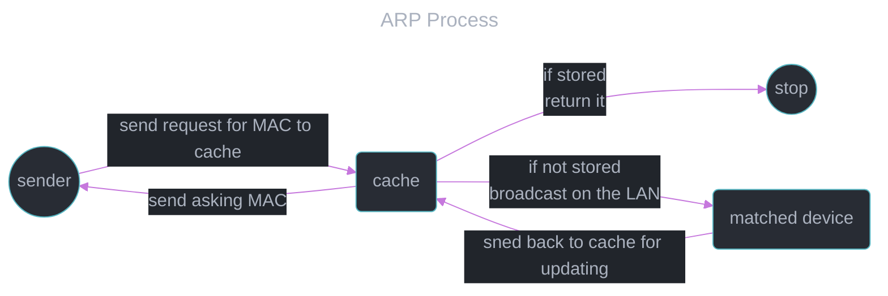

##### Format

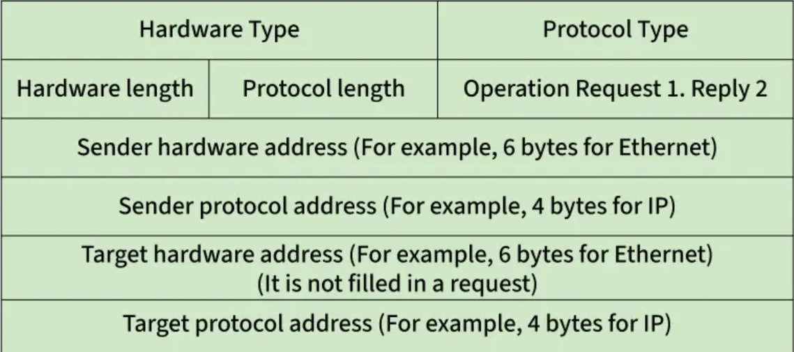

- hardware type (2 bytes): type of hardware, like `1` for `Ethernet`
- protocol type (2 bytes): type of protocol, like `0x0800` for `IPv4`
- hardware address length (1 byte): length of `MAC` address
- protocol address length (1 byte): length of `IP` address
- operation code (2 bytes): `1` for request, `2` for reply
- sender hardware address: MAC of sender
- sender protocol address: IP of sender
- target hardware address: empty in request, MAC of receiver in reply
- target protocol address: IP of receiver

##### Pros

1. `automatic mapping`: no need for manual configuration to resolve MAC addresses
2. `efficiency`: efficient communication within `LAN`s
3. `transparency`: work in the background
4. `flexibility`: support different types

#### `Transport Layer` Protocols

##### `T`ransmission `C`ontrol `P`rotocol

###### What Is It

- a connection-oriented protocol to exchange messages between different devices over a network for providing reliable delivery services
- one of main protocols in `TCP/IP` and cooperates with `IP`
- use `P`ositive `A`cknowledgement with `R`etransmission to ensure reliability
- use `three-way handshake` (`SYN`, `SYN-ACK`, `ACK`) to establish a reliable connection between sender and receiver
- use `three-way handshake` (`FIN`, `FIN+ACK`, `ACK`) to close the connection
- ensure `error-free`, `in-order delivery` of data packets
- used in applications requiring **reliable** and **ordered** data transfer, e.g. `web browsing`, `email` and `remote login`

###### Features

1. `segment numbering`: numbering each byte of data and provide `segments` to carry sequence numbers and `acknowledgment numbers` to confirm successful receipt
2. `connection-oriented`: keep the connection between sender and receiver until complete the data transfer, and preserve data order
3. `full duplex`: enable data flows both directions to improve efficiency
4. `flow control`: use `sliding window` to prevent the sender from overwhelming the receiver
5. `error control`: detect and manage **corrupted**, **lost**, **duplicate**, or **out-of-order** segments to ensure reliability
6. `congestion control`: adjust the sending rate based on network congestion to avoid overload

###### Format

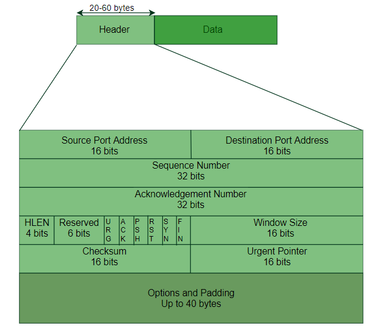

- header of `TCP` segment can range $[20, 60]$ bytes and `40 bytes` are optional
- `source port address`: identify sending application
- `destination port address`: identify receiving application
- `sequence number`: position of the first byte in the segment for ordering
- `acknowledgment number`: next byte expected by the receiver to confirm data received
- `H`eader `LEN`gth: size of headers in number of `4 bits` from `20 bytes` (5) to `60 bytes` (15)
- `URG`ent flag: indicate data should be prioritized and handled immediately and that is used in combination with `urgent pointer` to identify the urgent data
- `ACK`nowledgement flag: used to acknowledge the receipt and communicate with next expected sequence number
- `P`u`SH` flag: used to request immediate data delivery to the host without waiting. It's commonly used in real-time audio and video streaming
- `R`e`S`e`T` flag: terminate the connection if the sender feels something is wrong or the connection shouldn't be exist
- `SYN`chronize flag: used in the first step of connection establishment phrase for synchronizing sequence number, i.e. tell the receiver which sequence number should be accepted
- `FIN`ish flag: used to request in connection termination to terminate the connection
- `window size`: used in `flow control` for receiver's buffer size
- `checksum`: error detection
- `urgent pointer`: position of urgent data only for `URG` flag is set

###### Process

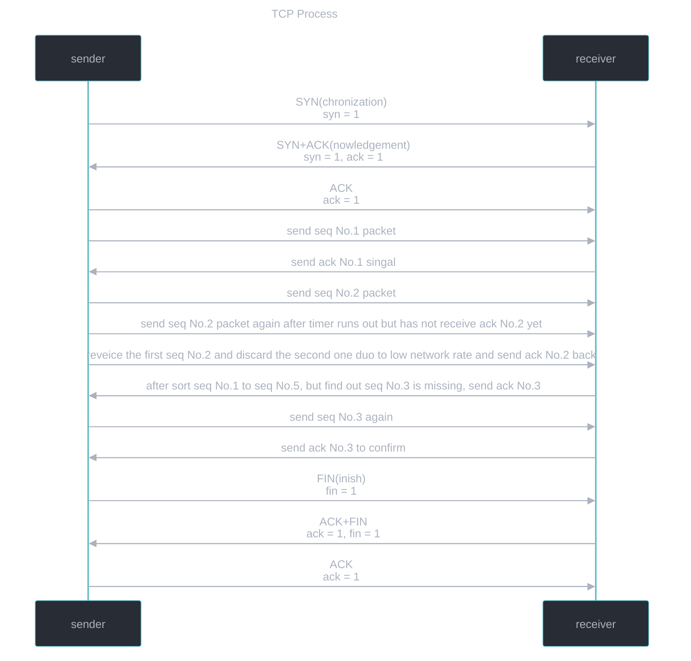

1. `SYN` (synchronize sequence number)
    - the client sends a segment with `SYN` to inform the server to start communication
    - the client also tells the server what sequence number it starts segments with
2. `SYN-ACK` (synchronization and acknowledgment)
    - `SYN` signifies with what sequence number the server to start the segments with
    - `ACK` signifies the response of the segment the server received
3. `ACK` (acknowledgment)
    - the client acknowledges the response to establish a reliable connection with and that the actual data transfer
4. send packets
    - the client starts a timer and puts the packet in a retransmission queue
    - the client will resends the packet if it has not yet received an `ACK` signal from the server after the timer runs out
    - the server will discard duplicate packets if it actually received the packet but delay to send a `ACK` response
    - the server will sort the packets based on `sequence number`, and send a retransmission response if missing some particular packets based on `sequence number` and `acknowledgement number`
5. `FIN`inish
    - the clients sends a finish flag to the server while sent all of data
6. `ACK+FIN`
    - the server sends finish flag and acknowledgment back to ensure
7. `FIN`
    - the client ensures to terminate the connection

###### Pros

1. a reliable protocol that provides `error-checking` and `recovery`
2. make sure that the data reaches the proper destination in the exact order
3. work in conjunction with `IP`

###### Cons

1. made for `WAN`, and its size can become an issue for smaller networks
2. slow down the speed of network because it runs several layers(`data link` + `network` + `transport` + `application`)
3. only work in `TCP/IP` suite
4. no modifications since it was developed

##### `U`ser `D`atagram `P`rotocol

###### What It Is

- `datagrams` mean packets of `UDP`
- designed in 1980
- a protocol provides **fast**, **connectionless** and **lightweight** communication between processes
- not guarantee **delivery**, **order** or **error checking**
- suitable for real-time and time-sensitive applications, e.g. video streaming, `DNS`, `VoIP`
- doesn't speed time to form a connection before transferring the data to reduce time
- can cause data packets to get lost and make `D`istributed `D`enial-`o`f-`S`ervice attack easy to execute by a hacker

###### Header Format

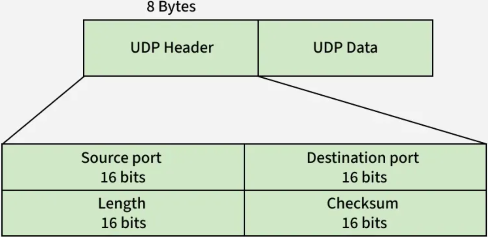

- `source port`:
    - identify and separate different senders
- `destination port`:
    - identify and separate different receivers
- `length`:
    - total size of `UDP` header and data
- `checksum`:
    - used for error detection (**optional** in `IPv4`, and **required** for `IPv6`)

- Pseudo Header

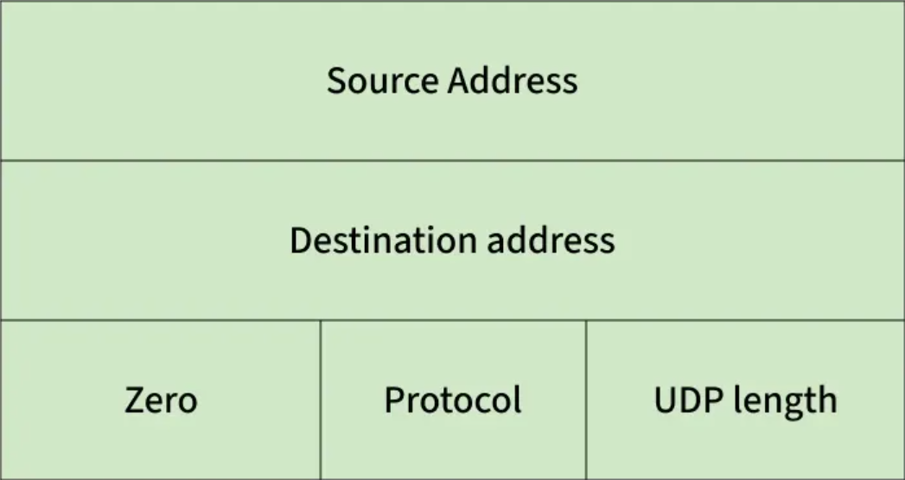

- this pseudo header doesn't transmit and just used to improve checksum accuracy during checksum calculation
- receiver verifies the checksum using the pseudo header and accepts the packet only if checksum is valid

###### Process

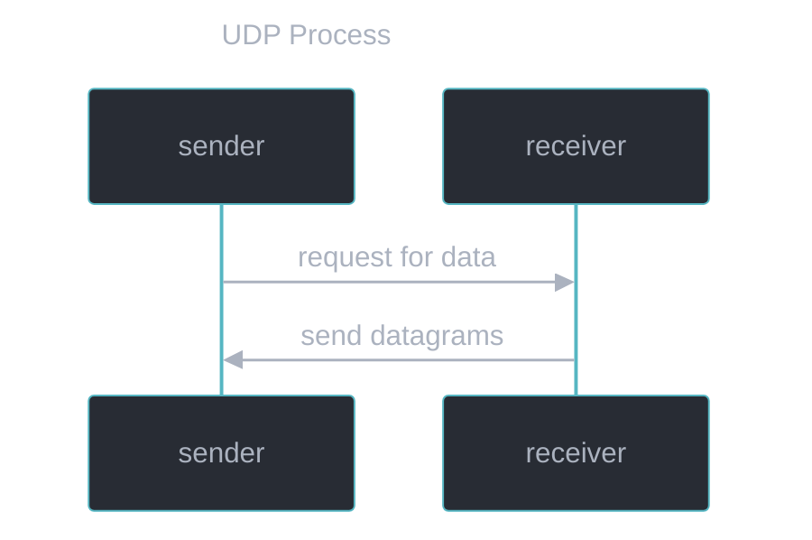

###### Comparison Between `TCP` and `UDP`

|        field         |                     `TCP`                      |    `UDP`     |
| :------------------: | :--------------------------------------------: | :----------: |
| establish connection |           use `three-way handshake`            | not support  |
|    order packets     | use `sequence number` and `acknowledge number` | not support  |
|       reliable       |                      yes                       |      no      |
|     loss packets     |                 can retransmit                 | loss forever |
|        speed         |                      low                       |     fast     |

#### `Application Layer` Protocols

##### `F`ile `T`ransfer `P`rotocol

##### `H`yper`T`ext `T`ransfer `P`rotocol

##### `D`omain `N`ame `S`ystem

##### `telnet`

##### `S`ecure `SH`ell

##### `S`imple `M`ail `T`ransfer `P`rotocol

##### `S`imple `N`etwork `M`anagement `P`rotocol

##### `N`etwork `F`ile `S`ystem

##### `V`oice `o`ver `I`nternet `P`rotocol

##### `S`ecure `S`ockets `L`ayer

##### `T`ransport `L`ayer `S`ecurity
