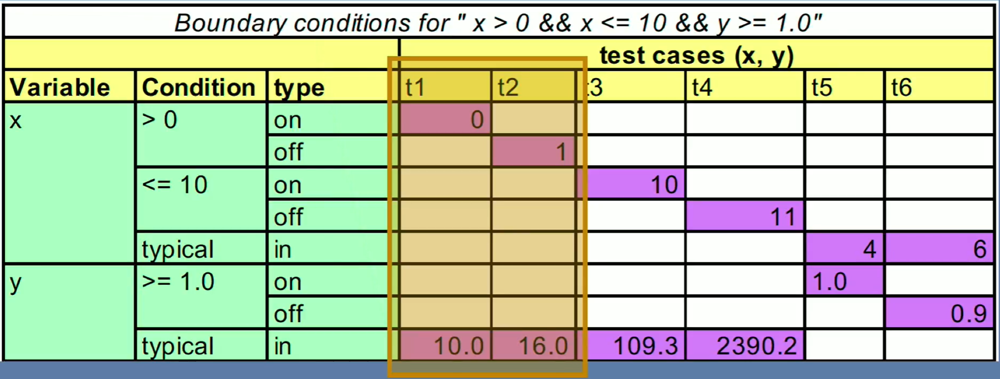

# week #2: Functional Testing

# Platform: Edx

# Course Name: DelftX ST1x Automated Software Testing: Unit Testing, Coverage Criteria and Design for Testability

# Author: Caesar James LEE

## Unknown Keywords

| English           | Pronunciation     | Chinese Meaning            |
| :---------------: | :---------------: | :------------------------: |
| artifact          | ˈɑrtɪˌfækt        | 工藝品                      |
| equivalence       | ɪˈkwɪvǝlǝns       | 相等                        |
| constraint        | kǝnˈstrеnt        | 限制                        |
| pragmatic         | præɡˈmætɪk        | 務實的；國家大事的           |
| conformance       | kǝnˈfɒrmǝns       | 遵從；符合                  |
| cardinality       | ˌkɑrdəˈnælətɪ     | 基數                        |
| prerequisite      | ˌpriˈrɛkwǝzɪt     | 不可缺的；事先需要的；必修的  |
| cipher            | ˈsaɪfɚ            | 密碼；零；阿拉伯數字         |
| encrypt           | ɛnˈkrɪpt          | 將……譯成密碼                |
| decrypt           | diˈkrɪpt          | 譯（電文）；解（密碼）       |

## Unknown Abbreviations

| Abbreviations | Full Name     | Pronunciation | Chinese Meaning   |
| :-----------: | :-----------: | :-----------: | :---------------: |
| specs         | specification | spɛks         | 規格；說明         |


## Partition

* often, programs are just too big, so we need to divide it into different partitions
* each partition represents a different case that has to be tested
* all tests are belong to the same equivalence partition

### category partition method
* ideas
    1. identify the parameters
    2. the characteristics of each parameter
        * from the specs
        * not from the specs
    3. add constrains
        * remove invalid combinations
        * reduce number of exceptional behaviors
    4. generate combinations

## Leap Year

### Code

* simple way
```java
    public class LeapYear{
        public boolean isLeapYear(int year){
            return (year % 4 == 0 && year % 100 != 0) || (year % 400 == 0);
        }
    }
```

* partition way
```java
    public class LeapYear{
        public boolean isLeapYear(int year){
            if(year % 400 == 0)
                return true;
            if(year % 100 == 0)
                return false;
            return year % 4 == 0;
        }
    }
```

### Test

```java
    import org.junit.jupiter.api.Assertions;
    import org.junit.jupiter.api.Test;

    public class LeapYearTest{
        @Test
        public void leapYearsThatAreNonCenturialYears(){
            Assertions.assertTrue(new LeapYear().isLeapYear(2016));//assert result is true
        }

        @Test
        public void leapCenturialYears(){
            Assertions.assertTrue(new LeapYear().isLeapYear(2000));
        }

        @Test
        public void nonLeapCenturialYears(){
            Assertions.assertFalse(new LeapYear().isLeapYear(1500));//assert result is false
        }

        @Test
        public void nonLeapYears(){
            Assertions.assertFalse(new LeapYear().isLeapYear(2017));
        }
    }
```

## Boundary Testing

### definition

* a testing method to check whether boundary conditions are handled correctly
* typically, we should test at least 5 cases:
    1. on the left boundary
    2. on the right boundary
    3. just below the left boundary
    4. just above the right boundary
    5. a value within the boundaries

### `ParameterizedTest`

```java
    @ParameterizedTest//declare a parametrized test method that runs multiple times with different arguments
    //output the default name (value) for each parameter
    @CsvSource({"1, 1, 5, 0", "1, 1, 6, 1"})//supply values for "small, big, total, expectedResult" as comma-separated input
    //a test method with four parameters
    public void totalIsTooBig(int small, int big, int total, int expectedResult){
        Assertions.assertEquals(expectedResult, new ChocolateBags().calculate(small, big, total));
    }

    @ParameterizedTest(name = "small = {0}, big = {1}, total = {2}, expectedValue = {3}")
    //same as above, but define a custom test name for better readability in the test output
    //name of the first parameter is "small", second is "big", etc
    @CsvSource({"1, 1, 5, 0", "1, 1, 6, 1"})
    public void totalIsTooBig(int small, int big, int total, int expectedResult){
        Assertions.assertEquals(expectedResult, new ChocolateBags().calculate(small, big, total));
    }
```

## terms about boundary points

1. `on point`
    * a value that is **exactly on boundary** of the valid input range
2. `in point`
    * a value that is **within** the valid input range
3. `out point`
    * a value that is **outside** the valid input range
4. `off point`
    * a type of `out point`, but just **barely** outside the boundary
* example: `return value >= 0 && value <= 100 ? "valid score" : "invalid score";`
    1. `on point`: `0` and `100`
    2. `in point`: `64`, `89`, etc
    3. `out point`: `-64`, `1989`, etc
    4. `off point`: `-1` and `101`

## simplified domain-testing strategy

* handle  boundaries independently
* for each boundary, pick **on** and **off** point
* while testing one boundary, use **varying in points** for the other boundaries
* use a **domain matrix** to organize test cases
* example of a `domain matrix`


## CORRECT (Conformance Ordering Range Reference Existence Cardinality Time) way

* a boundary condition way that was introduced in *Pragmatic Unit Testing in Java 8 with JUnit* by *Jeff Langr*, *Andy Hunt* & *Dave Thomas*

### 1. `conformance`

* ensure inputs follow the required format
* e.g., email: `name@domain`

### 2. `ordering`

* check if inputs and outputs respect required order
* e.g., dates in sequence, sorted rankings
* test what happens with unordered data

### 3. `range`

* input must stay within defined boundaries
* e.g., [0, 120]
* test values below, above, and at the limits

### 4. `reference`

* some operations depend on prior state
* e.g., placing an order requires a user account
* test behavior when the prerequisite is missing

### 5. `existence`

* input may be missing
* e.g., `null` or empty`
* check system behavior when data is absent or undefined

### 6. `cardinality`

* test with **zero**, **one**, and many elements
* watch out for `off-by-one` error in loops and conditions
* `off-by-one` error: when a program iterates one time too many or one time too few — usually due to incorrect loop conditions or index usage

### 7. `time`

* input involving time must handle edge cases like time zones and daylight saving time
* verify the system works correctly across locations