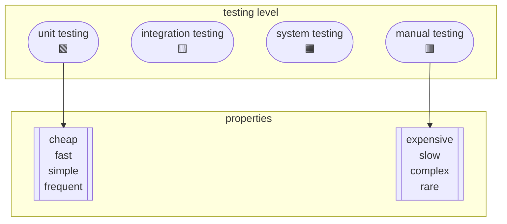
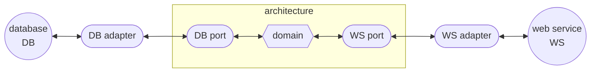

# week #4: Testability And Mock Object

# Platform: Edx

# Course Name: DelftX ST1x Automated Software Testing: Unit Testing, Coverage Criteria and Design for Testability

# Author: Caesar James LEE

## Unknown Keywords

| English           | Pronunciation     | Chinese Meaning            |
| :---------------: | :---------------: | :------------------------: |
| flaky             | ˈflеkɪ            | 薄片的；成層狀的；不穩定的   |
| mock              | mɑk               | 假的；模擬的                |
| invoice           | ˈɪnvɒɪs           | 開……的發票；將……列入清單     |
| infrastructure    | ˈɪnfrǝˌstrʌktʃɚ   | 公共建設；基礎建設           |
| legacy            | ˈlɛɡǝsɪ           | 遺產                       |
| precise           | prɪˈsaɪs          | 精確的；嚴格的              |
| verbose           | vɚˈbos            | 囉嗦的；冗長的              |
| decorator         | ˈdɛkǝˌrеtɚ        | 室內設計師                  |
| stub              | stʌb              | 殘端；菸蒂；存根             |
| snapshot          | ˈsnæpˌʃɑt         | 快照；急射；簡要印象         |
| tie               | taɪ               | 繫；束縛；打成平手           |
| tolerance         | ˈtɑlǝrǝns         | 寬容；忍耐；容許量           |
| hexagonal         | hɛkˈsæɡǝnḷ        | 六角形的                    |
| immutable         | ɪˈmjutǝbḷ         | 永遠不變的                  |
| stripe            | straɪp            | 條紋；狹長地帶；類型，特點   |
| cohesive          | koˈhisɪv          | 凝聚性的；有結合力的        |

## Unknown phrase

| English               | Pronunciation     | Chinese Meaning            |
| :-------------------: | :---------------: | :------------------------: |
| so on and so forth    | so ɑn ænd so forθ | 等等                       |

## test levels

1. `unit testing`:
    * test a single and isolated unit like a function, method, class, etc
    * isolated from an external systems (e.g., databases, networks)
    * advantages
        1. very fast
        2. easy to control using parameters or mocks
        3. easy to write and maintain
    * disadvantages
        1. less real
        2. some bugs cannot be reproduced at this level
2. `system testing`
    * test the complete system as a whole (end-to-end)
    * mimic real user workflows in a production-like environment
    * advantages
        1. very realistic
        2. capture the user perspective
    * disadvantages
        1. slow
        2. hard to write
        3. flaky
3. `integration testing`
    * test the interaction between multiple components or units
    * ensures that units work together correctly
    * often include external dependencies like databases, APIs, or file systems
    * advantages
        1. more realistic than `unit testing`
        2. detect bugs in the interfaces or communication between parts
    * disadvantages
        1. slower than `unit testing`
        2. more complex to write and maintain
        3. may require set up real or fake environment



### note

* **badly designed** class models are the **biggest enemy** of testability

## mock object

* fake implementations of real objects used to simulate the behavior of complex, real components
* mainly used in `unit testing` to isolate the code being tested
* advantages
    1. without dependencies(e.g. databases, web services, etc)
    2. simulate specific behaviors or error conditions
    3. verify interactions with the expected parameters
    4. test run faster since no real external resources are used

### popular mock libraries

1. `C++`
    * `Google Mock` (`gMock`)
        * features
            1. powerful matchers
            2. mock classes
            3. integration with `gTest`
        * open source (license)
            * ✅ (`BSD`)
        * IDE
            1. `JetBrains CLion`
            2. `Microsoft Visual Studio Code`
            3. `QT creator`
        * platform
            1. `Linux`
            2. `Microsoft Windows`
            3. `Apple macOS`
        * pros
            1. native C++ support
            2. strong matcher system
        * cons
            1. more setup required
            2. C++ template complexity
2. `Java`
    * `Mockito`
        * features
            1. easy to use
            2. annotations
            3. `BDD-style` API
            4. argument matching
        * open source (license)
            * ✅ (`MIT`)
        * IDE
            1. `JetBrains IntelliJ IDEA`
            2. `Eclipse`
            3. `Microsoft Visual Studio Code`
        * platform
            * cross-platform
        * pros
            1. simple syntax
            2. well-documented
            3. large community
        * cons
            1. limited to Java
            2. cannot mock `static` and `final` methods
    * `EasyMock`
        * features
            1. `record-replay` model
            2. strict expectations
        * open source (license)
            * ✅ (`apache 2.0`)
        * IDE
            1. `JetBrains IntelliJ IDEA`
            2. `Eclipse`
        * platform
            * cross-platform
        * pros
            1. strict control
            2. useful for legacy code
        * cons
            1. more verbose
            2. less flexible then `Mockito`
    * `JMock`
        * features
            1. precise expectation rules
        * open source (license)
            * ✅ (`BSD`)
        * IDE
            1. `JetBrains IntelliJ IDEA`
            2. `Eclipse`
        * platform
            * cross-platform
        * pros
            1. fine-grained control
        * cons
            1. verbose syntax
            2. stepper learning curve
3. `Python`
    * `unittest.mock`
        * features
            1. build-in
            2. patch decorator
            3. call assertions
        * open source (license)
            * ✅ (`PSF`)
        * IDE
            1. `JetBrains PyCharm`
            2. `Microsoft Visual Studio Code`
            3. `Thonny`
        * platform
            * cross-platform
        * pros
            1. included in standard lib
            2. no installed need
        * cons
            1. less powerful for complex behavior
4. `JavaScript`
    * `sinon.js`
        * features
            1. fakes, spies, stubs
            2. work with `Mocha`, `Jasmine`, etc
        * open source (license)
            * ✅ (`BSD`)
        * IDE
            1. `Microsoft Visual Studio Code`
            2. `JetBrains WebStorm`
        * platform
            1. web
            2. `node.js`
        * pros
            1. great for frontend
            2. work with all test libs
        * cons
            1. not suitable for `non-JS` code
    * `Jest Mocks`
        * features
            1. build-in mocking
            2. auto mocks
            3. mock functions
        * open source (license)
            * ✅ (`MIT`)
        * IDE
            1. `Microsoft Visual Studio Code`
            2. `JetBrains WebStorm`
        * platform
            1. web
            2. `node.js`
        * pros
            1. easy setup
            2. snapshot testing
        * cons
            1. tied to `Jest`

### example for `Mockito`

* I've four class: `Invoice` (entity for invoice), `InvoiceDao` (access the database), `InvoiceFilter` (filter the data) and `InvoiceFilterTest`  (test class)
* access database
    * `Invoice`
        ```java
            public class Invoice{
                private String customer;
                private double value;
                //constructor
                public Invoice(String customer, double value){
                    this.customer = customer;
                    this.value = value;
                }

                //getters
                public String getCustomer(){
                    return customer;
                }

                public double getValue(){
                    return value;
                }

                //override methods
                @Override
                public boolean equals(Object object){
                    if(this == object)
                        return true;
                    if(object == null || this.getClass() != object.getClass())
                        return false;
                    Invoice invoice = (Invoice)object;
                    if(Double.compare(invoice.value, this.value) != 0)
                        return false;
                    return this.customer != null ? this.customer.equals(invoice.customer) : invoice.customer == null;
                }

                @Override
                public int hashCode(){
                    int result = customer != null ? customer.hashCode() : 0;
                    long temp  = Double.doubleToLongBits(value);
                    //>>> for unsigned right shift
                    result = 31 * result + (int)(temp ^ (temp >>> 32));
                    return result;
                }
            }    
        ```
    * `InvoiceDao`
        ```java
            public class InvoiceDao{
                private static Connection c;
                public InvoiceDao(){
                    try{
                        if(c != null)
                            return;
                        c = DriverManager.getConnection("jdbc:hsqldb:file:mymemdb.db", "SA", "");
                        c.prepareStatement("CREATE TABLE IF NOT EXISTS invoice (name VARCHAR(100), value DOUBLE)").execute();
                    }catch(SQLException e){
                        throw new RuntimeException(e);
                    }
                }
                public List<Invoice> all(){
                    List  <Invoice> allInvoices = new ArrayList<>();
                    try{
                        PreparedStatement ps = c.prepareStatement("SELECT * FROM invoice");
                        ResultSet rs = ps.executeQuery();
                        while(rs.next()){
                            String name = rs.getString("name");
                            double value = rs.getDouble("value");
                            allInvoices.add(new Invoice(name, value));
                        }
                    }catch(SQLException e){
                        throw new RuntimeException(e);
                    }finally{
                        return allInvoices;
                    }
                }
                public void save(Invoice inv){
                    try{
                        PreparedStatement ps = c.prepareStatement("INSERT INTO invoice (name, value) VALUES (?,?)");
                        ps.setString(1, inv.getCustomer());
                        ps.setDouble(2, inv.getValue());
                        ps.execute();
                        c.commit();
                    }catch(SQLException e){
                        throw new RuntimeException(e);
                    }
                }
                public void close(){
                    try{
                        c.close();
                    }catch(SQLException e){
                        throw new RuntimeException(e);
                    }
                }
            }    
        ```
    * `InvoiceFilter`
        ```java
            public class InvoiceFilter{
                public List<Invoice> filter(){
                    List  <Invoice> filtered = new ArrayList<>();
                    for(Invoice inv : new InvoiceDao().all())
                        if(i.getValue() < 100.0)
                            filtered.add(i);
                    return filtered;
                }
            }
        ```
* `InvoiceFilterTest`
    ```java
        public class InvoiceFilterTest{
            @Test
            void filterInvoices(){
                InvoiceDao dao = new InvoiceDao();
                Invoice mauricio = new Invoice("Mauricio", 20.0),
                        arie = new Invoice("Arie", 300.0);
                dao.save(mauricio);
                dao.save(arie);
                InvoiceFilter filter = new InvoiceFilter(dao);
                List <Invoice> result = filter.filter();
                Assertions.assertEquals(mauricio, result.get(0));
                Assertions.assertEquals(1, result.size());
                dao.close();
            }
        }
    ```
* mock
    * `InvoiceFilter`
    ```java
        public class InvoiceFilter{
            private InvoiceDao dao;
            public InvoiceFilter(InvoiceDao dao){
                this.dao = dao;
            }
            public List<Invoice> filter(){
                List  <Invoice> filtered = new ArrayList<>();
                for(Invoice i : this.dao.all())
                    if(i.getValue() < 100.0)
                        filtered.add(i);
                return filtered;
            }
        }
    ```
    * `InvoiceFilterTest`
    ```java
        public class InvoiceFilterTest{
            @Test
            void filterInvoices(){
                Invoice mauricio = new Invoice("Mauricio", 20.0),
                        arie = new Invoice("Arie", 300.0);
                //create a mock of the InvoiceDao class
                InvoiceDao dao = Mockito.mock(InvoiceDao.class);
                //create a list that contains both invoices
                List <Invoice> list = Arrays.asList(mauricio, arie);
                //stub the all method to return the list instead of hitting a database
                Mockito.when(dao.all()).thenReturn(list);
                InvoiceFilter filter = new InvoiceFilter(dao);
                List <Invoice> result = filter.filter();
                Assertions.assertEquals(mauricio, result.get(0));
                Assertions.assertEquals(1, result.size());
                dao.close();
            }
        }
    ```

### technical terms

1. `controllability`
    * determine the work it takes to set up and run test cases and the extent to which individual functions and features of the system under test (SUT) can be made to respond to test cases.
    * in other words, how easy it is for us to provide inputs and invoke the behavior that we want in the system under test
2. `observability`
    * determine the work it takes to set up and run test cases and the extent to which the response of the system under test (SUT) to test cases can be verified
    * in other words, how easy it is for us to observe the system under test in order to verify whether the system behaved as expected
3. `System Under Test` (`SUT`)
    * the code, module, class, function, or full system that you're currently testing

## test a floating number

* as we all know, some decimal numbers cannot be precisely represented in binary form
* what we can do instead is compute them as accurately as possible by including more decimal places 
* to handle this, we use a concept called `delta`, denoted by the symbol $\Delta$, to measure the difference between the actual value and the computed value
* typically, we set `delta` to $10^{-9}$ (or `1e-9`)
* we can use `Assertion.assertEquals(expectedNumber, computedNumber, delta)` to test whether the solution is correct within the allowed margin of error

## `ports & adapters architecture`

1. `domain`
    * the core logic of the application
    * independent of external concerns like databases, user interfaces, etc
2. `port`
    * an interface that define how the domain interacts the outside world
    * has two different types
        1. `input port` aka `driving port`
        2. `output pot` aka `driven port`
3. `adapter`
    * implementation of the port
    * translate data and operations between the domain and a specific external systems
    * has two different types
        1. `DB adapter`
            * content the domain to a database
        2. `webservice adapter`
            * connect the domain to a web service

* `ports & adapters architecture` improves the testability, because we can easily mock the ports

## dependency injection

### definition

* a design pattern that promotes loose coupling by injecting dependencies from the outside rather than letting a class create them internally
* often part of `Inversion of Control` (`IoC`), where control of object creation and binding is shifted from the class to a container, like `Spring` framework
* for example: to use a hammer
    1. `tradition`: search for a hammer, pick it up, and use it
    2. `dependency injection`: someone gives you a hammer, and you use it

### common dependency injection types

1. `constructor injection`
    * dependencies are passed via the constructor
    * best for **required** dependencies and make the class **immutable**
2. `setter injection`
    * dependencies are passed via public setter methods
    * best for **optional** dependencies or when **mutability is acceptable**
3. `interface injection`
    * dependency is injected through an interface method that the client class implements
    * **used rarely**
    * some dependency injection does not support this

### differences
| feature           | traditional (`tightly coupled`)                       | dependency injection (`loosely coupled`)                                              |
| :---------------: | :---------------------------------------------------: | :-----------------------------------------------------------------------------------: |
| definition        | class directly creates its dependencies               | dependencies are passed from outside                                                  |
| coupling          | high -- hard-wired classes                            | low -- classes are flexible & swappable                                               |
| testability       | hard to test (need real dependencies)                 | easy to test (can use mocks or stubs)                                                 |
| flexibility       | hard to extend or replace dependencies                | easy to change dependencies                                                           |
| maintenance       | any change in a dependency affects dependent class    | change in dependencies rarely affect other classes                                    |
| example of usage  | quick prototypes, small apps                          | scalable, maintainable apps (e.g. enterprise apps)                                    |
| framework support | not required                                          | often used with frameworks like `Spring` (`Java`), `Dagger` (`Android`), Guicw, etc   |
| code smell        | violation of `SRP` and `OCP`                          | follows `SOLID` principles                                                            |

### example

* traditional
    * `Student.java`
    ```java
        class Student{
            private String firstName, lastName;
            private Course course = new Course();
            public Student(String firstName, String lastName, String courseName, double courseCredit, String courseTeacher, String classroomLocation){
                this.firstName = firstName;
                this.lastName = lastName;
                this.course.setCourse(courseName, courseCredit, courseTeacher, classroomLocation);
            }

            @Override
            public String toString(){
                return this.firstName + " " + this.lastName + "'s chosen class info:\n"
                    + "course name:\t" + this.course.getCourseName() + "\n"
                    + "course credit:\t" + this.course.getCourseCredit() + "\n"
                    + "course teacher:\t" + this.course.getCourseTeacher() + "\n"
                    + "classroom location:\t" + this.course.getClassroomLocation();
            }
        }
    ```
    * `Course.java`
    ```java
        class Course{
            private String courseName, courseTeacher, classroomLocation;
            private double courseCredit;

            public Course() {
                this.courseName = "";
                this.courseCredit = 0.0;
                this.courseTeacher = "";
                this.classroomLocation = "";
            }

            public void setCourse(String courseName, double courseCredit, String courseTeacher, String classroomLocation) {
                this.courseName = courseName;
                this.courseCredit = courseCredit;
                this.courseTeacher = courseTeacher;
                this.classroomLocation = classroomLocation;
            }

            public String getCourseName(){
                return this.courseName;
            }

            public double getCourseCredit(){
                return this.courseCredit;
            }
            public String getCourseTeacher(){
                return this.courseTeacher;
            }
            public String getClassroomLocation(){
                return this.classroomLocation;
            }
        }
    ```
    * `Main.java`
    ```java
        public class Main{
            public static void main(String [] args){
                Student student = new Student("Caesar", "Lee", "Software Testing", 3.0, "Mr. Lee", "Room 8964");
                System.out.println(student);
            }
        }
    ```
* dependency injection
    * `Student.java`
        ```java
            class Student{
                public Student(String firstName, String lastName, Course course){
                    this.firstName = firstName;
                    this.lastName = lastName;
                    this.course = course;
                }
                //does not change the rest
            }
        ```
    * `Main.java`
        ```java
            public class Main{
                public static void main(String [] args){
                    Course course = new Course("Software Testing", 3.0, "Mr. Lee", "Room 8964");
                    Student student = new Student("Caesar", "Lee", course);
                    System.out.println(student);
                }
            }

        ```
    * `Course.java`
        ```java
            class Course{
                public Course(String courseName, double courseCredit, String courseTeacher, String classroomLocation){
                    this.courseName = courseName;
                    this.courseCredit = courseCredit;
                    this.courseTeacher = courseTeacher;
                    this.classroomLocation = classroomLocation;
                }
                //does not change the rest
            }
        ```

## `dependency injection` vs `dependency inversion`

### `dependency injection`

* focus on how objects get their dependencies
* a design pattern used to supply objects with their needed resources (dependencies) from the outside, instead of creating them internally

### `dependency inversion`

* focus on how code is architected — specifically, how high-level and low-level components should interact
* a design principle (the "D" in SOLID) that guides dependency management at the architecture level
* key rules
    1. high-level modules should not depend on low-level modules, and both should depend on abstractions
    2. abstractions should not depend on details
    3. details should depend on abstractions

## `SOLID`

### definition

* five core design principles in `Object-Oriented Programming` (`OOP`) that help developers create **clean**, **maintainable**, and **scalable** code

### `S` - `Single Responsibility Principle` (`SRP`)

* `definition`: a class should have **only one** reason to change
* `goal`: make classes easier to understand and modify
* `example`: `ReportPrinter` class just define some methods to print a report

### `O` - `Open/Closed Principle` (`OCP`)

* `definition`: software entities (`class`es, `module`s, `function`s) should be **open** for **extension**, but **closed** for **modification**
* `goal`: add new features by extending, not changing, existing code
* `example`: use `interfaces` or `abstract classes` so you can add new behaviors without touching existing code

### `L` - `Liskov Substitution Principle` (`LSP`)

* `definition`: subtypes must be substitution for their base types without breaking the program
* `goal`: make **polymorphism safe**
* `example`: if `Bird` is a superclass, and `Penguin` is a subclass, `Penguin` shouldn't break logic that expects a `Bird` (e.g., you cannot assume all birds can fly, like turkeys, chicken, gooses, and penguin cannot fly)

### `I` - `Interface Segregation Principle` (`ISP`)

* `definition`: clients should not be forced to depend on interfaces they do not use
* `in other words`: an interface should be small, and which just has a single feature
* `goal`: favor **small**, **specific** interfaces over one **large**, **general** one
* `example`: split `Shape` interface into `ShapeCalculator`, `ShapePrinter`, etc, instead of implementing everything

### `D` - `Dependency Inversion Principle` (`DIP`)

* `definition`: high-level modules should not depend on low-level modules, and both should depend on abstractions
* `goal`: enable better flexibility  and testability
* `example`: a `paymentService` should depend on a `PaymentGateway` interface, not a specific `StripeGateway` class

## advices about testability

1. `avoid low cohesion`
    * classes often become hard to test when they do too many unrelated things
2. `promote high cohesion`
    * break large, mixed-responsibility classes into smaller, focused classes that are easier to test
3. `simplify complex conditions`
    * break down complicated logic so you can test each part independently
4. `don’t test private methods directly`
    * if you feel the need to, consider refactoring (rewrite) the private method into its own class with a public interface
5. `reduce tight coupling`
    * group related dependencies or create larger abstractions to simplify the class interface and allow easier mocking/stubbing
6. `avoid static methods for core logic`
    * static methods are hard to mock and often make testing harder
7. `wrap static calls in interfaces or layers`
    * use `dependency injection` or an `adapter pattern` to isolate static dependencies
8. `be cautious with infrastructure logic` (e.g., `DB`, `file I/O`)
    * infrastructure makes testing slow and brittle
    * Abstract it out into interfaces and mock them in unit tests
9. `encapsulate your logic`
    * use access modifiers (e.g., `private`, `protected`) wisely to hide internal details and maintain clear boundaries
10. `use dependency injection`
    * to control and replace dependencies easily in test environments