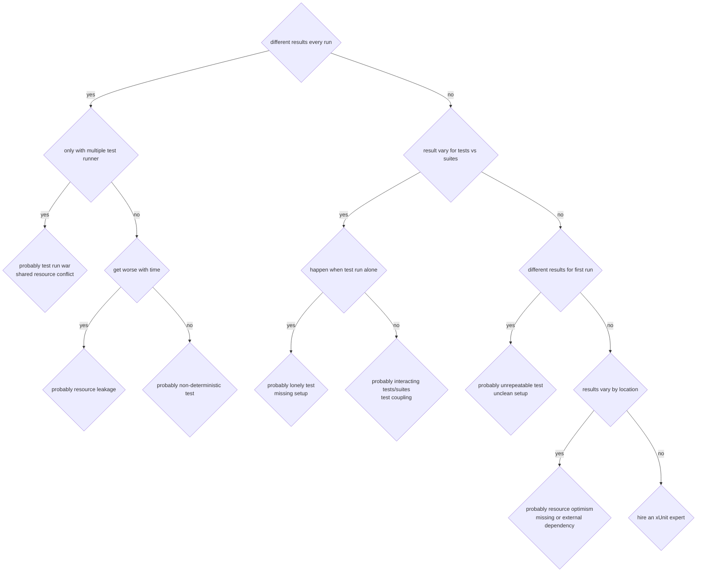

# week #5: Test Code Smells

# Platform: Edx

# Course Name: DelftX ST1x Automated Software Testing: Unit Testing, Coverage Criteria and Design for Testability

# Author: Caesar James LEE

## Unknown Keywords

| English           | Pronunciation     | Chinese Meaning                           |
| :---------------: | :---------------: | :---------------------------------------: |
| smell             | smɛl              | 異味                                       |
| smelly            | ˈsmɛlɪ            | 臭的                                       |
| idiomatic         | ˌɪdɪǝˈmætɪk       | 慣用語句的                                  |
| flaky             | ˈflеkɪ            | 薄片的；古裡古怪的                           |
| symptom           | ˈsɪmptǝm          | 症狀；表徵                                  |
| suite             | swit              | （總稱）隨員；組；套；套房                   |
| prone             | pron              | 有……傾向的；面向下的；傾斜的                 |
| eager             | ˈiɡɚ              | 熱心的；渴望的                              |
| roulette          | ruˈlɛt            | 輪盤賭；轉跡線                              |
| proneness         | pronnɪs           | 俯伏；傾向                                 |
| anonymize         | anonymised        | 匿名化                                     |
| fixture           | ˈfɪkstʃɚ          | 配件；長期固定於某項工作（或某種活動）的人    |
| resilient         | rɪˈzɪlɪǝnt        | 彈回的；迅速恢復精力的                      |
| interference      | ˌɪntɚˈfɪrǝns      | 阻礙；干涉；干擾                           |
| descriptive       | dɪˈskrɪptɪv       | 描寫的                                    |
| parallelizable    | ˋpærəlɛl͵aɪzib!   | 可平行化的                                |
| mutable           | ˈmjutǝbḷ          | 易變的；反覆無常的                         |
| tailored          | ˈtеlɚd            | 訂做的；裁縫做的；乾淨俐落的                |

## triple A principle

* a **simple**, **clean** pattern for writing unit tests that are easy to read and maintain

### `arrange`

* prepare the environment
* set up
    1. `inputs`
    2. `test data`
    3. `mocks/stubs`
    4. the object under test
* example
    ```java
        Product chocolateCake = new Product("chocolate", 8.99, "HOME"),
                firedChicken = new Product("fired chicken", 5.99, "BUSINESS");
        ProductDao pd = Mockito.mock(ProductDao.class);
        List <Product> products = Arrays.asList(chocolateCake, firedChicken);
        Mockito.when(pd.all()).thenReturn(products);
        DiscountApplier da = new DiscountApplier(pd);
    ```

### `act`

* run the test method
* execute the actual method that you want to test - `System Under Test`  (`SUT`)
* example
    ```java
        da.setNewPrices();
    ```

### `assert`

* verify result
* check that the result is what you expected
* example
    ```java
        Assertions.assertEquals(8.091, chocolateCake.getPrice(), 1e-9);
        Assertions.assertEquals(6.589, firedChicken.getPrice(), 1e-9);
    ```

## `code smells`

* `indicate`, `symptoms` that usually point to a **deeper problem** in the system
* example: a long method or long class
* when your code has smells:
    1. become harder to read
    2. more difficult to maintain
    3. may not properly test what it's supposed to
* we should try to **avoid code smells** as much as possible
* test smells are **widely** spread throughout the software system studied
* most of the test smells have a **strong negative impact** on the comprehensibility of test suites and production code
* tests with smells are more change and defect-prone
    1. `change-prone`
        * your tests break more easily when the system changes
    2. `defect-prone`
        * your production code ends up with more bugs, because it's not properly tested
* `indirect testing`, `eager test` and `assertion roulette` are the most significant smells for change-proneness
    1. `indirect testing`
        * testing behavior through another object, instead of directly
        * hard to know what exactly failed
        * changes in unrelated code can break the test
    2. `eager testing`
        * a single test covers too many things (e.g., multiple methods or behaviors)
        * hard to understand
        * if the test fails, you don't know what went wrong
    3. `assertion roulette`
        * test has many `assert` statements with no clear message or separation
        * when the test fails, you don't know which `assert` caused the failure without reading through everything
* production code is more `defect-prone` when tested by smelly tests
    1. developers don't trust them, so they ignore failures
    2. bugs slip into production because test don't really check correctness
    3. refactoring or changing code becomes risky, because tests are hard to update or break easily

## `FIRST` properties of good tests

### `F` - fast

* tests should execute quickly
* minimize code that depends on show components (e.g., database, network)
* fast feedback can improve development speed and confidence

### `I` - isolated

* good `unit test`s focus on a small piece of functionality
* shouldn't depend on other tests
* avoid shared resources to prevent test interferences

### `R` - repeatable

* a test should always produce the same result when run under the same condition
* isolation helps ensure repeatability

### `S` - self-validating

* tests must include assertions to automatically verify correctness
* manual verification is slow and error-prone
* also include `self-arrangement` setting up the necessary state/data for the test to run independently

### `T` - timely

* tests should be written soon after or during code development
* write tests letter makes bug harder to detect and test coverage harder to achieve

## some common test smells

### 1. duplicated code

* repeating setup or logic cross tests makes maintenance hard
* changes in one place require updating many others
* refactor using shared  `@BeforeEach` methods or utility methods
* hard to maintain

### 2. assertion roulette

* too many assertions without clear messages or structure
* if a test files, it's hard to tell which assertion failed and why
* solution
    1. use descriptive messages
    2. break into multiple tests

### 3. slow test

* developers may avoid tests if they take too long
* optimize or isolate slow dependencies use `mocks`/`fakes`/`stubs`

### 4. resource optimism

* test assume the presence of external resources (like a local BD), but this may not be true for every developer
* solution
    1. avoid external dependencies with `mocks`
    2. if unavoidable, fail gracefully with helpful error messages

### 5. test run war

* tests that cannot be run by multiple people at the same time (often duo to shared DB state)
* tests should be **parallelizable** and not rely on shared **mutable state**

### 6. general fixture

* a large, shared setup is created, but individual tests use only a small part of it
* leads to confusion and poor test performance
* create **minimal**, **focused fixtures** tailored to each test

### 7. indirect tests

* test that verify behavior through other classes instead of directly
* unclear what exactly is being tested
* tests should directly verify the behavior of the class under test

### 8. sensitive equality

* tests break easily when unrelated parts of the system change
* avoid overly strict comparisons (e.g., full object equality when only one field matters)
* aim for resilient tests that only break when the intended behavior changes

## test data builder

### definition

* a design pattern to help create **complex** test objects in a **clearn**, **readable** and **flexible** way

### benefits

1. `readable`
    * `withPropertyName(value)` is clearer than a constructor
2. `reusable`
    * can reuse a builder across many tests
3. `maintainable`
    * if constructor changes, only the builder needs to be update
4. `flexible`
    * you can override only the value you care about

### example: test a `Product` object

* without data builder

`Product.java`:
```java
    public class Product{
        private String name = "default";
        private double price = 0.0;
        private String category = "default";

        public Product(String name, double price, String category){
            this.name = name;
            this.price = price;
            this.category = category;
        }

        @Override
        public String toString(){
            return this.name + " - " + this.price + " - " + this.category + "\n";
        }
    }
```

`ProductTest.java`:
```java
    public class ProductTest{
        @Test
        void testProduct(){
            Product product = new Product("icy americano", 3.99, "drink");
            Assertions.assertEquals("icy americano - 3.99 - drink\n", product.toString());
        }
    }
```

* with data builder

`ProductBuilder.java`
```java
    public class ProductBuilder{
        private String name = "default";
        private double price = 0.0;
        private String category = "default";

        public ProductBuilder withName(String name){
            this.name = name;
            return this;
        }

        public ProductBuilder withPrice(double price){
            this.price = price;
            return this;
        }

        public ProductBuilder withCategory(String category){
            this.category = category;
            return this;
        }

        public Product build(){
            return new Product(this.name, this.price, this.category);
        }
    }
```

`ProductBuilderTest.java`
```java
    public class ProductBuilderTest{
        @Test
        void testProductBuilder() {
            Product product = new ProductBuilder()
                    .withName("icy americano")
                    .withPrice(3.99)
                    .withCategory("drink")
                    .build();
            Assertions.assertEquals("icy americano - 3.99 - drink\n", product.toString());
        }
    }
```

## flaky test

* a strange test test that passes sometimes, and fails sometimes
* possible causes
    1. `external infrastructure`
        * e.g., databases, networks
    2. `shared resources`
    3. `timeouts`
        * very common in web applications
    4. `interacting tests`

## test readability

* the lower the test readability, the more time it takes for developers to read and understand the code
* tips
    1. `information` (`important`)
        * we need make sure that anyone can understand the information that in there
        * we need to introduce variables instead of numbers to a constructor or setter, because developers have to turn to the definition of the constructor or setter to figure out what are those number mean
        * example
            * using numbers
            ```java
                public class ProductTest{
                    @Test
                    void testProduct(){
                        Product product = new Product("icy americano", 3.99, "drink");
                        Assertions.assertEquals("icy americano - 3.99 - drink\n", product.toString());
                    }
                }
            ```
            * using variable
            ```java
                public class ProductTest{
                    @Test
                    void testProduct(){
                        String name = "icy americano";
                        double price = 3.99;
                        String category = "drink";
                        Product product = new Product(name, price, category);
                        Assertions.assertEquals("icy americano - 3.99 - drink\n", product.toString());
                    }
                }
            ```
    2. `assertion` (`fundamental`)
        * a first thing a developer will see whether a test passes or fails
    
## flaky test tree

