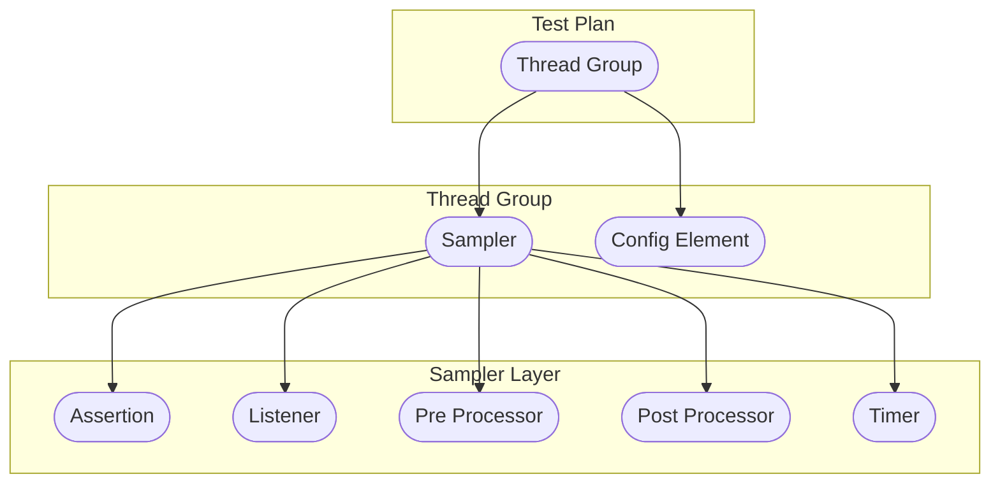

# II. JMeter Note

# Author: Caesar James LEE

## What Is `Apache JMeter`

- `Apache JMeter` is an **open-source testing tool** mainly used for:
    - **Performance testing**: `load testing`, `stress testing`, `spike testing`, `endurance (soak) testing`
    - **Functional testing**: `API behavior validation`
    - **Protocol testing**: `HTTP/HTTPS`, `SMTP`, `JDBC`, `TCP`, `JMS`, `FTP`, etc
- think of it as a **robot army** capable of simulating thousands of users who:
    - send request
    - wait
    - validate responses

    automatically, repeatedly and accurately

## Download & Run `Apache JMeter`

1. download `java 8+`: [download](`https://www.oracle.com/java/technologies/downloads/`)
2. verify java:
    ```bash
        java -version
    ```
3. download `Apache JMeter` binary distribution: [download](`https://jmeter.apache.org/download_jmeter.cgi`)
4. unzip the downloaded file
5. run
    - `Microsoft Windows`
        ```bat
            bin\jmeter.bat
        ```
    - `Apple macOS`/`Linux`
        ```bash
            cd path/bin; ./jmeter
        ```

## Structure



## Element Categories

|  category  |       element       |      usage       |          example          |
| :--------: | :-----------------: | :--------------: | :-----------------------: |
|    core    |      Test Plan      |  root container  |    entire test project    |
|  threads   |    Thread Group     | simulated users  | many user acting at once  |
|  samplers  |    HTTP Request     |  send requests   |      browser actions      |
|   config   | HTTP Header Manager |   add headers    | add `Authorization` token |
| assertions | Response Assertion  | validate result  |   status code == `200`    |
|   timers   |   Constant Timer    |    add delay     |     human think time      |
|   logic    |    If Controller    | conditional flow |     if login succeeds     |
| listeners  |  View Results Tree  |  view responses  | Browser DevTools (`F12`)  |

## `Thread Group`

### Options

|           option            |       description       |
| :-------------------------: | :---------------------: |
| `Number of Threads (users)` | number of current users |
|      `Ramp-up Period`       | time to start all users |
|        `Loop Count`         |  number of repetitions  |

### Example

- `number of threads`: `10`, `ramp-up period`: `5`, `loop count`: `2`
- 10 users start gradually within 5 seconds, each repeating the scenario twice

## Samplers

### `HTTP Request`

#### Purpose

- used to send `HTTP`/`HTTPS` requests

#### Options

|       option        |          description          |
| :-----------------: | :---------------------------: |
|       `Name`        |         sampler name          |
|     `Comments`      |          description          |
|     `Protocol`      |    `HTTP`(default)/`HTTPS`    |
|    `Server Name`    |         domain or IP          |
|      `Method`       |  `GET`/`POST`/`PUT`/`DELETE`  |
|       `path`        |         request path          |
| `Conntent encoding` |      `UTF-8` recommended      |
|    `Parameters`     |  `key-value` form parameters  |
|     `Body Data`     | `JSON` or raw body parameters |
|   `Files Upload`    |    binary file parameters     |

### `SMTP Sampler`

#### Purpose

- used to send emails

|      option      |      description       |
| :--------------: | :--------------------: |
|     `Server`     |  `SMTP` server domain  |
|      `Port`      |      `SMTP` port       |
|  `Address From`  |  sender email address  |
|   `Address To`   | receiver email address |
|    `Subject`     |      email title       |
|    `Message`     |     email content      |
| `Attach file(s)` |   email attachments    |

## Config Elements

### `HTTP Request Defaults`

#### Purpose

- used to set default values of all HTTP samplers

### `HTTP Header Manager`

#### Purpose

- used to add `HTTP` headers

### `HTTP Cookie Manager`

#### Purpose

- used to manage cookies automatically

#### Options

|  option  |  description  |
| :------: | :-----------: |
|  `Name`  |  cookie name  |
| `Value`  | cookie value  |
| `Domain` |    domain     |
|  `Path`  |     path      |
| `Secure` | secure cookie |

### `CSV Data Set Config`

#### Purpose

- used to enable parameterized (data-driven) testing

#### Options

|       option        |            description            |
| :-----------------: | :-------------------------------: |
|     `Filename`      |        `.csv`/`.tsv` file         |
|  `Variable Names`   | variable names (comma-separated)  |
| `Ignore first line` |      `True` if header exists      |
|     `Delimiter`     | `,`(default, `.csv`)/`\t`(`.tsv`) |
| `Allow quoted data` |       enable quoted values        |

#### Usage

```text
    ${variableName}
```

## Assertions

### `Response Assertion`

#### Purpose

- used to validate responses

#### Options

|       option       |             description              |
| :----------------: | :----------------------------------: |
|  `Text Response`   |            response text             |
|  `Response Code`   |          HTTP response code          |
| `Response Message` |    name of an HTTP response code     |
| `Response Headers` |           response headers           |
| `Request Headers`  |           request headers            |
|   `Request Data`   |             request text             |
|     `Contains`     |             contain text             |
|     `Matches`      |       regular expression match       |
|      `Equals`      |     exact match (case-sensitive)     |
|    `Substring`     | contain the pattern (case-sensitive) |
|       `Not`        |        inverse matched result        |
|        `Or`        |        any assertion matched         |

### `JSON Assertion`

#### Purpose

- used to validate `JSON` responses

#### Options

|            option             |       description        |
| :---------------------------: | :----------------------: |
|   `Assert JSON Path exists`   |      key existence       |
|  `Additionally assert value`  |       value check        |
| `Match as regular expression` | regular expression match |
|       `Expected Value`        |      expected value      |
|         `Expect null`         |       allow `null`       |
|      `invert assertion`       |      reverse result      |

### `Duration Assertion`

#### Purpose

- used to enable performance limits

#### Options

|           option           |          description          |
| :------------------------: | :---------------------------: |
| `Duration in milliseconds` | maximum allowed response time |

## Listeners

### `View Results Tree`

#### Purpose

- used to view request and response info in a tree
- used to only for debugging
- **never use** in large load tests

#### Options

|             option             |   description    |
| :----------------------------: | :--------------: |
|        `Sampler result`        |     overview     |
|   `Request -> Request Body`    |   request body   |
|  `Request -> Request Headers`  | request headers  |
|  `Response -> Response Body`   |  response body   |
| `Response -> Response Headers` | response headers |

### `View Results in Table`

#### Purpose

- similar to `View Results Tree` but in a table

### `Summary Report`

#### Purpose

- used to view every thread and all thread overview info

#### Options

|    option    |          description          |
| :----------: | :---------------------------: |
|   `Label`    |         sampler name          |
| `# Samples`  |    indexes of the sampler     |
|  `Average`   | average time in milliseconds  |
|    `Min`     | minimum time in milliseconds  |
|    `Max`     | maximum time in milliseconds  |
|  `Error %`   | percentage of failed requests |
| `Throughput` |        speed of output        |
|  `Received`  |  speed of received response   |
|    `Sent`    | speed of sending the request  |
| `Avg. Bytes` |   average size of requests    |

### `Aggregate Report`

#### Purpose

- similar to `Summary Report` but display some different fields

### `Graph Results`

#### Purpose

- used to view `data`, `average`, `median`, `deviation` and `throughput` in a line chart

### `Simple Data Writer`

#### Purpose

- used to save response data in a file

## `Pre Processors`

### `User Parameters`

#### Purpose

- used to provide per-user variables

#### Options

|    option    |  description  |
| :----------: | :-----------: |
|    `Name`    | variable name |
| `user_index` |  user index   |

#### Options

|      option      |                 description                  |
| :--------------: | :------------------------------------------: |
| `Simple timeout` | timeout limit of the request in milliseconds |

## `Post Processors`

### `JSON Extractor`

#### Purpose

- used to extract value as a variable using `JSON`

#### Options

|         option         |  description   |
| :--------------------: | :------------: |
| `JSON Path expression` | `$.key.subKey` |

### `Regular Expression Extractor`

#### Purpose

- similar to `JSON Extractor` but using `regular expression`

#### Options

|        option        |        description         |
| :------------------: | :------------------------: |
| `Regular Expression` | regular expression pattern |
|      `Template`      | `$i$`, `1` means the first |
|     `Match No.`      |   which match to extract   |
