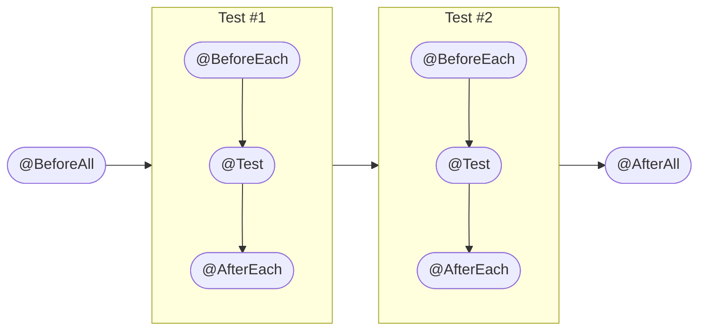

# JUnit5 Note

# Author: Caesar James LEE

## What Is `JUnit5`

- `JUnit` is a test automation framework for `Java`
- used to write and run unit tests
- linked as a `.jar` during test runtime
- widely used in industry and CI pipelines

## Integration with `Apache Maven`

```xml
    <dependencies>
        <!-- JUnit 5 -->
        <dependency>
            <groupId>org.junit.jupiter</groupId>
            <artifactId>junit-jupiter</artifactId>
            <version>5.10.0</version>
            <scope>test</scope>
        </dependency>

        <!-- Allure report adapter -->
        <dependency>
            <groupId>io.qameta.allure</groupId>
            <artifactId>allure-junit5</artifactId>
            <version>2.27.0</version>
            <scope>test</scope>
        </dependency>
    </dependencies>
```

## Lifecycle

### Flow Chart



### Table

| hook annotation |         description         | execution times |          scenario          |
| :-------------: | :-------------------------: | :-------------: | :------------------------: |
|  `@BeforeAll`   | before **all** test methods |       `1`       | create database connection |
|   `@AfterAll`   | after **all** test methods  |       `1`       | close database connection  |
|  `@BeforeEach`  | before **each** test method |      many       |      reset test state      |
|  `@AfterEach`   | after **each** test method  |      many       |     cleanup resources      |
|     `@Test`     |     actual test method      |      many       |        verify logic        |

### Example

- `OddEven`

    ```java
        public class OddEven{
            public boolean idOdd(int number){
                return number % 2 != 0;
            }
        }
    ```

- `OddEvenTest`

    ```java
        import org.junit.jupiter.api.*;
        public class OddEvenTest{
            private final OddEven oddEven = new OddEven();
            private int count = 1;

            @BeforeAll
            static void beforeAll(){
                System.out.println("Testing OddEven class");
            }

            @BeforeEach
            void beforeEach(){
                System.out.printf("Testing test #%d%n", count);
            }

            @AfterEach(){
                System.out.printf("test #%d finished%n", count++);
            }

            @Test
            void testOdd(){
                Assertions.assertTrue(oddEven.isOdd(1));
            }

            @Test
            void testEven(){
                Assertions.assertFalse(oddEven.isOdd(2));
            }

            @AfterAll
            static void afterAll(){
                System.out.println("Testing finished");
            }
        }
    ```

## `Assertions`

### Table

|              assertion              |          purpose           |
| :---------------------------------: | :------------------------: |
|  `assertEquals(expected, actual)`   |       check equality       |
| `assertNotEquals(expected, actual)` |      check inequality      |
|       `assertTrue(condition)`       |  condition must be `true`  |
|      `assertFalse(condition)`       | condittion must be `false` |
|        `assertNull(object)`         |   object must be `null`    |
|       `assertNotNull(object)`       | object must not be `null`  |
|          `assertThrows()`           |  exception must be thrown  |
|       `assertDoesNotThrow()`        |    no exception allowed    |

## Parameterized Test

### Table

|      annotation       |           source           |
| :-------------------: | :------------------------: |
| `@ParameterizedTest`  | enable parameterized test  |
|    `@ValueSource`     | **single** variable values |
|     `@CsvSource`      |   **multiple** variables   |
|   `@CscFileSource`    |        `.csv` file         |
|     `@EnumSource`     |     enumeration values     |
|    `@MethodSource`    |           method           |
|  `@ArgumentsSource`   |     reusable provider      |
|     `@nullSource`     |           `null`           |
|    `@EmptySource`     |           empty            |
| `@NullAndEmptySource` |       `null` + empty       |

### Example

- `data`

    ```csv
        number,expected
        -3,true
        -2,false
        -1,true
        0,false
        1,true
        2,false
        3,true
    ```

- `OddEvenTest`

    ```java
        import org.junit.jupiter.api.*;
        import org.junit.jupiter.params.*;
        import org.junit.jupiter.params.provider.*;

        import java.util.stream.Stream;

        public class OddEvenTest{
            private final OddEven oddEven = new OddEven();

            static Stream <Arguments> data(){
                return Stream.of(
                    Arguments.of(-3, true),
                    Arguments.of(-2, false),
                    Arguments.of(-1, true),
                    Arguments.of(0, false),
                    Arguments.of(1, true),
                    Arguments.of(2, false),
                    Arguments.of(3, true)
                )
            }

            @ParameterizedTest
            @ValueSource(ints = {-3, -2, -1, 0, 1, 2, 3})
            void testUsingValueSource(int number){
                Assertions.assertTrue(oddEven.isOdd(number));
            }

            @ParameterizedTest
            @CsvSource({"-3,true", "-2,false", "-1,true", "0,false", "1,true", "2,false", "3,true"})
            void testUsingCsvSource(int number, boolean expected){
                Assertions.assertEquals(ecpected, oddEven.isOdd(number));
            }

            @ParameterizedTest
            @CsvFileSource(resources = "/data.csv", numberLinesToSkip = 1)
            public void testUsingCsvFileSource(int number, boolean expected){
                Assertions.assertEquals(expected, oddEven.isOdd(number));
            }

            @ParameterizedTest
            @MethodSource("data")
            void testUsingMethodSource(int number, boolean expected){
                Assertions.assertEquals(expected, oddEven.isOdd(number));
            }

            @ParameterizedTest
            @NullSource
            void testNull(Integer number){
                Assertions.assertNull(number);
            }
        }
    ```

## Report using `allure`

### What Is `allure`

- test reporting framework
- generate interactive `HTML` reports
- default output directory: `target/allure-results`

### Annotations

|   annotation   |        purpose        |
| :------------: | :-------------------: |
|    `@Epic`     | large business domain |
|   `@Feature`   |  feature under epic   |
|    `@Story`    |      user story       |
| `@Description` |   test description    |
|    `@Owner`    |      test owner       |
|  `@Severity`   |    test importance    |
|    `@Link`     |     external link     |
|    `@Issue`    |        bug ID         |
|   `@TmsLink`   |     test case ID      |
|    `@Step`     |       step name       |

### Severity Levels

|   level    |       meaning        |
| :--------: | :------------------: |
| `BLOCKER`  |   system unusable    |
| `CRITICAL` | core function broken |
|  `NORMAL`  |    normal failure    |
|  `MINOR`   |     minor issue      |
| `TRIVIAL`  |    cosmetic issue    |

### Example

```java
    import io.qameta.allure.*;
    import org.junit.jupiter.api.*;
    import org.junit.jupiter.params.*;
    import org.junit.jupiter.params.provider.*;

    @Epic("Match")
    @Feature("Test OddEven class")
    @Owner("Caesar James LEE")
    public class OddEvenTest{
        private OddEven oddEven = new OddEven();

        @Story("Test odd numbers")
        @Description("Verify odd numbers")
        @Severity(SeverityLevel.CRITICAL)
        @ParameterizedTest
        @CsvSource({"-5, true", "-3, true", "-1, true", "1, true", "3, true", "5, true"})
        void testOdds(int number, boolean expected){
            Allure.step("Test odd: " + number)
            Assertions.assertEquals(expected, oddEven.isOdd(number));
        }

        @Story("Test even numbers")
        @Description("verify even numbers")
        @Step("Test even: {number}")
        @ParameterizedTest
        @CsvSource({"-4, false", "-2, false", "0, false", "2, false", "4, false"})
        void testEvens(int number, boolean expected){
            Assertions.assertEquals(expected, oddEven.isOdd(number));
        }
    }
```

### Commands

|            command             |                purpose                |
| :----------------------------: | :-----------------------------------: |
|       `allure --version`       |          verify installation          |
|      `allure serve path`       | generate report in `path` and open it |
|     `allure generate path`     |      generate a report in `path`      |
| `allure generate path --clean` |     like above but clean old data     |
|         `allure open`          |            open the report            |
